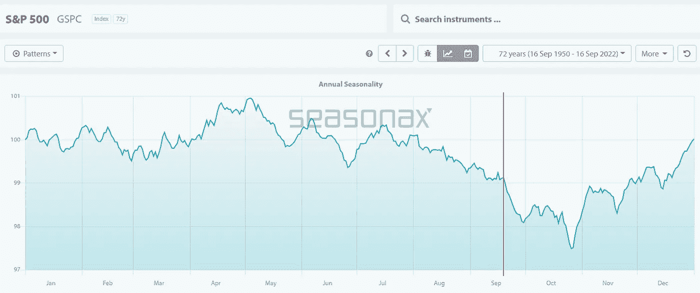
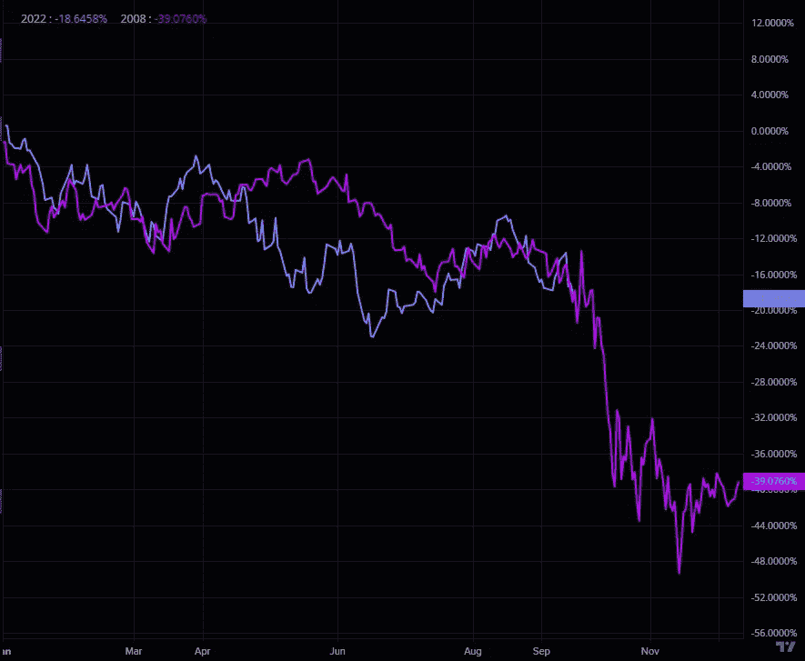
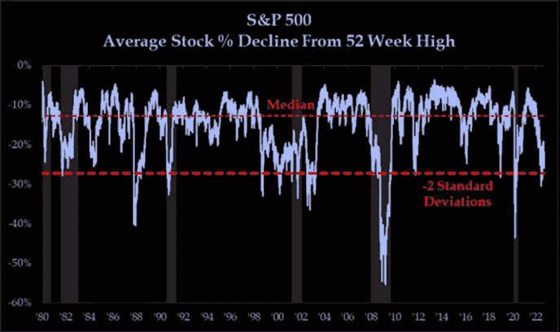
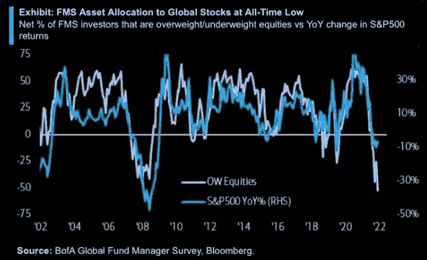
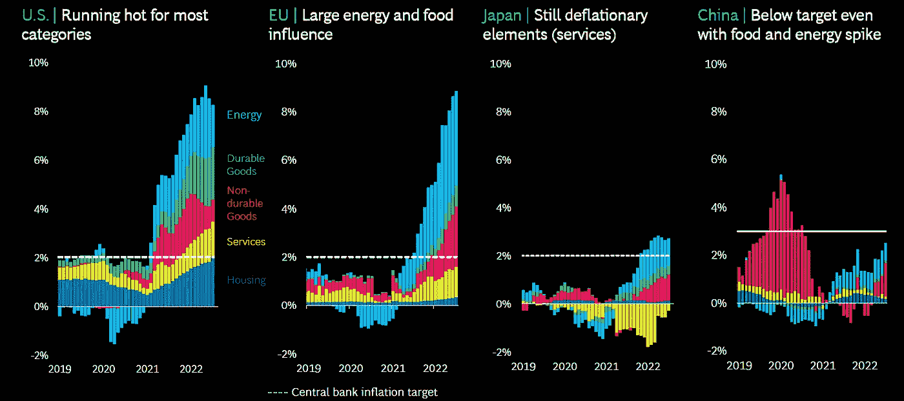
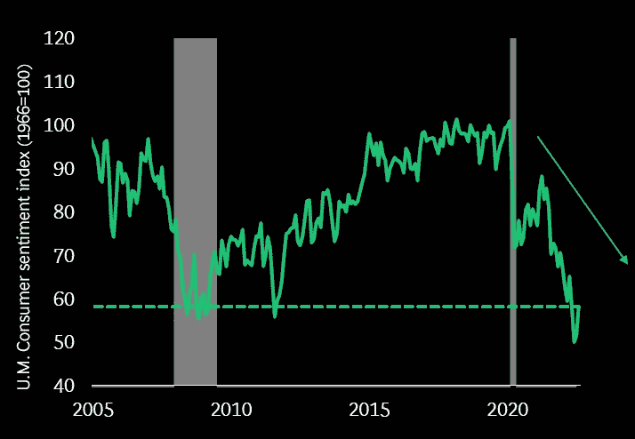
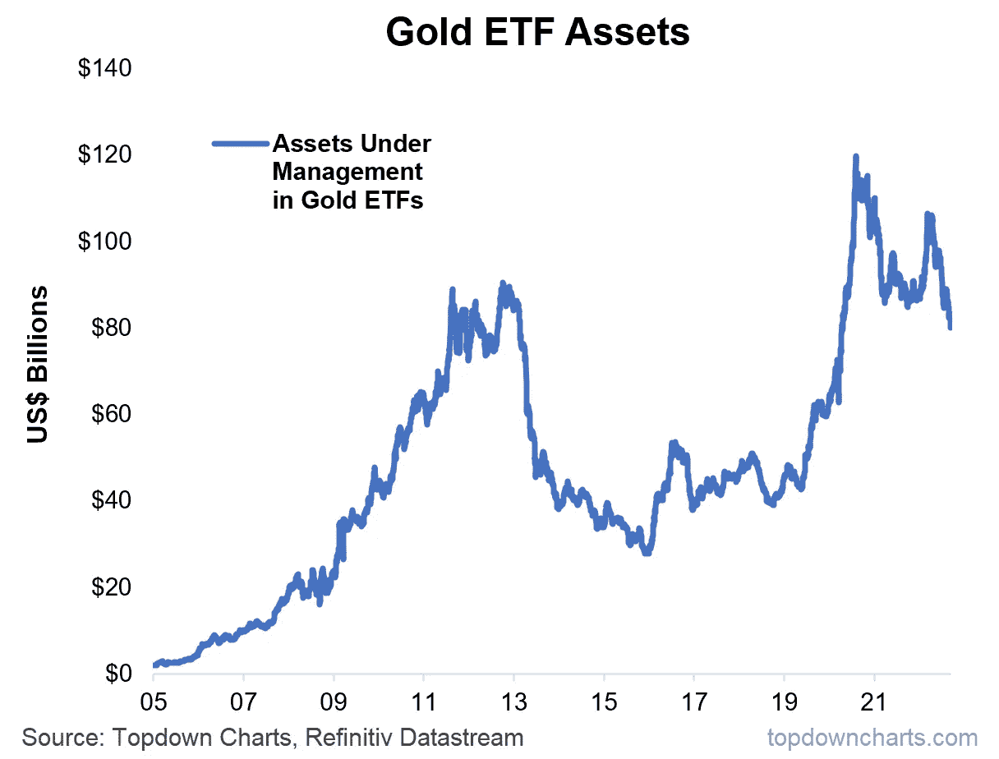

# 最伟大的反向指标，黄金大崩盘，2008 年的崩盘会重演吗？

> 原文：<https://medium.com/coinmonks/the-greatest-contrarian-indicator-the-great-gold-breakdown-2008-crash-aabout-to-repeat-itself-ab380ddfb77f?source=collection_archive---------22----------------------->

嘿，我是基兰！市场又将迎来新的一周，以下是需要注意的关键事件，以及来自投资银行的最有趣的宏观研究。我希望能在本周的[贸易挑战](http://www.traderseed.io/)中与你交谈，并且一如既往，如果你有任何问题，请在下面给我留言。

**嘿，我是基兰！**市场又将迎来新的一周，以下是需要注意的关键事件，以及来自投资银行的最有趣的宏观研究。我希望能在本周的贸易节目中与你们交谈。一如既往，如果你有任何问题，只需回复此邮件，我会非常乐意回答任何问题。

# 每周观察列表

本周，市场的注意力将完全集中在美联储周三的会议上，政策制定者普遍预计将连续第三次加息 75 个基点。高于预期的美国 8 月份通胀数据巩固了市场对美国再次大幅加息的预期。市场已经消化了 75 个基点的加息，但市场也消化了一个百分点的潜在加息，这在不久前还是不可想象的。

# 宏观视角

**季节性即将跌落悬崖。我们正在进入标准普尔 500 指数历史上最糟糕的 4 周。**

**2008v 2022S&P500 类比。**我们一整年都在跟踪这一点，现在很快就是成败的关键，看看我们是否会步 2008 年后尘，进一步崩溃，或者我们会脱钩。

**与反弹相关的级别..在变得过于悲观之前，保持开放的心态，因为任何事情都可能发生，历史上我们已经从这些水平反弹。标准普尔 500 指数年初至今下跌了近 20%,但更重要的是，平均股票跌幅%接近 2 标准差水平，这通常与反弹有关..**

**最伟大的逆势指标刚刚开始闪烁。美国银行上周的基金经理调查显示，全球股票配置处于历史低点。如果你正在寻找一个反向指标来购买股票，你可能不会找到比这更好的了。**

**全球通胀并非同质。**千差万别的司机和水平。

**消费者信心低于 GFC 期间。对市场或经济来说不是好消息。**

**黄金大崩溃。**上周，我们看到黄金向下大幅突破。随着投资者被迫平仓，管理下的黄金 ETF 资产正在快速下跌。在下一轮黄金牛市开始之前，我们可能需要看到一轮下跌行情，以洗清剩余的弱势。美元坚挺，利率上升，这是一场完美的风暴。也就是说，当市场上的事情看起来很明显时，通常会发生相反的情况，所以要小心行事！

我希望你觉得这很有趣，很有用。像往常一样，把风险管理放在第一位，安全交易，保持敏捷。

祝你一周愉快！
基兰
www.traderseed.io

**想在本周交易市场吗？** 100k 节目起 **$75** ！！点击这里查看新节目 [**！**](http://www.traderseed.io/)

[**查看节目**](http://www.traderseed.io/)

> 交易新手？试试[加密交易机器人](/coinmonks/crypto-trading-bot-c2ffce8acb2a)或者[复制交易](/coinmonks/top-10-crypto-copy-trading-platforms-for-beginners-d0c37c7d698c)