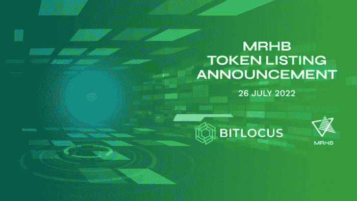

# 清真 DeFi 令牌$MRHB 现在可以在 Bitlocus Exchange 上兑欧元交易

> 原文：<https://medium.com/coinmonks/the-halal-defi-token-mrhb-can-now-be-traded-against-the-euro-on-bitlocus-exchange-13211435ef46?source=collection_archive---------48----------------------->

*阿联酋迪拜，2022 年 7 月 27 日* — [MRHB。网络](https://mrhb.network/)，第一个致力于支持道德和清真加密产品的去中心化金融平台，**已经在**[**bit locus**](https://app.bitlocus.com/exchange)**加密交易所上市$MRHB 代币，现在提供针对其本地代币的欧元交易。**除了 USDT 对，**新的交易对 MRHB/EUR 是 halal token 进军欧洲市场的一部分，使加密用户能够进行即时的菲亚特-加密转换。**

Bitlocus 是第四家上市 MRHB 的全球集中交易所，包括 [LBank](https://www.lbank.info/exchange/mrhb/usdt) 、 [BitMart](https://www.bitmart.com/trade/en?layout=basic&symbol=MRHB_USDT) 和 [CoinTiger](https://www.cointiger.com/en-us/#/trade_pro?coin=mrhb_usdt) 。这种代币也可以在领先的分散式交易所进行交易。

> *“在 Bitlocus 上市标志着 MRHB 的又一个里程碑，我们很高兴扩大我们的范围，为代币持有者提供交易美元兑欧元的选择，”CMO MRHB DeFi Network 说。"* ***降低购买菲亚特 crypto 的门槛是吸引更多用户的关键一步。通过提供 crypto 和 fiat 之间的桥梁，我们可以为我们的社区提供更方便和更好的交易体验，使我们向$MRHB 的大规模采用迈进了一步。***

在 Bitlocus 上市是两个实体之间长期和更广泛合作的一部分，Bitlocus 将通过其各姐妹实体的服务和产品促进 MRHB 向欧洲市场的扩张。顺便说一下，从 MRHB 团队的构思阶段开始，Bitlocus 就是它最早的盟友和支持者之一。

> MRHB DeFi Network 是一个备受尊敬的 DeFi 项目，旨在让 cryptoverse 变得更好。 *我们很高兴在我们的交易所上市他们的 MRHB 令牌，以支持社区寻找合乎道德的加密货币解决方案，”Bitlocus 首席执行官*[*and rius Norman tas*](https://lt.linkedin.com/in/andrius-normantas-b0b41726)*说。*

Bitlocus 加密货币交易所成立于 2018 年。他们的总部设在立陶宛，并在立陶宛注册，受欧盟严格、可信的监管。Bitlocus 提供超过 16 种代币和加密货币的现货交易，以欧元为基础货币，并有一个固定的上/下匝道。

MRHB DeFi 平台是专门为帮助以前被排除在加密货币之外的社区而构建的，例如全球 18 亿穆斯林代表着价值约 3 万亿美元的金融市场。为了确保去中心化金融生态系统是清真的，因此允许穆斯林使用，MRHB DeFi 团队雇佣了一个咨询委员会，根据严格的道德和清真指南审查平台上的所有加密货币和服务。

**关于搭建更好的 DeFi 平台**

MRHB DeFi 平台的旗舰产品和基石是 Sahal Wallet，这是一款自我保管的加密货币钱包，可在 iOS 和 Android 上使用。值得注意的是，Sahal Wallet 只接受清真代币，并作为整个 MRHB DeFi 生态系统的门户。

> *“在设计我们的 Sahal Wallet 应用程序时，我们竭尽全力确保 UX 尽可能简单友好。MRHB 首席执行官*[*Naquib Mohammed*](https://au.linkedin.com/in/mohammednaquib)*说:“我们 7 万名支持者中的大多数都是第一次使用加密技术，老实说，新人进入加密领域会非常困难。”。“MRHB DeFi 是一个一站式平台，我们的用户可以放心，一切都是清真的，而不必自己做大量的额外研究，使 Sahal Wallet 成为他们道德 DeFi 的关键。”*

自 2021 年 12 月在超额认购的 IDO 中上市以来，该公司已经推出了一系列强劲的产品，筹集了超过 550 万美元的资金。包括 Sahal Wallet 在内，MRHB DeFi 还推出了[SouqNFT](https://souq.mrhb.network)——一个道德 NFT 的市场，它还拥有来自 [Shariah 专家](https://shariahexperts.com)的[清真合规证书](https://beincrypto.com/defi-platform-marhaba-looks-to-taps-3-trillion-islamic-economy-with-halal-certified-nfts/)，采用不可改变、不可伪造的 NFT 形式。[今年即将推出的](https://www.globenewswire.com/news-release/2022/06/10/2460377/0/en/MRHB-continues-to-Lead-with-World-s-First-Halal-DeFi-Solutions-for-Passive-Crypto-Income-Commodity-Exchange-Staking.html)是一款 halal 流动性收割机，可产生 5%至 15%的被动收益率，一款令牌化商品和金属的交易所，一款世界首创的 halal DeFi staking 解决方案，以及 Sahal Wallet 的众多增强功能，包括可逆交易。

他们将于 2023 年推出的路线图上的其他雄心勃勃的产品包括无息加密融资解决方案、去中心化慈善事业、企业家发射台和去中心化自主治理。

MRHB DeFi Network 得到了众多合作伙伴和投资者的支持，包括 [Polygon Technology](https://polygon.technology/) 、 [Sheesha Finance](https://www.sheeshafinance.io/) 、[澳大利亚海湾资本](https://www.ausgulf.com)、 [NewTribe Capital](https://www.newtribe.capital/) 、[区块链澳大利亚](https://blockchainaustralia.com.au/)、 [Mozaic](https://nwgp.com/#mosaic) 、 [Contango Digital Assets](https://www.contango.digital/) 、 [ZKSync](https://zksync.io/) 、 [Acreditus Partners](https://acreditus.com/) 、

**关于 MRHB。网络**

[MRHB。Network](https://mrhb.network/) 是一个清真、去中心化的金融平台，通过遵循基于信仰的金融和商业原则来体现“道德和包容性 DeFi”的真正精神，所有被排斥的群体都可以从 DeFi 的全部赋权潜力中受益。

这个多元化的团队由研究人员、技术专家、有影响力的人、伊斯兰金融科技专家和商业企业家组成，他们聚集在一起，确保 MRHB DeFi 以一种将影响整个社会的方式盛行，从根本上弥合信仰意识社区和区块链世界之间的差距。

**关于 Bitlocus**

Bitlocus 是一家全球金融科技公司，运营 Bitlocus 加密货币交易所。Bitlocus 的主要使命是通过以下功能将法定货币和加密货币结合在一起，例如法定货币到加密货币的交换、面向 DeFi 协议的法定友好网关、支付卡、加密支付处理、流动性以及面向商业和零售客户的其他服务。欲了解更多信息，请访问[https://bitlocus.com/](https://bitlocus.com/)。

**MRHB。网络官方渠道**

网址: [https://mrhb.network](https://mrhb.network/)

推特:[https://twitter.com/marhabadefi](https://twitter.com/marhabadefi)

电报:

电报通知:[https://t.me/marhabadefi_ANN](https://t.me/marhabadefi_ANN)

YouTube:[https://www.youtube.com/c/MarhabaDeFi](https://www.youtube.com/c/MarhabaDeFi)

中:[https://medium.com/@mrhbdefi](/@mrhbdefi)

领英:[https://www.linkedin.com/company/marhabadefi](https://www.linkedin.com/company/marhabadefi)

不和:[https://discord.com/invite/DubSjKmkBX](https://discord.com/invite/DubSjKmkBX)

https://www.facebook.com/MRHBDeFi

电报(阿拉伯语):[https://t.me/mdf_arabic](https://t.me/mdf_arabic)

电报(俄语):[https://t.me/marhabadefi_russia](https://t.me/marhabadefi_russia)

电报(土耳其语):[https://t.me/MarhabaDefiTR](https://t.me/MarhabaDefiTR)

电报(波斯语):【https://t.me/mrhbdefi_persian】T2

电报(乌尔都语/印地语):【https://t.me/MRHBDeFi_Urdu_Hindi 

SouqNFT market place:[https://souq . mrhb . network](https://souq.mrhb.network)

> 交易新手？尝试[加密交易机器人](/coinmonks/crypto-trading-bot-c2ffce8acb2a)或[复制交易](/coinmonks/top-10-crypto-copy-trading-platforms-for-beginners-d0c37c7d698c)