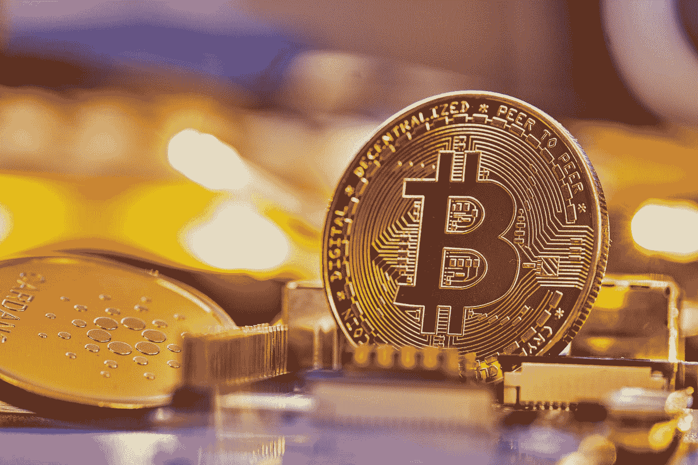
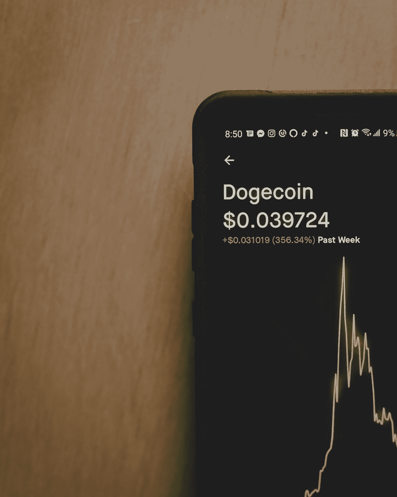

# 从数字现金到比特币:加密货币简史

> 原文：<https://medium.com/coinmonks/the-history-of-cryptocurrencies-35b7c279ca6a?source=collection_archive---------22----------------------->

加密货币的历史引人入胜，充满了许多曲折。

Photo by [Michael Förtsch](https://unsplash.com/@michael_f?utm_source=medium&utm_medium=referral) on [Unsplash](https://unsplash.com?utm_source=medium&utm_medium=referral)

[加密货币](https://www.investopedia.com/terms/c/cryptocurrency.asp)是一种数字货币，通过使用被称为密码术的高级加密技术来创建和管理。它是一种以电子方式创造、持有和交换的数字形式的货币。与电子货币和中央银行系统相反，加密货币是分散的。[中本聪](https://cointelegraph.com/bitcoin-for-beginners/who-is-satoshi-nakamoto-the-creator-of-bitcoin)，一个化名的开发者，在 2009 年创造了比特币作为第一种去中心化的加密货币。自那以后，许多其他加密货币被创造出来。本文探讨了加密货币的历史。

## 早期先例

数字货币的概念并不新鲜。1983 年，密码学家大卫·乔姆开始研究数字货币的概念。DigiCash 是他设计的一个系统，允许个人在没有第三方参与的情况下安全地转移数字代币。然而，该系统并没有被广泛采用，直到 20 世纪 90 年代末才开始流行

1998 年，尼克·萨伯创造了比特黄金，许多人认为这是比特币的第一个前身。Bit Gold 是一个分散的数字货币系统，使用工作证明系统来验证和认证每笔交易。

## 比特币的崛起

加密货币历史上最重大的发展发生在 2009 年，当时推出了比特币。比特币是由一个名叫中本聪的匿名程序员或程序员群体创造的。它被设计成分散的，这意味着没有中央权力机构或政府控制它。这使得用户可以安全地将数字令牌从一个人转移到另一个人，而无需依赖第三方。比特币使用一个[工作证明](https://www.coinbase.com/learn/crypto-basics/what-is-proof-of-work-or-proof-of-stake)系统，并通过一个被称为区块链的分散式账本进行管理。

自推出以来，比特币已成为世界上最受欢迎的加密货币。它已被个人、企业甚至政府广泛采用。例如，新加坡对加密货币采取了非常积极的态度，并实施了全面的监管框架。此外，[新加坡金融管理局(MAS)](https://www.mas.gov.sg/news/speeches/2022/mas-approach-to-the-crypto-ecosystem) 发布了几份加密货币相关服务的指导文件。

Photo by [Clay Banks](https://unsplash.com/@claybanks?utm_source=medium&utm_medium=referral) on [Unsplash](https://unsplash.com?utm_source=medium&utm_medium=referral)

## 其他加密货币的增长

2011 年， [Namecoin](https://www.namecoin.org/) 成为第一枚 altcoin。它类似于比特币，但增加了在其区块链交易数据库中存储数据的功能。这些数据可用于在 Namecoin 网络中查找信息，如域名注册信息。

自从[比特币](https://www.bitcoin.com/)诞生以来，无数其他加密货币被创造出来。[以太币](https://ethereum.org/en/)、瑞波币、莱特币、破折号都是比较受欢迎的山寨币。这些替代硬币的创建有多种原因，例如提供更快、更有效的资金转移方式，添加额外的安全功能，或者为智能合约提供平台。有些人甚至从另一个替代硬币的弱点中获得他们存在的目的。

2013 年，美国金融犯罪执法网络(FinCEN)发布了关于如何从监管角度对待加密货币的指南。这是美国政府首次正式承认加密货币的潜力，并就如何从法律和监管角度对待加密货币提供了指导。

自那以后，加密货币越来越受到投资者和用户的欢迎。这创造了一个新的加密货币交易、采矿和交易服务行业。今天，我们有像币安、比特币基地、北海巨妖、Kucoin、HotBit 和 Probit 这样的顶级交易所作为先锋。除其他外，这些交易所使加密用户能够轻松转换资产，无缝交易，并使用加密支付服务。越来越多的人对加密货币感兴趣，这导致加密货币背后的技术变得更加复杂，围绕加密货币的监管也更加严格。据 [Statista](https://www.statista.com/statistics/647374/worldwide-blockchain-wallet-users/) 估计，2018 年至 2020 年间，全球加密货币用户增长了近 190%。

## 加密货币的未来

加密货币的未来很难预测，但很明显它将会存在。随着越来越多的人意识到这项技术，越来越多的企业和政府可能会采用它。这可能会导致加密货币的更广泛使用和数字代币的更大市场。

## 结论

加密货币的历史令人着迷，充满了许多曲折。历史上由坏人实施的许多骗局引发了人们对加密货币的效用和监管的担忧。

政府对加密货币的监管有必要吗？去中心化在加密货币中意味着什么？这仅仅是一个游戏，还是分散的分散？事实上，未来还有很多事情要展现。

> 交易新手？试试[加密交易机器人](/coinmonks/crypto-trading-bot-c2ffce8acb2a)或者[复制交易](/coinmonks/top-10-crypto-copy-trading-platforms-for-beginners-d0c37c7d698c)
> 
> 多样化的密码持有，了解[币安替代品](https://coincodecap.com/binance-alternatives)
> 
> 加入 Coinmonks [电报频道](https://t.me/coincodecap)和 [Youtube 频道](https://www.youtube.com/c/coinmonks/videos)获取每日[加密新闻](http://coincodecap.com/)

## 另外，阅读

*   [复制交易](/coinmonks/top-10-crypto-copy-trading-platforms-for-beginners-d0c37c7d698c) | [加密税务软件](/coinmonks/crypto-tax-software-ed4b4810e338)
*   [网格交易](https://coincodecap.com/grid-trading) | [加密硬件钱包](/coinmonks/the-best-cryptocurrency-hardware-wallets-of-2020-e28b1c124069)
*   [密码电报信号](/coinmonks/top-3-telegram-channels-for-crypto-traders-in-2021-8385f4411ff4) | [密码交易机器人](/coinmonks/crypto-trading-bot-c2ffce8acb2a)
*   [最佳加密交易所](/coinmonks/crypto-exchange-dd2f9d6f3769) | [印度最佳加密交易所](/coinmonks/bitcoin-exchange-in-india-7f1fe79715c9)
*   开发人员的最佳加密 API
*   最佳[密码借贷平台](/coinmonks/top-5-crypto-lending-platforms-in-2020-that-you-need-to-know-a1b675cec3fa)
*   [免费加密信号](/coinmonks/free-crypto-signals-48b25e61a8da) | [加密交易机器人](/coinmonks/crypto-trading-bot-c2ffce8acb2a)
*   [杠杆代币的终极指南](/coinmonks/leveraged-token-3f5257808b22)