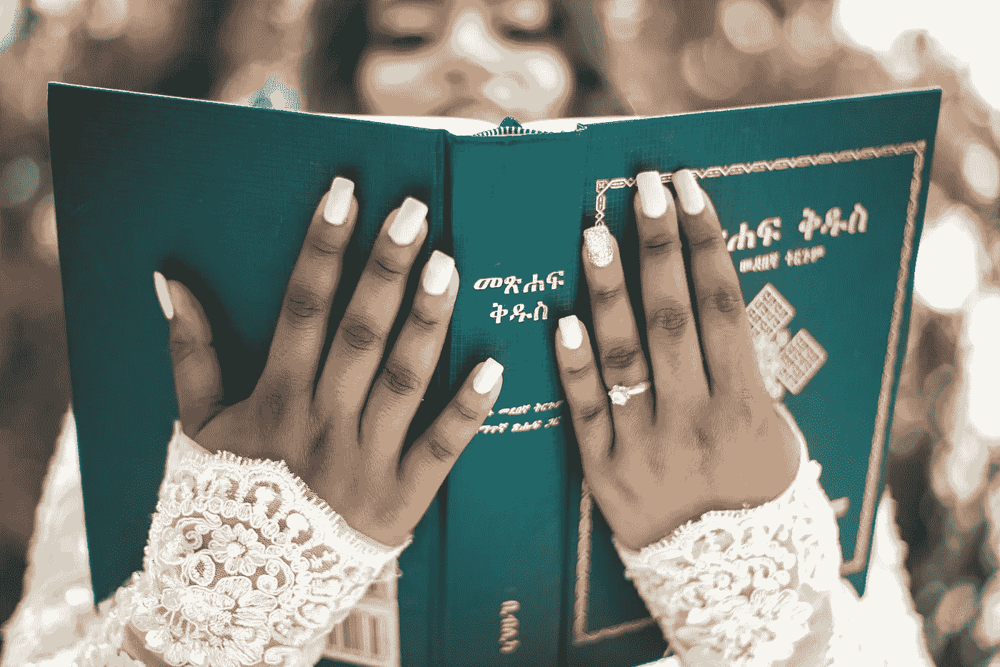

# 金钱圣书

> 原文：<https://medium.com/coinmonks/the-holy-book-of-money-f8f8c8aa05b7?source=collection_archive---------7----------------------->

金钱是我们现代的上帝吗？我们应该崇拜它吗？许多人认为它是快乐的力量和源泉，但你应该乞求它让你更快乐吗？

金钱是一种宗教；它有原则、信仰、罪恶和美德。要想变得富有，你必须相信金钱隐藏的力量并遵循它的方向，避免它的罪恶并传播它的信息，并启发有需要的人。