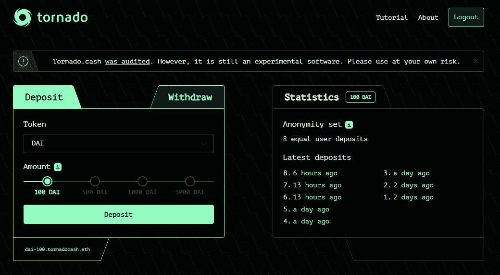
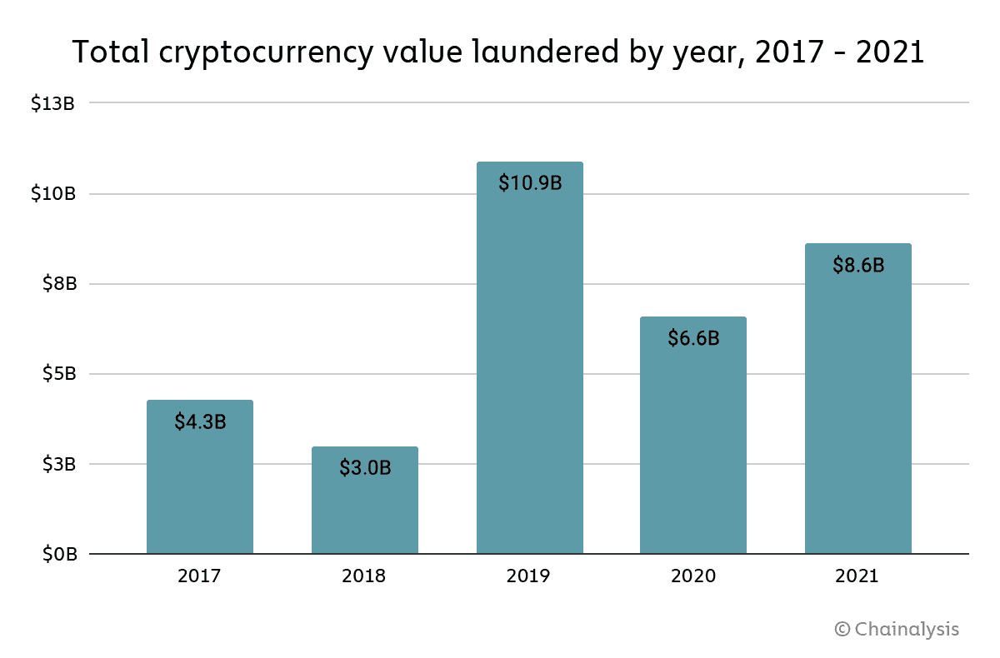
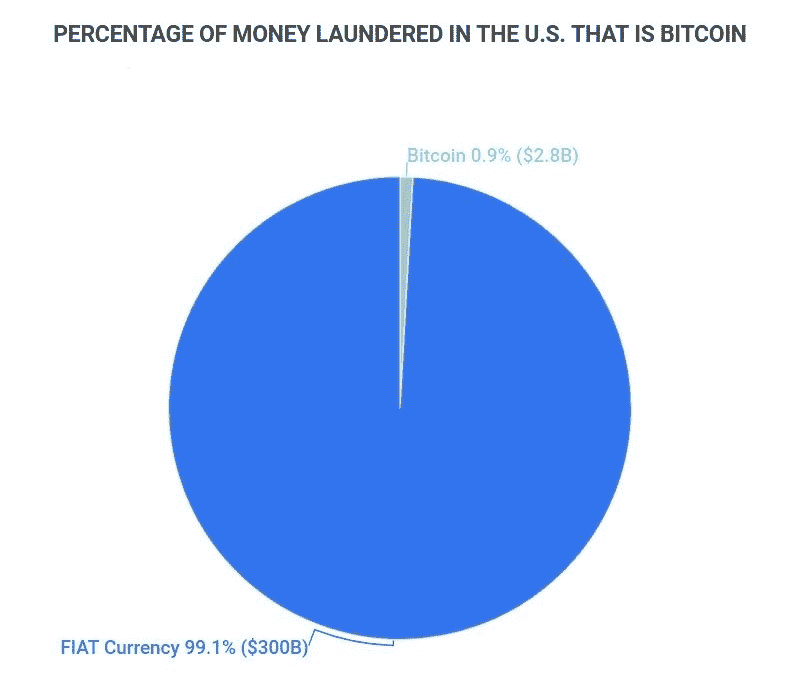

# 龙卷风现金镇压背后的虚伪

> 原文：<https://medium.com/coinmonks/the-hypocrisy-behind-the-tornado-cash-crackdown-b348719b166a?source=collection_archive---------18----------------------->

现在，龙卷风现金被美国财政部制裁已经一周多了。发布了大约 336 行 Solidity 代码的 [Github](https://github.com/tornadocash/tornado-relayer) 已经被关闭，其中一名开发者已于上周五被[荷兰警方](https://thehackernews.com/2022/08/tornado-cash-developer-arrested-after.html)逮捕，其以太坊令牌被撕毁[自发布到本文撰写之时已经下降了 61%](https://coinmarketcap.com/currencies/torn/) 。crypto 中最广泛使用的混合器和隐私增强项目之一显然已经被击败。还是有？

在弄清楚之前，这里有一个短期运行什么是龙卷风现金(是？).Tornado Cash 是一个混合器，这意味着一个钱包可以匿名向另一个钱包发送一定数量的 ETH，因为 Tornado 将几笔交易组合在一起。在之前的文章[中，我写了更多关于 mixers 和其他关注隐私的区块链制裁项目的内容。就接收钱包而言，它从 Tornado Cash 获得了一些资金，但无法辨别资金的(先前)来源。其工作方式是，用户存入固定数量的 ETH，并获得收据。然后，他们可以将该收据发送给另一个用户，以便提取相同金额的资金。私人的，无法追踪的，匿名的。](https://totiavlad.substack.com/p/privacy-coins-and-sanctions-are-a?utm_source=%2Fprofile%2F87329865-vlad-totia&utm_medium=reader2)

不幸的是，正如新技术和本应是基本权利的情况一样，坏人和罪犯为了自己的利益滥用这一制度。最臭名昭著的例子莫过于最近据称朝鲜支持的拉扎勒斯集团通过浪人网上的[桥对](https://www.wired.com/story/ronin-hack-lazarus-tmobile-breach-data-malware-telegram/)[和谐一号](https://fortune.com/2022/06/30/north-korea-lazarus-group-hackers-behind-100-million-harmony-crypto-heist/)和之前的【Axie Infinity】进行的黑客攻击。在这两起案件中，该组织显然使用了“龙卷风现金”来使资金来源在他们的以太坊地址中无法追踪。虽然通过加密进行洗钱肯定是一种活跃的现象，但它仅代表全球洗钱的一小部分，与来自其他来源的大量脏钱相比就相形见绌了。

这并不是说我们应该忽视洗钱和其他犯罪活动，这些犯罪活动利用区块链来混淆执法和便利他们的活动。任何地方的罪犯都应该在他们的法律管辖范围内最大限度地被抓获和审判，执法部门绝对应该为此使用他们所掌握的一切手段。洗钱是一种非常普遍的现象，资金可以通过几乎任何手段从黑市转移到公开市场。小企业、永无止境的建设、银行转账、艺术市场、葡萄酒市场、全球运输和包装路线、赌博、加密，应有尽有。

联合国毒品和犯罪办公室[估计每年全球 GDP 的 2-5%被洗钱。这占到了 8000 亿到 2 万亿美元之间。该办公室估计，全球经济总量中约有 10%是以暗钱形式存在的。根据 Chainalisys](https://www.unodc.org/unodc/en/money-laundering/overview.html) 的数据，2021 年大约有 86 亿美元通过加密手段被洗钱。如果我们考虑 UNODC 的最低估计，这将使全球洗钱总额的 1%多一点。根据 Zippia Research 的数据，仅在美国，2021 年就有大约 3000 亿美元被洗钱，其中只有 28 亿美元(0.9%)是通过比特币完成的。同一份分析指出，同年，比特币占全球洗钱总额的约 0.3%。

洗钱当然是不好的。然而，通过加密洗钱充其量是一种过于复杂的转移资金的方式，在最坏的情况下是一种隐藏资金来源的不同手段。

我个人并不认为通过摧毁一些开发者的生活来针对一个社交网站并“认可”它能算作打击犯罪。除了市场营销和在一些政府强制的 KPI 列表中打勾之外，我不知道它是什么。我之所以相信这一点，不仅仅是因为加密洗钱的影响微不足道。这是因为今天的监管者仍然不明白一个非常简单的事实:你无法监管无法监管的东西。

当然，被撕毁的令牌被关闭了，一些开发者被逮捕或躲藏起来了。然而，龙卷风现金仍然非常启动和运行。我不会在这里把它联系起来，因为我不想在凌晨 3 点醒来时被警察敲我的门。然而，通过谷歌搜索，IPFS 与该平台的链接只有一步之遥。Github 页面可以是 404 的，网站可以被关闭，人们可以被关进监狱。但是，只要有人使用和维护，智能合同就不会过时。无论有多少分析师和金钱来关闭它们，混合器、环签名项目和隐私硬币将仍然存在，因为人们需要它们的存在。隐私不等于犯罪，我愿意相信这一基本权利仍然是:一种权利，而不是一种奢侈。

> 交易新手？试试[加密交易机器人](/coinmonks/crypto-trading-bot-c2ffce8acb2a)或者[复制交易](/coinmonks/top-10-crypto-copy-trading-platforms-for-beginners-d0c37c7d698c)