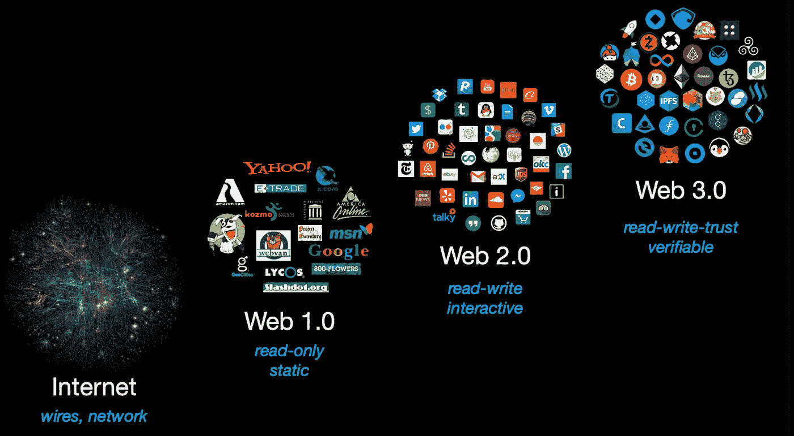
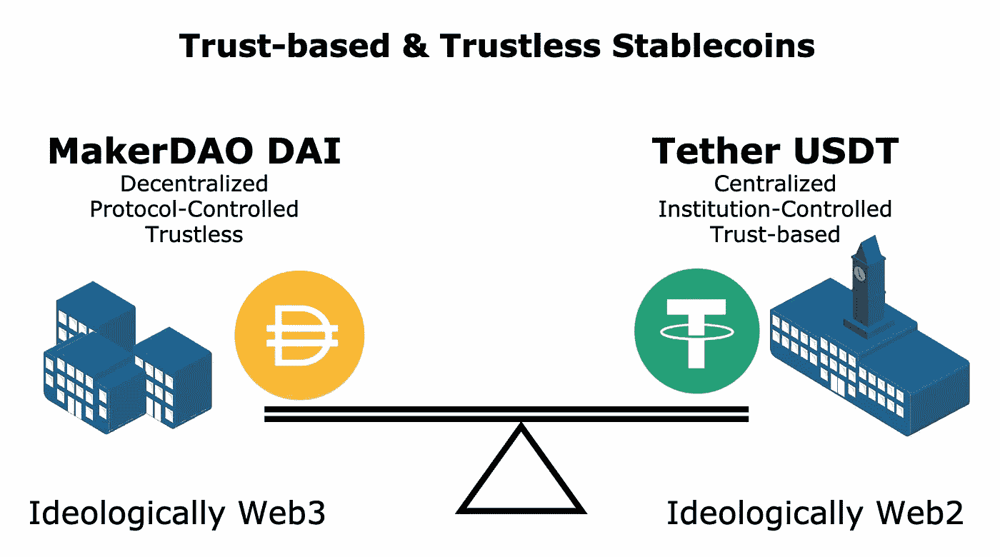
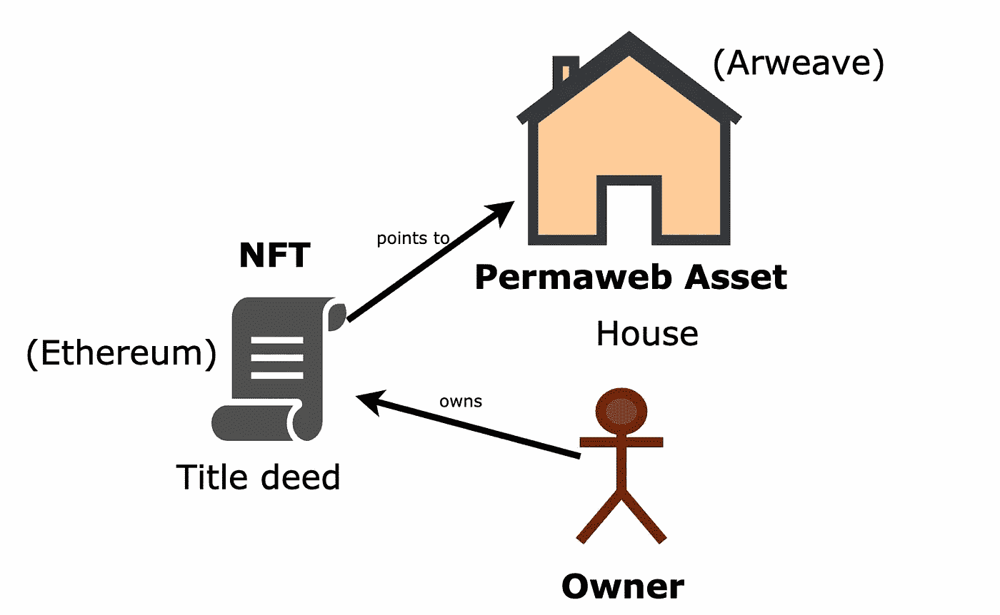
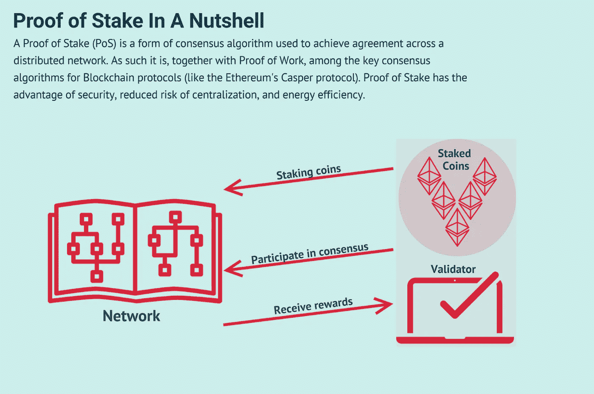

# 💡Web 3 的意识形态

> 原文：<https://medium.com/coinmonks/the-ideology-of-web-3-38d3d9849e5a?source=collection_archive---------2----------------------->

*一种哲学的敬意* [*苏格拉底法*](https://en.wikipedia.org/wiki/Socratic_method)

0xFishylosopher

Evolution of the Web. Source: Protocol Labs presentation [https://www.youtube.com/watch?v=l44z35vabvA](https://www.youtube.com/watch?v=l44z35vabvA)

*这篇文章是对 Web3 的“垂直”介绍，使用三个思想支柱讨论了该行业。关于几代 Web3 项目如何随时间发展的“横向”介绍，请参见我的姐妹文章*[*“web 3 的全家福”*](https://fishyonchain.medium.com/a-family-portrait-of-web-3-7c3b3113bd96)

# 介绍

已经有太多的文章试图解释“Web 3”是什么。那么我为什么要费心写这篇文章呢？作为一名计算机科学家和哲学家，我对 Web 3 特别感兴趣，因为它从根本上来说是一场由技术进步促成的意识形态革命。

Web 3 最重要的技术基础是区块链的使用。区块链之于 Web 3，就像蒸汽机之于工业革命一样——这一潜在的技术飞跃为整整一代新机制提供了动力。从根本上来说，区块链是一个公开可见的、仅附加的数据结构，它的独特之处在于它融合了三个不同的领域:密码学、分布式系统和博弈论[1]。

这三个领域中的每一个都对 Web 3 的意识形态演变做出了贡献。具体来说，**密码术使不信任成为可能**，**分布式系统使永久成为可能**，而**博弈论使自愿成为可能**。在本文中，我将使用这三个原则作为主轴，将无数 Web 3 项目之间的点连接起来，并将 Web 3 的技术创新与其哲学含义并列。

# 不信任——由加密技术驱动

很久很久以前，在一个遥远的地方，“crypto”这个词只是“cryptography”的简写，而不是“cryptocurrency”密码学一直是，并且可能永远是支撑加密货币的关键技术(双关语)。公钥加密(或非对称加密)允许用户匿名发送数据，而不会泄露所述数据。

无论是集中式还是分散式的金融系统，这种数据加密都是非常重要的。这是因为你想防止窥探的眼睛能够查看和窃取您的资金。想象一下，如果你发现你的银行没有采取任何措施来保护你的财务数据，每个人都可以查看你的每一笔财务交易，你会有多愤怒。可怕的东西。

当你有一个分散的金融系统，比如比特币区块链，这一点就更加重要。没有一个中央集权的实体可以让你诉诸法庭。如果你的资金在交易过程中被劫持，它们就消失了。运气不好。这就是为什么比特币协议如此小心翼翼地通过公钥加密保护交易。为了使交易被认为是有效的，用户必须提供“数字签名”，这是一种数据的加密哈希，需要用户的私钥来创建，但只需要用户的公钥来验证[2]。此外，用户发送资金的“钱包地址”本身是用户公钥的散列，提供了额外的真实性证明，表明签署交易的用户是钱包的作者。甚至用户的公钥本身也不会被泄露，直到用户决定发送事务。[3]比特币协议中所有这些细微的设计决定都表明了区块链是如何在不信任的基础上运作的:信任过程，而不是信任人。**毕竟数学靠谱，而人不靠谱。**

**不信任可以作为一个重要的鉴别器，来决定哪些项目在意识形态上是 Web 2，哪些是真正的 Web 3 原生项目。**考虑两个 stablecoin 项目，Tether 的和 MakerDAO 的戴。两者都旨在实现同一个目标，即维持一种与美元 1:1 挂钩的加密货币。但是他们实现的方式截然不同。

Trust-based and Trustless Stablecoins. Source: Original Content.

在系绳的情况下，模型非常简单。每当我给泰瑟一美元，泰瑟就会给我 1 USDT，并承诺我可以随时用 1 USDT 换回 1 美元。问题是，我需要相信系绳不会带着我实际的美元跑掉，把我“拖”走，留给我一文不值的 USDT [4]。因此，从意识形态上来说，Tether 是一个 Web 2 项目，因为它依赖于我的信任，即 Tether 会保护我的原始美元的安全，而不是随它一起消失[5]。

另一方面，MakerDAO 的 DAI 是一个意识形态上的 Web 3 项目，可以说是最成功的去中心化项目之一。戴是通过马克尔道的“过度抵押”贷款协议得以维持的。为了从马克尔道借 1000 戴，我需要锁定至少价值 1500 美元的 ETH 作为抵押[6]。对于傣币来说，用来铸造这些傣币的“过度抵押贷款”成为了货币的支持。当代币价格低于 1 美元时，人们将在交易所购买代币，以折价偿还其代币本金，从而减少代币的供应并抬高价格。另一方面，如果 DAI 的价格超过 1 美元，那么人们就有动机通过将他们的 ETH 作为抵押品来“铸造”更多的 DAI。DAI 供应和 ETH 抵押品的增加将导致 DAI 价格回到 1 美元[7]。

您不需要信任单一的集中式实体，例如 Tether，您只需要信任分散的 MakerDAO 智能契约代码来检查它是否按预期运行。如果您愿意，您甚至可以将代码复制粘贴到您自己的环境中，并运行一系列演示测试来确保它按预期工作。这允许最大的透明度，是 Web 3 意识形态的典型例子[8]。

重要的是，权力下放是一种手段，而不信任是目的。 **权力下放本身并不构成“首要原则”，**因为当有显著的规模经济可利用时，它就没有意义了。考虑垃圾车收集的情况。想象一下，不是让一辆集中的垃圾车每周收集垃圾并把它们运到垃圾场，而是“分散的”,这样附近的每个人都必须每周开车到垃圾场去倒垃圾。这是一个巨大的和不必要的不便。因此，权力下放并不是让一切都变得更好的灵丹妙药。

**相反，只有当不信任、持久和自愿的优势超过被放弃的规模经济时，分权才有意义。现在，让我们把注意力集中在不信任上。在垃圾收集的例子中，所涉及的参与者之间实际上没有任何冲突的动机。人们通常不会真的有强烈的欲望想知道你的垃圾里有什么。而你的垃圾里很可能没有你最秘密最珍贵的物品。因此，信任一个集中的实体，如社区垃圾车的风险非常低，并且从集中中获得的规模经济远远超过成本。**

但就银行数据和金融交易而言，情况正好相反。你把钱存在一家中央银行，而不是放在自己的保险箱里，这实际上并没有多大的规模经济效益。另一方面，许多人会强烈渴望拥有你的钱。因此，分散金融系统以确保一个不可信的网络的优势远远超过其成本。这就是比特币作为区块链项目有意义的原因。

# 持久性—由分布式系统提供动力

**从根本上说，规模经济也是规模的脆弱性。**单点故障非常脆弱，不利于数据的“永久性”正如动物如何繁殖以增加其 DNA 在不确定环境中的生存机会一样，将数据复制到多个位置和“节点”会使这些数据对错误、黑客和系统故障更具弹性。**通过将相同的数据存储在不同的机器上而不是一台机器上，去中心化也是实现永久原则的一个好主意。**

但是跨分布式系统协调数据是一个难题[9]。您如何处理数据损坏以及不可避免地渗透到分布式网络中的恶意参与者？现代区块链采用的关键思想是“拜占庭容错”的概念，这表明只要“坏角色”不超过网络总节点的 1/3，区块链就应该继续运行。本质上，当网络上的一个节点提议将一个块附加到区块链时，它需要收集至少 2/3 的节点验证器的签名，然后才被认为是有效的。这个收集签名的过程被称为“共识”虽然现代区块链以不同的方式实现“共识”(比特币的工作证明、以太坊的利害关系证明、索拉纳的历史证明)，但它们都是“拜占庭容错的”至关重要的是，随着节点数量的增加，**“拜占庭容错”区块链享有分散的规模经济，黑客在共识层面控制足够多的节点来攻击区块链变得更加困难。**

既然我们已经确定了“永久”是如何通过区块链的分布式系统实现的，我们需要问:什么应该是永久的并存储在区块链上？回到垃圾车的例子，你显然不在乎你的垃圾是否消失(事实上你积极地希望它消失)。另一方面，你显然不希望自己的钱有一天突然不见了。因此，比特币分类账等金融交易显然是持久性非常重要的领域。但这还不是全部。**无论是通过宗教、故事、雕塑还是纪念碑，人类总是有一种内在的驱动力，要从我们短暂的生命中打造出一种永恒。数字纪念品，如个人网站、相册和游戏成就都代表了这种在不断变化的生活中对永恒的渴望。这些对我们来说，即使不比我们实际的钱更珍贵，也同样珍贵。**

现在，我们大多把这些东西存储在硬盘或云备份中。但这些根本不靠谱。如果您丢失了硬盘，会发生什么？Google 或者 Dropbox 被黑了怎么办？如果他们窃取了你的数据怎么办？这些 Web 2 解决方案从根本上依赖于信任元素；这些公司可以随时审查和删除你的数据。但是分布式共识使 Web 3 解决方案完全不同。这就是“永久网”的前景，它可以让你最珍贵的数字资产保存多久就保存多久，而不用担心审查。

Arweave 是构建 permaweb 的最著名的项目之一，它承诺以少量的前期费用提供永久性的分布式存储。虽然 Arweave 的设计深受区块链的启发，但它在技术上并没有实现区块链。从根本上说，区块链是一个一维链表，其中一个块只指向最后一个块。另一方面，Arweave 使用“块编织”，其中每个“块”可以指向多个块，形成一个二维图，类似于您笔记本电脑上的“文件系统树”[13]。这种设计允许更有效地访问内容。在共识机制中，Arweave 还使用了“随机访问证明”方法，确保每个节点都可以随机访问存储在 blockweave 上的数据。

NFTs and the Permaweb. Source: Original Content

如你所料，Arweave 和其他分散的“permaweb”协议(如 IPFS)与不可替换令牌(NFT)有着天然的密切关系[14]。**如果在 Arweave 和 IPFS 的 permaweb 资产是一栋房子，那么 NFT 就是这栋房子的地契。**“房子”本身可以被任何参观它或路过街道的人看到。但只有房主持有房屋的地契。而当房主把房子卖给另一个房主时，她并没有对房子本身做什么；她只把它交给买家。拥有地契 NFT 使资产的所有权和转让切实可行，并得到密码保护。**因此，NFT 不仅仅是“加密兄弟的虚荣盘子”；它们作为数字资产的所有权凭证具有实际用途。但地契的价值取决于它所指向的资产。**因此，让我们尝试使用 NFTs 来指向除了猿的图片之外的东西。

# 自愿——以博弈论为动力

Web 3 独特意识形态的第三个原则是博弈论支持的自愿性。人们不会出于利他主义或内心的善良而成为网络上的节点。他们是为了钱。这种博弈论诱导的自愿性在各种各样的地方表现出来，最显著的是作为许多顶级区块链基础的“利害关系证明”共识模型，包括以太坊、多边形和币安智能链[15]。如信息图所示，本质上，你在网络上“标上”一定数量的硬币，如以太坊上的 32 ETH，以成为验证者并参与共识。如果你在网络上是一个诚实的演员，你将获得“赌注奖励”，达到大约 10%的 APY。另一方面，如果你被发现是一个恶意的演员，你的赌注硬币(第 32 个)将被“砍”，你将失去所有的奖励。所以你有一个博弈论的动机去成为网络上的一个诚实的节点。

Proof of Stake in a Nutshell. Image Source: [https://fourweekmba.com/proof-of-stake/](https://fourweekmba.com/proof-of-stake/)

博弈论诱导的自愿性的另一个应用是在分散交易所(dex)中，如 Uniswap 和 Curve，它们分散了充当加密货币交易所的智能合约。这些 dex 的钱从哪里来？他们来自被称为流动性提供者(LPs)的自愿用户，他们将自己拥有的一对硬币提供给交易所，以便交易者可以用来交换它们。作为回报，这些有限合伙人将获得交易者必须通过 DEX 支付的部分交易费用，从而有效地从他们的池币中赚取“利息”[16]。

至关重要的是，不像在 Web 2 中，谷歌和脸书把它的算法强加给你，没有人强迫你在以太坊上下注或成为 Uniswap LP。你出于自愿使用它，因为你知道你有机会获得巨额收入。从意识形态上来说，Web 3 社区是完全自发的，社区行动基本上是由博弈论驱动的。

**这种博弈论驱动的自愿性思想不仅出现在分散金融(DeFi)项目中，也普遍出现在 Web 3 社区中，最显著的形式是 DAO，即分散自治组织。**这些组织将一群有着相似最终目标的人聚集在一起(例如购买美国宪法，就 ConstitutionDAO 而言)[17]，并允许人们使用“治理令牌”对提案进行民主投票，这种令牌由 DAO 发布，用于跟踪成员资格并就如何使用社区资源做出集体决定。

不幸的是，今天真正去中心化和意识形态化的 Web 3 DAOs 很少。许多项目通过某种“治理令牌”声称是 Dao，但是因为运行项目的公司可能持有令牌的大部分，即使有投票，项目实际上是集中的。因此，这些治理标记的“伪 Dao”在意识形态上是引擎盖下的 Web 2，即使它们呈现出分散化组织的诱人外表。

因此，博弈论诱导的自愿性给了我们另一个重要的原则来区分意识形态上的 Web 2 项目和意识形态上的 Web 3 项目。**前者的特点是有一个单一的，集中的实体来决定用户将如何与它互动，而后者将让用户对社区的集体行动进行民主投票。**

# 结论

Web 3 仍处于起步阶段，还有很长的路要走。尽管如此，我们已经可以开始看到它对未来的革命性观点，以及基于不信任、永恒和自愿的意识形态。当然，Web 3 要面对的结构问题还是很多的。例如，当一个项目背后的“公司”和它的社区根本不一致时，你如何前进？公司是压制社区还是放弃权力？此外，区块链如何用于连接离线的真实资源和对象？或者这里有另一个有趣的问题:经济惩罚(如砍杀)足以阻止任何恶意行为者吗？我们还需要诉诸肢体暴力来真正“惩罚”人吗？我确信，在未来，更多的 Web 3 原生项目将逐渐演化出对所有这些问题的满意回答。

**但是有一个紧迫而又挥之不去的问题:Web 3 会对 Web 2 产生什么影响？**集中式和分散式互联网将如何互动？**回想一下，从根本上说，一个意识形态上的 Web 3 项目是一个自愿的项目**。它依赖于自愿的参与者，在博弈论奖励的激励下，参与去中心化社区的积极维护。如果没有人愿意投票、参与和提交，DAO 将要么解散，要么成为事实上的中央集权实体。毕竟，如果没有人投票，民主是行不通的。但是每个人的时间、精力和努力都是有限的，而且不是每个人都关心同样的事情。因此，通常情况下，人们可能更喜欢别人为他们做决定，因为这需要更少的脑力劳动——Web 2 算法，本质上是由人工智能为他们做出选择。

因此，我设想一个 Web 2 和 Web 3 共存的世界。在我们生活中真正关心的部分，也许是一个社区项目，艺术收藏，或者网络游戏，我们可以积极参与并在 Web 3 DAO 或社区中获得收入。但在我们更喜欢自动驾驶的其他部分，我们可以使用 Web 2 解决方案和人工智能系统，它们很乐意为我们做出决定。**重要的是，Web 3 给了我们一个选择**，这是一个可行的替代方案，可以为我们真正关心的生活部分“选择我们自己的命运”，而不是让极权主义的人工智能控制我们日常生活的方方面面。请记住，在 Web 3 中，我们不需要依赖任何人的信任，我们可以确保我们所做的事情按照我们的意愿保留多久，我们可以自行定义我们的优先事项。

因此，自由之风将会吹响。

🐦@0xfishylosopher

📅2022 年 10 月 14 日

# 参考

[1]来自丹·博纳教授，斯坦福的 CS 251:[https://cs251.stanford.edu/](https://cs251.stanford.edu/)

[2]参见 https://river.com/learn/how-bitcoin-uses-cryptography/的

[3]比特币白皮书:【https://bitcoin.org/bitcoin.pdf 

[4]系绳介绍:[https://www . Forbes . com/advisor/investing/cryptocurrency/what-is-Tether-usdt/](https://www.forbes.com/advisor/investing/cryptocurrency/what-is-tether-usdt/)

[5]关于系绳争议的更多内容:[https://www . Forbes . com/sites/seansteinsmith/2022/08/28/crypto-accounting-matters-and-Tether-is-moving in-the-right-direction/？sh=16a1241b72e3](https://www.forbes.com/sites/seansteinsmith/2022/08/28/crypto-accounting-matters-and-tether-is-finally-moving-in-the-right-direction/?sh=16a1241b72e3)

[6]来自 coin desk:[https://www.youtube.com/watch?v=J9q8hkyy8oM](https://www.youtube.com/watch?v=J9q8hkyy8oM)

[7]参见对[的回答 https://ether eum . stack exchange . com/questions/89328/how-do-the-Dai-peg-to-dollar/102052 # 102052](https://ethereum.stackexchange.com/questions/89328/how-does-the-dai-peg-to-dollar/102052#102052)

[8]维塔利·布特林论马克尔道的意义:[https://www.youtube.com/watch?v=XlYyj0WFi9Y](https://www.youtube.com/watch?v=XlYyj0WFi9Y)

[9]参见状态机复制:[https://en.wikipedia.org/wiki/State_machine_replication](https://en.wikipedia.org/wiki/State_machine_replication)

[10]拜占庭容错的细节:[https://decrypt . co/resources/Byzantine-Fault-Tolerance-what-is-it-explained](https://decrypt.co/resources/byzantine-fault-tolerance-what-is-it-explained)

[11]英国哲学家约翰·格雷的著作《永生委员会》对这一主题进行了有趣的探索

[12]perma web 简介:[https://ar weave . medium . com/welcome-to-the-perma web-ce 0 E6 c 73 ddfb #](https://arweave.medium.com/welcome-to-the-permaweb-ce0e6c73ddfb#)

[https://arweave.news/what-is-arweave-ar/](https://arweave.news/what-is-arweave-ar/)

[https://docs.ipfs.tech/how-to/mint-nfts-with-ipfs/](https://docs.ipfs.tech/how-to/mint-nfts-with-ipfs/)

[15][https://wiki . polygon . technology/docs/home/polygon-basics/what-is-proof-of-stage/](https://wiki.polygon.technology/docs/home/polygon-basics/what-is-proof-of-stake/)

[16]uni swap 简介:【https://whiteboardcrypto.com/uniswap-v3/ 

[17]constitution Dao:[https://coinmarketcap . com/Alexandria/article/constitution Dao](https://coinmarketcap.com/alexandria/article/constitutiondao)

> 交易新手？尝试[加密交易机器人](/coinmonks/crypto-trading-bot-c2ffce8acb2a)或[复制交易](/coinmonks/top-10-crypto-copy-trading-platforms-for-beginners-d0c37c7d698c)