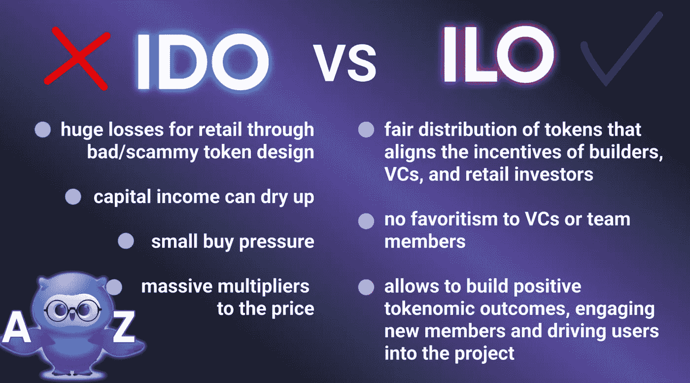
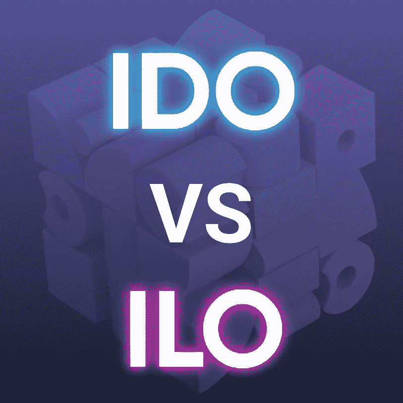

# 国际劳工组织已死——国际劳工组织万岁

> 原文：<https://medium.com/coinmonks/the-ido-is-dead-long-live-the-ilo-82e364239ab6?source=collection_archive---------22----------------------->

# **什么是 IDO？**

初始 DEX 发行或 IDO 是一种加密硬币(或代币)发行，发生在分散式交易所(DEX)或具有分散式交易所的发射台。

IDO 是 ICO 和 IEO(初始交易)发展的下一阶段。与在交易所上市之前出售代币的 ICO 相反，IDO 中的代币立即在 DEX 上上市，通过该 DEX 出售代币。与 IEO 不同的是，这一过程是分散的，更容易启动(ido 大多位于启动台上，它们的尽职调查程序通常没有交易所严格)。

# **什么是国际劳工组织，为什么它这么酷？**

ILO(首次锁定发行)是 Crypto 融资的下一步。

通常，当项目出售代币(没有 ILO)时，投资者在 TGE(代币生成事件)事件和悬崖期之后开始收到代币。除非这些时间段结束，否则用户不会从项目中获得任何资产，但他们已经为他们的令牌支付了费用。

就 ILO 而言，购买代币的投资者会收到包裹在 NFT 中的代币。

要从非关税壁垒中获得代币，他们应该等待 TGE 和克利夫，或者只是打开他们的非关税壁垒——这取决于每个国际劳工组织的条款。

## **有什么区别？**

*   投资者可以在 TGE、悬崖和归属期之前出售他们的 NFT(和里面的代币)。因此，ILO **使他们的投资更具流动性**
*   在一些项目中，NFT 有很多实用函数，所以很多人甚至不打开它们。例如，NFT 赌注、使用服务的特殊条款、游戏中的奖金或高级访问、访问 VIP 活动或与创始人的私人聊天等
*   对于加密项目，ILO 是阻止更多代币进入流通的一种方式——因此，项目代币价格的压力会更小
*   此外，对于项目来说，NFT 可能是一个额外的收入来源——他们可以为与 NFT 的每笔交易设定佣金

# **这里有什么问题？**

75%的已启动项目低于 IDO 价格，尽管其中许多项目一度是 IDO 价格的巨大倍数。

这主要是因为代币的设计，代币发行时浮动很小，因此即使很小的购买压力也会导致代币价格的巨大乘数。在这一点上，在有任何迹象表明产品符合市场或真正的业务发展之前，内部人士会抛售他们的代币以获得即时利润。在这种启动之后，真正创造出有意义的东西的机会微乎其微，因为激励机制并不一致。

团队需要一种方法来筹集资金，并将他们的代币分发给尽可能多的人，以便为他们的项目筹集资金。为什么这么重要？因为只有散户在，VC 和机构资本才在；如果一个人离开，游戏就停止。此外，这从一开始就开始了——如果创始人不能筹集资金，什么也建不起来，整个市场都会停滞不前。

显而易见，launchpads 本质上并不坏，但尽管我们正在走向市场的民主化，加密在很大程度上仍然是业内人士的生意。Launchpads 正试图通过给予新生项目一些应有的关注来解决这种情况。它们在初始令牌分发和为新产品建立早期用户基础方面发挥着重要作用。

# **为什么 ILO 这么牛逼？**

这种启动策略允许社区建立积极的 tokenomic 成果，吸引新成员并推动用户加入项目。我们的社区=我们的用户。这对我们很重要，你对我们也很重要。

token 解锁的更长时间范围为团队提供了一个在投资者支持下构建项目的机会，投资者现在受到长期成功的激励。

主要问题是，在 ILO 中，用户甚至可以在悬崖和归属结束之前出售他们的代币(在 NFT 境内)!

# **适合国际劳工组织的令牌组学模型，或者为什么我们应该考虑得更长远？**

因为没有动态锁定令牌组学模型的 ILO 启动只是延迟了锁定令牌释放后不可避免的转储。

另一方面，正确执行的 ILO 具有创新的令牌模型，包括既得令牌乘数、每日 APY 奖励和额外激励，为协议及其令牌的成功发布和未来提供了框架。

# **8 点怎么工作。金融？**

八分钟后。融资我们还提供通过 ILO 购买包裹在 NFT 中的代币的机会。一些细节:

*   我们将只铸造 1000 个 NFT:
*   800 NFTs 是基本的(购买 1000 USDT 到 5000 USDT 的 8F 代币)，
*   200 NFTs 是唯一的(用于购买 5000 USDT 或更多的 8F 代币)
*   https://bit.ly/3KG3pjw NFT 系列的名字是疯狂的猫头鹰——你可以在这里找到他们的设计——

## 实用功能:

*   所有者可以在 TGE、悬崖和归属之前出售/转让 NFT
*   用 30%的代币收益率押上赌注
*   在加密游戏中获得独特的锦标赛和活动
*   在加密游戏中获得独特的初始包和有限的皮肤
*   获得 NFT 持有者的私人 VIP 聊天
*   访问 8 的已关闭事件。金融和我们的合作伙伴

我们认为国际劳工组织模式是国际劳工组织模式的自然继承者，具有文章中描述的一些显著优势。

> 我们欢迎您阅读更多关于我们的 NFTs[https://docs . 8 . finance/wiki-eng/token omics/fair-token-sales/8f-tokens-wrapped-in-crazy-owls-NFTs](https://docs.8.finance/wiki-eng/tokenomics/fair-token-sales/8f-tokens-wrapped-in-crazy-owls-nfts)并购买它们—【https://bit.ly/3gH1ekO】T2

八点。金融，我们有一个市场，用户可以在那里购买 8F 和 8G 的加密游戏蛇很多项目。此外，我们有公用事业 NFT，为其所有者提供了许多有趣的功能。我们称他们为疯狂猫头鹰。发布后，我们不销售 NFTs，但其他用户销售。

疯狂猫头鹰 NFT 是证明 8F 代币权利的文件。在疯狂猫头鹰 NFT 里面有被包裹在 NFT 里的代币，你可以买代币或者里面有代币的杨百翰 NFT。为什么要买 NFT？以获得其效用，并能够在断崖和归属前出售代币。

开始悬崖和归属倒计时，你应该“解开”8 NFT。金融平台。在这种情况下，NFT 将被烧毁，令牌悬崖和归属将从“解开”发生的钱包开始。在 NFT 被“打开”之前，悬崖期和归属期不会开始计算。

NFT 可以在任何时候发送和出售给其他人，允许投资者在悬崖和归属期结束前退出。

八号。金融劳工组织已经开始购买代币或包装在 NFT 代币中的代币，请遵循此处的说明[，参与者可以选择将代币包装在包含锁定 8F 代币的 NFT 中。](https://docs.8.finance/wiki-eng/getting-started/how-to-buy-8f-tokens-at-private-sale)

NFT 的主要特点之一是能够在任何时候出售或以项目令牌的 30%的利润对其进行投资。

除了在锁定期内提供既得代币，疯狂猫头鹰 NFT 还授权持有者进入 NFT 持有者的私人 VIP 聊天；访问已关闭的在线和离线活动:与项目团队的已关闭 ama，免费访问或折扣我们和我们合作伙伴的活动；加密游戏在贪吃蛇中的额外好处，以及其他更多好处

如果你想了解更多关于疯狂猫头鹰 NFTs tokenomics 模型，NFT 赌注，保证收益率等，你可以在这里找到更多信息。

# 结论

总之，我们认为国际劳工组织模式是国际劳工组织模式的自然继承者，因为其特点包括:

调整风险投资、团队和零售激励

作为防止泵送和倾倒的安全措施

给协议时间来建立一个伟大的社区和产品

国际劳工组织为所有人制定激励措施，并通过确保团队开发出能创造实际价值的产品来保护零售。我们希望激励用户和构建者参与这一新的发布策略。

去买 8 个。私下出售的金融代币，请遵循此处的说明[。](https://docs.8.finance/wiki-eng/getting-started/how-to-buy-8f-tokens-at-private-sale)

> 交易新手？试试[密码交易机器人](/coinmonks/crypto-trading-bot-c2ffce8acb2a)或者[复制交易](/coinmonks/top-10-crypto-copy-trading-platforms-for-beginners-d0c37c7d698c)