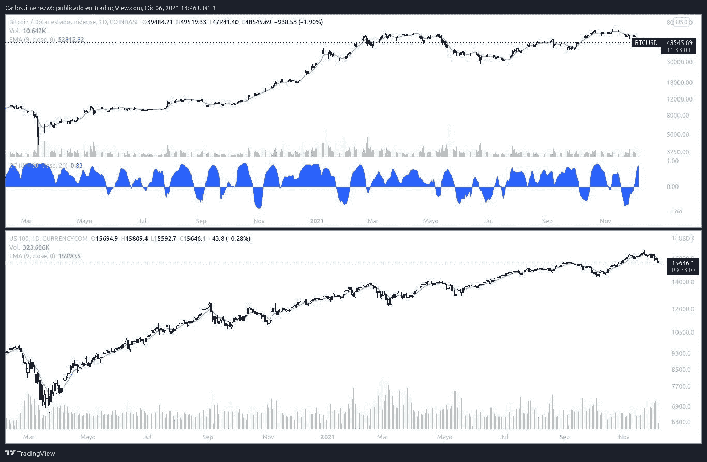
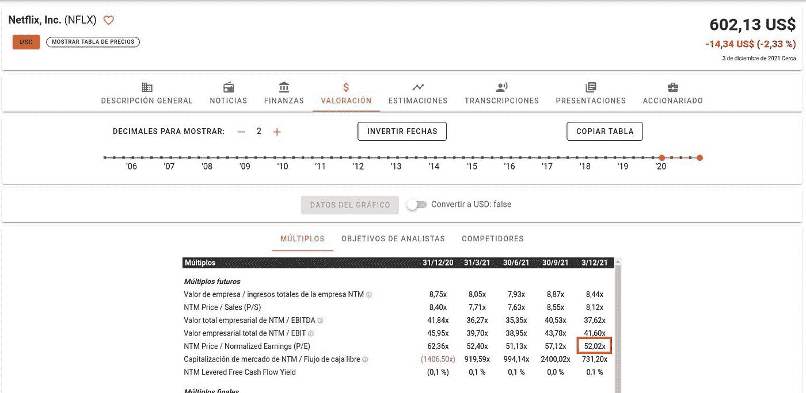
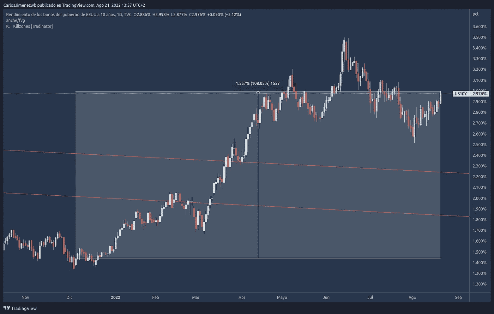
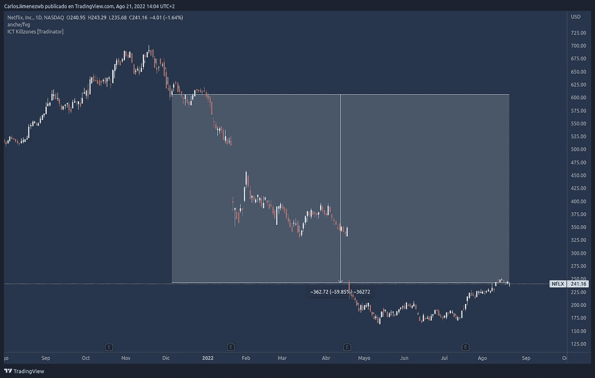
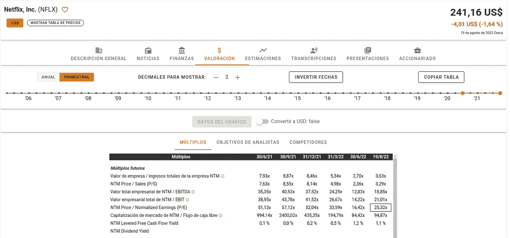
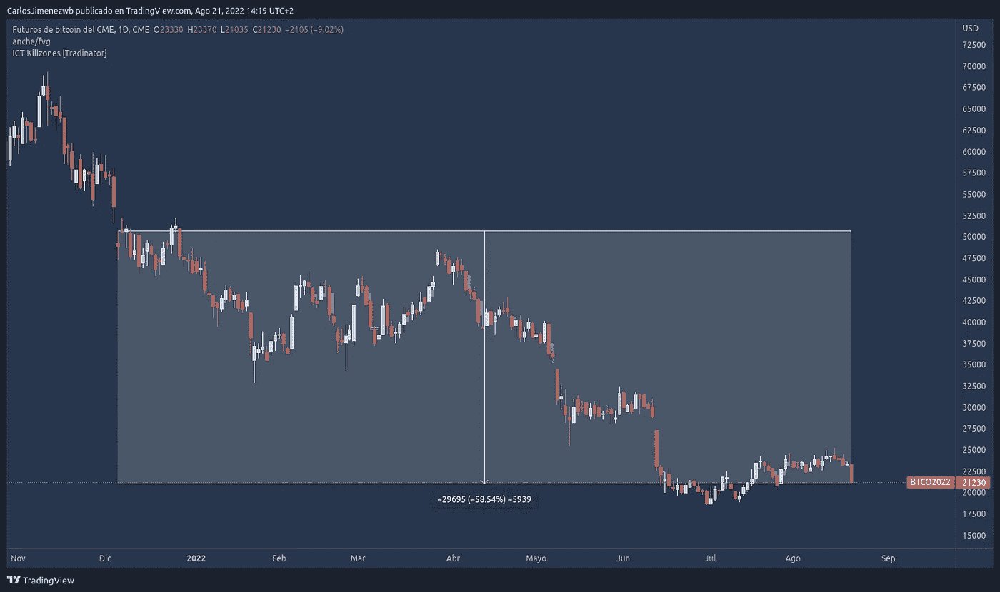
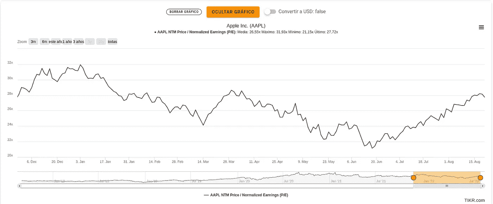
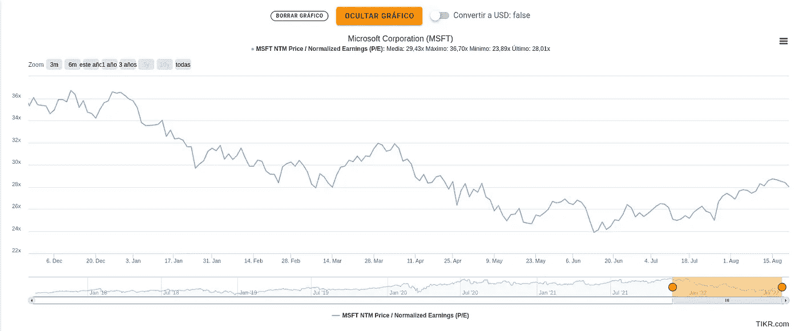

# 固定收益对风险资产的影响

> 原文：<https://medium.com/coinmonks/the-impact-of-fixed-income-on-risk-assets-c220e69dec5f?source=collection_archive---------26----------------------->

9 个月前，我写了这条推特(西班牙语):[https://twitter.com/Trader_WB/status/1467844069539909638?s = 20&t = fnalx 07 newajgi 3 ojyzqg](https://twitter.com/Trader_WB/status/1467844069539909638?s=20&t=fNAlX07MnEWAJGi3OJYZqg)

我想在这里翻译一下，看看网飞和比特币发生了什么。

[2021 年 12 月 6 日](https://twitter.com/Trader_WB/status/1467844082970079232):我将尝试解释我对股票市场的过度膨胀和高估如何影响#crypto 市场的看法。

要点:
-相关性
-增长
-债券

第一件事是关联🧐.如果我们比较自 2020 年 3 月 COVID 事件以来#比特币和#NASDAQ100 的价格，我们可以看到，大多数情况下都是正相关的:它们往往会一致上涨和下跌。

Correlation US100 & Bitcoin

而#纳斯达克呢？

纳斯达克是世界上最大的大型成长型指数之一。这是什么意思？构成该指数的公司关注未来的创新和增长。好吧，但是对一个公司来说，关注增长意味着什么呢？🤨

在计算股票的预期回报时，增长成分的权重很大。计算方法如下:

初始回报(IR) +增长(C.)=最终回报(FR)。

不含股息的 IR =(1/每股)* 100。例如，网飞的 IR 将是(1/50)*100 = 2%。

https://app.tikr.com/stock/multiples?cid=32012&tid = 2633241&ref = 3 all 1i

Netflix Financial Data Dec 6, 2021

c 是由分析师指定的预期增长，对于这些股票，它相对于 IR 是高的(因此它们是成长型股票)。假设是 15%。

RF = 2% + 15% = 17%。

债券呢？

这就是固定收益(低风险)发挥作用的地方:债券、其收益率和利率。如果#US10Y(收益率。10 年期美国债券的)增加 2%，所有其他资产都应该增加 2%的 ir 来竞争(C 不受影响)。

例子和后果⬇️

网飞的内部收益率应该从 2%上升到 4%，那么:
4% =(1/PER)* 100->PER 将从 50 倍上升到 25 倍，理论上下降了 50%。

因此，⚠️theoretically 加息会不会给⚠️制造一个类似网飞在纳斯达克股票市场的例子的情景。

正如我们在开始时看到的那样，#比特币和#NASDAQ100 之间的正相关性表明，指数的普遍下跌将在加密货币的价格中复制。

这是 9 个月前的假设，让我们看看发生了什么。

从 2021 年 12 月 6 日到 2022 年 8 月 19 日，US10Y 增长了 1.56%，如下图所示。

US10Y from Dec 6, 2021 to Aug 19, 2022

记得网飞 IR 是~(1/50)*100 = 2%。所以网飞 IR 现在应该是~ 2+1.56=3.56%

3.56% =(1/PER)* 100-> PER 应该约为 28 倍，而 action 应该已减少(50–28)/50 ~ 45%。

Netflix price from Dec 6, 2021 to Aug 19, 2022

Netflix Financial Data Aug 19, 2022

计算是近似的，但结果实际上符合假设。

在比特币中，价格下跌的结果也颇为相似。

Bitcoin price from Dec 6, 2021 to Aug 19, 2022

此外，其他公司，如 AAPL 或 MSFT 遭受的损失要小得多，但也可以公平地说，这些公司已经是老牌巨头，增长可能不那么重要。

我想以我在推特上做的民意调查来结束我的演讲。111 人回答，75%对固定收益一无所知，18%甚至不感兴趣。它给了我们思考的食粮。

感谢您的阅读。

您可以在以下网址找到我:

推特:[https://twitter.com/Trader_WB](https://twitter.com/Trader_WB)

YouTube:【https://www.youtube.com/channel/UCTkUdfI6gL4oKQcT_wMX1Tg 

> 交易新手？试试[密码交易机器人](/coinmonks/crypto-trading-bot-c2ffce8acb2a)或[复制交易](/coinmonks/top-10-crypto-copy-trading-platforms-for-beginners-d0c37c7d698c)