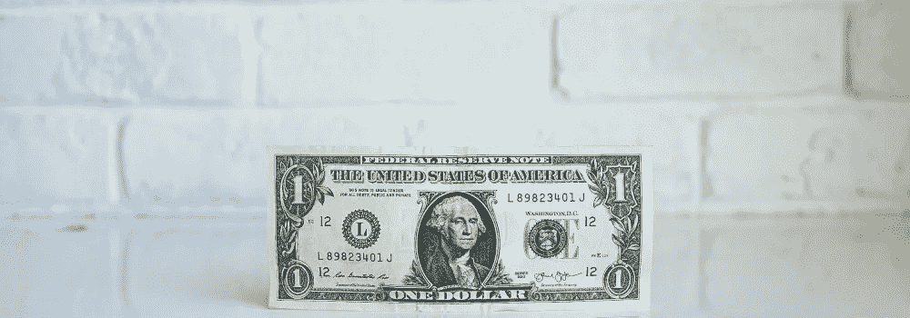

# 多样化的重要性

> 原文：<https://medium.com/coinmonks/the-importance-of-diversification-e6afbb522caf?source=collection_archive---------31----------------------->

你只能从今晚的晚餐菜单上选两个菜。明天，同样的两件物品。每天晚上。你能想象吗？

限制你的食物选择对你的身体健康是危险的，就像限制你的投资组合对你的财务健康一样。奇怪的类比但是真实的。

正如你管理你的生活方式选择，你也管理你的投资组合。最重要的是，你要让自己明白多样化的重要性。当然，你可能持有几只收益不错的股票，你梦想着有一天它们全都飙升。有时候，你很幸运，但有时候，你不可避免地会赔钱。

多元化从来没有像现在这样重要。拥有几项跨行业和投资类型的投资，你可以在市场下跌时帮助抵消你的损失。你知道他们怎么说鸡蛋和篮子的。

# 什么是多元化？

投资组合的多样化是一种方法，旨在通过将金额分配到各种类型的投资机会来降低风险，提高或支持您的回报率。多样化可以帮助你避免惊人的损失，稳定你的表现。

# 你的投资组合中应该有哪些资产类别？

投资的价值基于几个因素，但它们基本上分为三大类:

*   股票和债券等投资工具。这也包括另类投资，如[房地产或土地](https://blog.ark7.com/blog/5-easy-steps-to-invest-in-real-estate/)。这些投资的价值通常随其所属的市场而流动。
*   **供求关系。**这包括石油、天然气和其他天然或其他商品的投资。这类投资的价值通常会受到特定地理位置的政治事件或该位置或地区的法规的影响。
*   **储值。这些投资往往包括老式汽车、艺术品、黄金和其他贵金属。这类投资的价值取决于投资者或收藏家愿意支付的价格。**

# 多样化如何提高你的回报率？

适当的投资组合多样化是个人的选择，但最好投资几种不同类型的投资，包括另类投资和不同的资产类别。投资其他地区也无妨。这提供了对整个投资领域的敞口。

例如，假设你决定分散投资于某个地理区域的几个行业——比如沙特阿拉伯或伊朗。你的投资组合可能是多样化的，但总的来说，你的投资组合或多或少只暴露于一个国家的经济、一种货币和一种商品。在这种情况下，商品是石油。你的平均回报率可能会徘徊在 5%左右。还不错。

如果你只拿出最初投资的一半，转而投资于国际 ETF(交易所交易基金)，由于资产类型和地理区域的进一步多样化，你可能会看到接近 6%的回报率。

但同样，多样化是关键——虽然上面的例子显示了多样化的好处，但你还可以追逐更多的视野。假设你拿出初始投资的三分之一，投入到非流动性的另类投资中。你可能会看到接近 10%的更大回报，因为你现在增加了一种不会随着整体市场波动的投资类型。

重要的是将你的投资分散到多个资产类别、类型甚至地区——想想在不同州的房地产——以真正体验多样化的好处。

那么，它实际上是什么样的呢？

> 交易新手？试试[加密交易机器人](/coinmonks/crypto-trading-bot-c2ffce8acb2a)或者[复制交易](/coinmonks/top-10-crypto-copy-trading-platforms-for-beginners-d0c37c7d698c)

# 如何保持投资组合多样化

虽然任何类型的投资都有风险，但分散投资组合有助于减轻突然的市场波动，并保护您免受不必要的风险。适当的多样化要求你:

*   **改变资产类别。例如，将一部分资金投入股票、债券或共同基金，一部分投入 ETF，一部分投入房地产。**
*   **改变每个资产类别的类型或子类。例如，如果你决定投资股票，将你的投资组合分散在成长型股票和价值型股票之间。**
*   **改变扇区**。真的觉得特斯拉股票？或者你喜欢苹果。科技股是极好的投资，但重要的是分散投资，包括来自多个行业的投资，如能源和医疗保健。

多样化当然提供了大量的选择。那么，你怎么知道你已经足够多样化了呢？还是太多了？

如果你是投资新手，找到最佳投资点——投资者的黄金地带——就像投资一只反映标准普尔 500 的指数基金一样简单。当你掌握了诀窍，你可以添加一两只不同风险水平的指数基金。考虑指数基金:

*   购买不同地理区域的公司股票
*   持有小型成长型公司的股票
*   购买债券
*   拥有各种房地产投资信托基金(REITs)的股份

***你知道吗？*** 用 Ark7，可以购买实际属性的股份。  [了解更多](https://www.ark7.com?tc=8OQ9X)。

每一种投资的表现都会因市场条件的不同而有很大差异。如果你有一个多元化的投资组合，它更有可能在任何时间点都有表现良好的投资。

# 分配资产

资产配置是最受欢迎的多样化形式之一。通过对不同类别的投资进行多种表现，你可以降低将所有鸡蛋放在同一个篮子里的风险。此外，你帮助你的投资组合保持其价值。

例如，假设股票开始暴跌，但其他投资开始飙升，因为精明的投资者正在将他们在股票上的资金转移到风险更低的投资上。举例来说，如果你的投资组合中有股票、ETF 和 REIT，而股市崩盘了，你也不会完全倒霉——不像那些投资组合中只有股票的人。你的投资可能不会像股票一样很快获得回报，但这意味着你不会遭受巨大损失。

# 选择不同的资产类别

虽然在你的投资组合中拥有不同的资产是一个很好的做法，但进一步分散每个资产类别也是一个好主意。还记得世纪之交投资者无法获得足够多的科技股吗？随着网络泡沫的破灭，他们的衬衫被撕破，导致科技股迅速抛售。在 2007 年底和 2008 年初，次级抵押贷款在为股票融资方面做了同样的事情。

# 多元化的房地产众筹

再次谈论食物——比如说，你要请你的朋友来吃比萨饼。你们都为馅饼而努力，知道你们都将得到至少一片。如果有人最后不那么饿了，你们其他人可以把剩下的部分分开。

房地产众筹有点像和你的哥们分享一块披萨。例如，它将多个投资者聚集在一起，共同投资于已经出租的房产，希望从租金收入中分得一杯羹。投资者成为房产的共有人，每个人的投资都比一个投资者单独购买整个房产要少——投资越少意味着风险越小。

这种类型的另类投资比单独购买整个投资物业更具流动性，并能在投资周期内提供稳定的回报。

# 寻找金发区

多样化，就像一般的投资一样，是个人的决定。你的投资组合应该多样化多少取决于多种因素，如你的财务目标和你个人的风险承受能力。没有完美的平衡。你的“完美”多样化对你和你的财务状况是独一无二的。你唯一可能犯的错误是过度分散投资——投资于如此多的不同领域，以至于没有一个领域有足够的投资来真正发挥作用。

虽然你应该为增加额外投资制定一个时间表，但你不应该仅仅为了增加投资而增加新的投资。购买和持有太多不同的资产会使跟踪和管理你的资金变得更加困难。分散投资的全部意义在于让管理风险变得更容易，这样你就能获得足够的回报。

> 加入 Coinmonks [电报频道](https://t.me/coincodecap)和 [Youtube 频道](https://www.youtube.com/c/coinmonks/videos)了解加密交易和投资

# 另外，阅读

*   [最佳加密交易 VPNs】](https://coincodecap.com/best-vpns-for-crypto-trading)
*   [印度最佳 P2P 加密交易所](https://coincodecap.com/p2p-crypto-exchanges-in-india) | [柴犬钱包](https://coincodecap.com/baby-shiba-inu-wallets)
*   [八大加密附属计划](https://coincodecap.com/crypto-affiliate-programs) | [eToro vs 比特币基地](https://coincodecap.com/etoro-vs-coinbase)
*   [最佳以太坊钱包](https://coincodecap.com/best-ethereum-wallets) | [电报上的加密货币机器人](https://coincodecap.com/telegram-crypto-bots)
*   [交易杠杆代币的最佳交易所](https://coincodecap.com/leveraged-token-exchanges) | [购买弗洛基](https://coincodecap.com/buy-floki-inu-token)