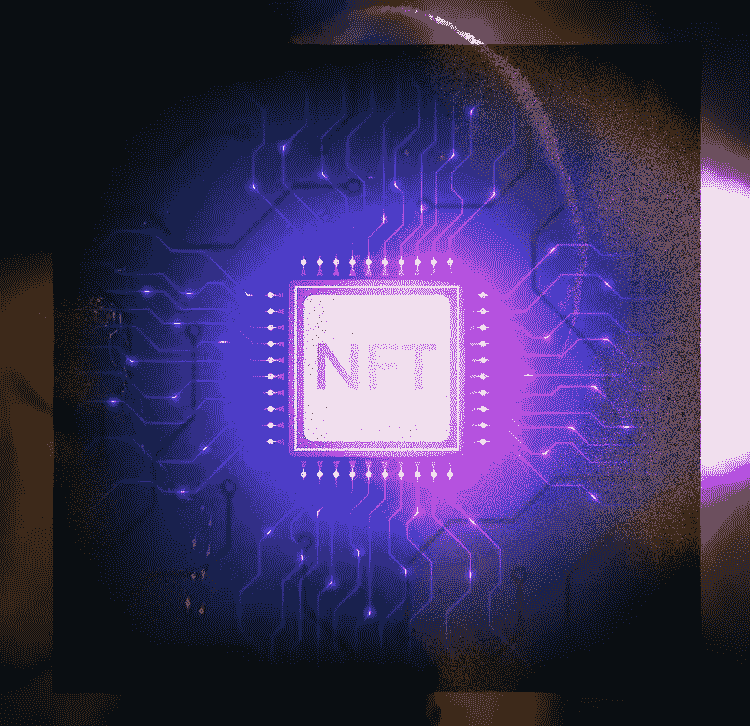
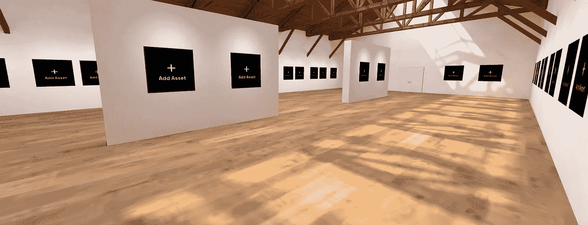
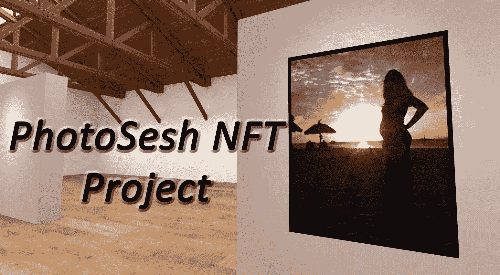
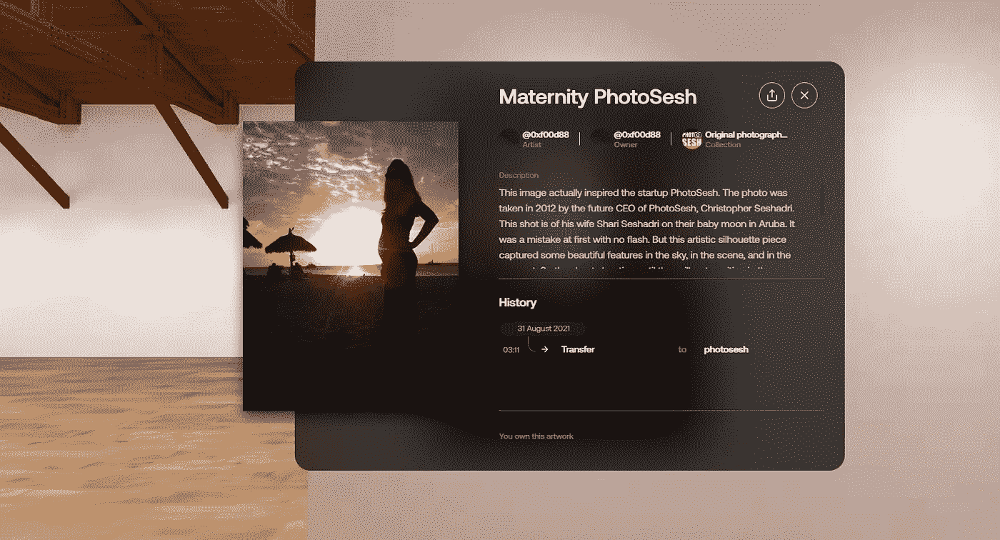

# NFTs 在摄影中的重要性——photoshex 以太坊区块链项目

> 原文：<https://medium.com/coinmonks/the-importance-of-nfts-in-photography-a-photosesh-ethereum-blockchain-project-fd3abaee6e12?source=collection_archive---------41----------------------->

近年来，不可替代令牌(NFT)的使用越来越普遍。NFT 是独一无二且不可替代的数字资产。它们通常用于表示数字世界中的有价值的项目，如艺术、收藏品，甚至是经历。这些例子是最新的热门话题。但是，重要的是要认识到，非功能性测试不是一种时尚，它们会一直存在。许多人担心投机者是否会在这个领域获利，但这是另一个话题。非功能性交易使我们在公共分类账上的日志记录和文档记录更具功能性和效率，而没有一个集中的权力机构来监督它。这将是我们这个世界的一个重要方面，帮助永久记录几乎任何东西，无论是实物还是虚拟物品。它将帮助我们在安全的以太坊区块链上证明真实性，证明所有权，证明其稀缺性。

现在，PhotoSesh 更进一步，致力于一个项目，帮助以可承受的价格和规模标记摄影师的工作。通过这样做，我们希望为摄影师提供一个新的安全和所有权水平，并为营销和货币化开辟新的机会。让我们仔细看看为什么我们认为 NFT 对摄影如此重要。

# NFTs 提供了一个新的安全和所有权级别

首先，NFT 为摄影师提供了新的安全和所有权水平。当你标记你的作品时，你就在区块链上创建了一个永久的记录。这意味着未经您的允许，您的照片永远不会被删除或更改。此外，区块链技术使跟踪每张照片的所有者和分享地点变得容易。这有助于防止侵犯版权，保护您的作品不被窃取或滥用。

An NFT gallery example where photographers can showcase their work on the Ethereum blockchain.

# NFT 也为营销和货币化开辟了新的机会

除了提供更大的安全性和所有权，NFTs 还为营销和货币化开辟了新的机会。例如，有了 PhotoSesh 这样的 NFT 平台，摄影师可以选择以一次性授权或无限量订阅的形式出售他们的照片。这让买家在为摄影服务做预算时有了更大的灵活性，也为摄影师提供了更稳定的收入来源。你甚至可以创建一个虚拟画廊，观众可以探索你的工作。

此外，NFT 使得在照片中嵌入链接、元数据和其他类型的信息成为可能。这为营销活动和其他类型的与买家的互动开辟了新的机会。例如，摄影师可以在支持 NFT 的照片中嵌入他们网站或作品集的链接，或者他们可以包含照片拍摄地点的信息，使买家更容易找到同一张照片的更多照片。

# 使用案例示例…

**这是十亿个独特的例子中的一个，告诉你如何将你的 NFTs 货币化**

实际上有无限的用例，这个特殊的例子不依赖于“NFT 艺术”的价值上升或下降。这是一种体验。想象一下，你会出售 5 年、10 年甚至终身的头像年费。但是在这种情况下，它将是 NFT 形式的可转移数字凭证。当然，你也可以在 NFT 加入一张很酷的图片。但是，让我们添加一些细节到令牌:“谁拥有这个特定的 XYZ NFT 在每年 1 月 1 日将得到一个免费的头像兑换在一月份。”你将如何构建它并定价？那要看你了。记得给它定价，让它值得你的时间和你的套餐持续时间。你将永远知道谁拥有它。这不可能是假的。作为世界上最好的大头照摄影师，你越出名，这幅 NFT 的成交价就越高。；)记住，每次有人将你的代币出售或转让给另一个人，你也可以获得 10%的提成。这个头像包可能不是你对 NFT 的最佳想法，但希望这个例子能帮助我们探索我们可以将非功能性传播作为艺术、服务、数字产品、合同或体验的方向。

Details, description, meta data, and transaction history will be available when a viewer clicks on your art.

总而言之，我们相信 NFT 在摄影领域有一个光明的未来——我们很高兴能够以可承受的价格和规模帮助标记摄影师的作品。如果你是一名摄影师，有兴趣了解我们项目的更多信息，请联系我们——我们很乐意与你聊天！给我们发电子邮件到 info@photosesh.com 的。

克里斯多佛·塞沙德里
首席执行官、丈夫、父亲、蔻驰
[*www.photosesh.com*](http://www.photosesh.com)

> 交易新手？尝试[加密交易机器人](/coinmonks/crypto-trading-bot-c2ffce8acb2a)或[复制交易](/coinmonks/top-10-crypto-copy-trading-platforms-for-beginners-d0c37c7d698c)