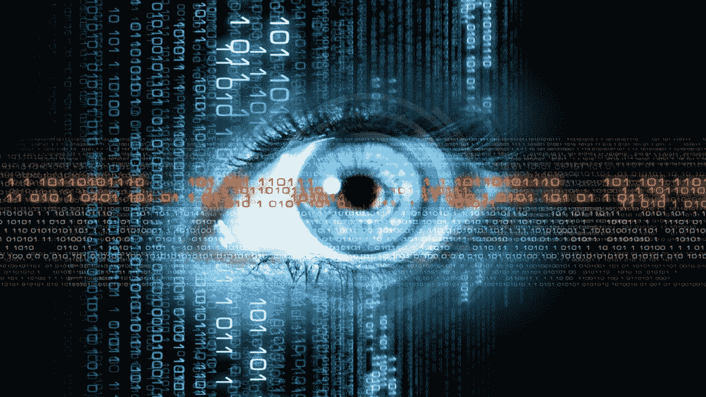

# 隐私和分散身份的重要性。你就是你的数据。

> 原文：<https://medium.com/coinmonks/the-importance-of-privacy-and-decentralized-identity-you-are-your-data-fe3668b5b73c?source=collection_archive---------6----------------------->

我认为，如果所有人都知道你的一切，甚至包括你的想法，你会不会非常脆弱？当然会。

你就是你的数据。

保留关于你自己的信息不是犯罪，也不是源于任何犯罪行为，而只是为你提供安全。

如果你没有隐私，你就不会安全。隐私是安全的一部分，但不是唯一的组成部分。

匿名不是隐私，而是隐藏身份。身份与隐私直接相关。匿名性与身份相反。

考虑到匿名性是完全的隐私，匿名性和隐私经常被混淆，但事实并非如此，因为匿名性是没有身份的，没有身份隐私是不可能的。

换句话说，要有隐私，就必须有身份。隐私是保留该身份的信息。

隐私是个人有选择地向他人透露自己的数据的决定。每个人决定他希望别人了解他什么。在大多数西方国家，这一决定作为一项基于保护个人数据的权利而受到尊重，但最近监管机构似乎想对其进行改变，限制其范围。

在你的一生中，你不应该和你遇到的每个人都谈论你的财务状况，嗯，你不应该这样做。如果你这样做了，你就必须改变你的态度。

在日常生活中，重要的是要清楚这些概念，就像它是在计算。事实证明，今天的电脑是日常生活的一部分，但许多人并不认为它。您的密码、互联网浏览、社交网络以及其他元数据都包含您必须使用隐私和安全工具保护的敏感信息(现在您知道这些信息有所不同)。在某些情况下，匿名是可取的。

虽然有些法律规定，在某些情况下(比如乘坐飞机、进入国境或购买车辆)，人们必须证明自己的身份，但隐私权仍然是一项个人权利。

隐私也不应与犯罪行为联系在一起，因为犯罪分子更喜欢匿名而不是隐私。

在日常生活中，重要的是要清楚这些概念，就像它是在信息技术。事实证明，It 已经成为日常生活的一部分。很多人并没有意识到这一点。

你的密码、你的互联网浏览、你的社交网络，都包含了你必须用隐私和安全工具保护的敏感数据，而你现在知道它们是不同的。在某些情况下，匿名是可取的。

每年，世界各地的公司和政府从人们那里收集越来越多的数据。原因不同，但问题是一样的，侵犯隐私意味着安全性的降低。

在中央数据库中存储真实身份给加密资产所有者带来了相当大的风险，因为信息的泄露或滥用会给资金安全带来风险，甚至会给可能受到威胁或勒索的人的生命带来风险。

## 密码产业和隐私

区块链技术是基于加密技术设计的，在网络上执行活动不需要信任。正是这个概念允许隐私，因为没有必要为了在区块链上操作而用个人数据来识别自己。

但是，大多数区块链都允许对记录的交易进行跟踪，这意味着可以完全透明地跟踪记录在其分类帐中的交易，包括数据、执行日期、金额、来源和目的地地址以及其他元数据。卡尔达诺和比特币一样，都起源于区块链。

虽然无法通过本地方法识别持有人，因为使用非托管钱包参与区块链不需要任何个人数据记录，这也是他们被称为“伪匿名”区块链的原因，但用户的身份可以通过替代方法与资金联系起来，这通常是由于人们的“粗心大意”

在这些伪匿名网络中识别持有人的最常见的漏洞是将在与 KYC 的交易所购买的加密货币发送到非托管的专有钱包，从而可以跟踪整个交易并看到资金总额。

这个问题在卡尔达诺变得更加严重，因为这是赌注的证明，有了赌注钥匙，所有的钱包地址都可以被追踪。

在比特币中，有几种保护隐私的解决方案，其中最好的一种是 Samourai Wallet，它实现了石墙技术，利用这种技术可以保护应用程序的元数据，以防止第三方能够识别相关的钱包。

在卡尔达诺，一个开发团队已经开始设计一个名为[卡尔达诺混合器](https://cardmix.io)的混合器协议，以模糊 ADAs 的可追溯性，然而在 [Tornado Cash](https://www.coindesk.com/policy/2022/09/13/us-treasury-explains-how-us-persons-can-recover-crypto-locked-in-tornado-cash/) 被认为用于洗钱而受到制裁后，以及[一个被指控为该协议主要开发者的人](https://www.coindesk.com/policy/2022/08/12/netherlands-arrests-suspected-tornado-cash-developer/)被捕后，该团队决定[暂停其开发](https://cardmix.medium.com/some-necessary-changes-57cbbfbd42cc)以“避免法律问题”。

有几个隐私解决方案已经存在于设计中，如最著名的区块链 Monero，Dash，Zcash。

但这种类型的协议不受政府监管机构的重视，因为它们使 KYC(了解你的客户)和反洗钱(反洗钱)流程失效，根据法律规定，这些流程要求交易加密资产的机构要求其客户在开户时提供个人数据，如地址、身份证、护照或驾照以及自拍。

其中一个问题是，这些信息提供商的服务器遭到黑客攻击，这种情况比你想象的更常见，会给你的安全带来风险。

那么，解决方案是什么，一个匿名的社会？

不，当然不是，因为我们不能没有身份，因为这是人类关系的全部，知道我们是谁才能理解彼此。

身份包括代表我们是谁的所有不变特征，如种族、出生日期，以及职业、居住地等不断变化的特征。

去中心化的身份允许我们拥有自己的数据。

## 作为隐私解决方案的分散身份

有两个因素构成了分散身份:

—数字身份(DId ),这是关于数据持有者的声明的在线表示，以及

—可验证凭证(VC)，它代表数字世界中的这些断言，类似于我们今天使用的物理文档。

实体，无论是个人还是组织，都使用这些虚拟社区与其他实体共享信息。这种信息共享提出了关于安全性的两个重要问题，与其他实体共享识别信息的安全性如何，以及谁控制数据。

这就是自我主权身份(SSI)的由来。SSI 是一套原则，包括拥有无可争议的权力来控制您与他人共享的个人信息。

这些算法产生随机的独特字符串。当与对等方交换时，DId 会创建一个允许双向通信的安全通道。你所做的一切实际上都是化名，用户可以完全控制他们的数据，以及他们与谁分享这些数据。

在卡尔达诺区块链有一项关于数字身份的开发，名为[阿塔拉棱镜](https://atalaprism.io/)。

另一个肯定会被用作 DId 协议的技术是零知识协议(ZKP ),它被用在 ZCash 中。

ZKP 证明是一种认证方法，在这种方法中，不需要泄露秘密就可以达到证明某人拥有某个秘密信息的目的。

这很重要，因为不共享秘密意味着秘密不能被窃取。

这种类型的协议的目的是证明你知道某个人的一些秘密，而不需要实际泄露秘密。“零知识”这个术语来源于没有信息被透露的事实。零知识测试的本质是，它基于证明一个人拥有某些信息的知识，而不需要明确地披露它。

这一过程涉及两方；论证的“证明者”和论证的“验证者”。*我不会深究这种复杂的技术，我只是提一下关于它的想法*。

通过这种方式，可以在不泄露可能被利用或窃取的数据的情况下证明个人身份，并且您仍然能够拥有您的数据，因为您就是您的数据。

在区块链上阅读更多关于[数字身份的信息。](https://liberlion.medium.com/digital-identity-on-blockchain-4f98babeb2e5)

【liberlion.com 

> 交易新手？尝试[加密交易机器人](/coinmonks/crypto-trading-bot-c2ffce8acb2a)或[复制交易](/coinmonks/top-10-crypto-copy-trading-platforms-for-beginners-d0c37c7d698c)