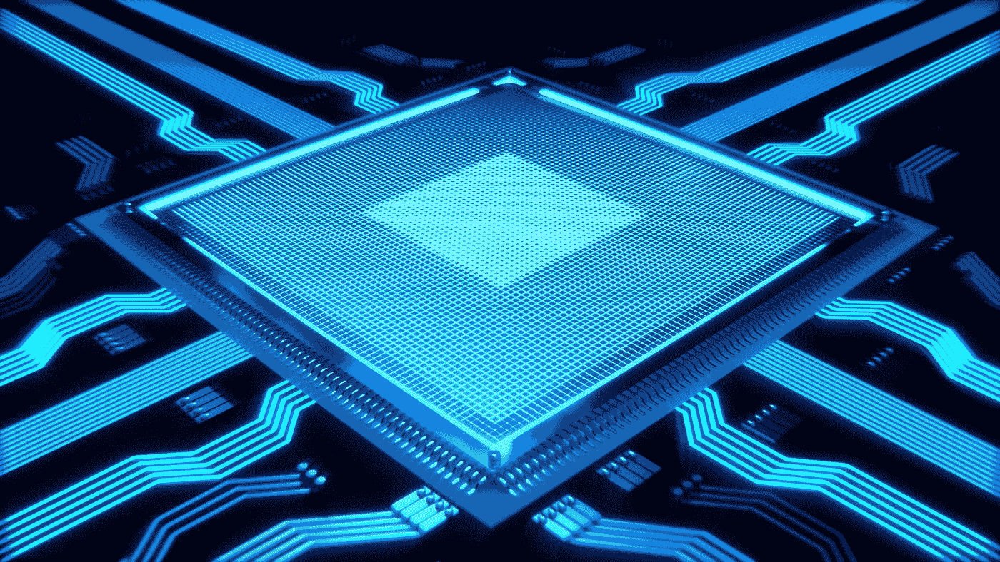

# 量子计算机的重要性

> 原文：<https://medium.com/coinmonks/the-importance-of-quantum-computers-c7ebdc10b260?source=collection_archive---------22----------------------->

## 量子计算将如何改变商业

在人工智能成为主要趋势并在当今商业中发挥重要作用后，量子计算机正在兴起。在 2015 年至 2020 年期间，量子公司的风险投资资金总额增加了 500%！所以我们肯定是在处理下一件大事，不是吗？

# 简单看一下量子领域

但这是为什么呢？是什么让量子计算机如此特别？当人们谈论量子计算机时，人们会听到许多事情。“它们比传统计算机快多了。”
“但是为什么？”
“因为他们和量子合作！”
“是啊，但是是什么让量子如此特别呢？”

到目前为止，我们已经用了很多“量子”这个词，我们甚至还没有开始讨论这个话题。我非常抱歉。但是为了理解为什么量子计算机如此特别，我们需要简单了解一下量子物理学。别担心，我们不会深究的。只是把我们的脚稍微浸入又冷又深的湖水。

这一切都是从量子物理学开始的，这是一种奇怪的物理学，在上个世纪初已经开始发展。到目前为止，当涉及到事物行为的本质时，物理学家总是有相当“经典”的观点——我们现在可以这么说。身体上的东西。我们该如何描绘那幅画面？

理解这个问题的最好方法是看一看著名的双缝实验。想象一堵墙，墙上有两条缝。每一条缝的宽度刚好能让一颗子弹穿过。你朝其中一个缝隙射出一颗子弹。你擅长瞄准，所以你确定子弹会穿过去。
的确如此。一切顺利。子弹穿过了其中一个缝隙。

这就是量子介入游戏的地方。因为“经典”物理学家认为，微观粒子的行为方式与子弹相同。
但是微观粒子的行为并不“经典”。基本上他们想做什么就做什么。以一个电子为例。我们能想象到的最普通的基本粒子(然而对万物的存在如此重要……)。现在我们重复上面的实验，但我们发射的不是子弹，而是电子。

首先，我们必须缩小实验的规模。壁变得更小，缝隙变得更薄。第二，我们需要一支电子枪。那些东西真的存在！但它只是一个装置，在磁场的帮助下产生电子并加速它们。
反正。我们用那支电子枪，把它放在有两个窄缝的墙前面，然后我们开始向那面墙发射电子。
电子将同时穿过两个狭缝。仅仅因为它们是量子的。

这实际上是量子计算的全部基础。量子粒子可以同时处于多种状态。一个电子可以同时在两个不同的地方。所以我们可以用量子粒子来存储信息并处理它。我们如何做到这一点？

# 量子计算机如何工作

这就是我们面对的一个新词:量子比特。量子比特的简称。
量子比特是经典比特的量子类比(这里我们又有很多量子词)。传统的位是 1 或 0，用于存储信息。一个量子比特既是。它可以是 1 或 0，也可以同时是 1 和 0，甚至介于两者之间。因此，这不仅使得在单个量子比特中存储比传统比特更多的信息成为可能，而且使得处理信息的速度更快！

“我明白了，您可以存储更多的信息，但如何让信息处理速度更快？”，你可能会问。
要回答这个问题，记得双缝实验。电子同时穿过两个狭缝，它同时在“做”两件不同的事情。在这个实验中，电子是最初的多重任务者。
当我们谈论处理信息时，我们谈论的是通过执行一定数量的步骤，将像 1010101010 这样的比特序列改变为另一个比特序列 00001010。但是这些步骤必须一个接一个地顺序执行，对吗？
量子计算机可以同时执行这些步骤。
疯了吧？

# 商业部分呢？

超级疯狂，我会说。但这并不“那么”容易。为了让量子计算机比经典计算机更有效地执行某些任务，我们需要特殊的算法。所谓的量子算法。
只能在量子计算机上运行的算法。
Shore-Algorithm 就是这样一种算法。它是由 Peter Shore 在 90 年代开发的，可以比传统计算机更快地分解大数。“嗯，听起来没什么特别的。”“它可以摧毁这个星球上所有的加密系统。”
“什么？”“但它只能在量子计算机上运行。”
就是这么回事。从理论上讲，我们知道如何分解大数，从而利用量子计算机破解地球上的任何加密系统。但是我们需要一台量子计算机。
只要他们还没有准备好，你作为企业主就有时间去准备。

有量子安全加密系统:即使是量子计算机也无法破解的系统。至少那些科学家是这么宣称的。但正如我们所知，只有时间会告诉我们，更重要的是，用真正的量子计算机进行的实验会告诉我们。这就是“后量子密码术”的科学分支正在处理的事情。但是除了破解所有的加密系统，让整个星球变得可攻击之外，量子技术也有一些很好的应用。

量子算法可以用来更有效地搜索大型数据集中的特定数据。特别是随着大数据的兴起以及未来将出现的海量数据，这对许多企业主来说将是一个巨大的解脱。

另一个用例将是优化你作为企业主所能想到的基本上任何流程。最著名的例子是供应链管理。而且在旅游或运输行业，路线的优化和大量数据的分析将需要计算能力，而这只能由量子计算机提供。通过在量子计算机上运行特别设计的算法，电信公司也将找到一种更好的方法来改善他们的网络结构。

所以现在我们知道了我们的未来。作为一个企业主，我们可能认识到量子算法的发展有巨大的潜力。它们必须为特定的问题而特别设计，因此在这方面继续教育的需求越来越大。
在你的业务领域，你可能有疯狂的专业技能，但你需要用量子知识来增强它，以推动你的业务更上一层楼。
“但是我将如何使用量子计算机呢？它们不会超级贵吗？”是的，他们会的。但最有可能的是，你不必为了在你的业务中使用量子计算机而给自己买一台。一个基于云的系统将会出现，在这个系统中，公司只需在量子计算机上租用计算时间——就像 AWS 或谷歌云一样。
这已经发生了。
你已经可以学习如何编写量子算法，并在量子计算机上远程运行它们。
所以未来已经到来。我们需要做好准备。

所以现在我们知道了我们的未来。作为一个企业主，我们可能认识到量子算法的发展有巨大的潜力。它们必须为特定的问题而特别设计，因此在这方面继续教育的需求越来越大。
在你的业务领域，你可能有疯狂的专业技能，但你需要用量子知识来增强它，以推动你的业务更上一层楼。“但是我将如何使用量子计算机呢？它们不会超级贵吗？”是的，他们会的。但最有可能的是，你不必为了在你的业务中使用量子计算机而给自己买一台。一个基于云的系统将会出现，在这个系统中，公司只需在量子计算机上租用计算时间——就像 AWS 或谷歌云一样。
这已经发生了。
你已经可以学习如何编写量子算法，并在量子计算机上远程运行它们。
所以未来已经在这里了。我们需要做好准备。

> 交易新手？尝试[加密交易机器人](/coinmonks/crypto-trading-bot-c2ffce8acb2a)或[复制交易](/coinmonks/top-10-crypto-copy-trading-platforms-for-beginners-d0c37c7d698c)