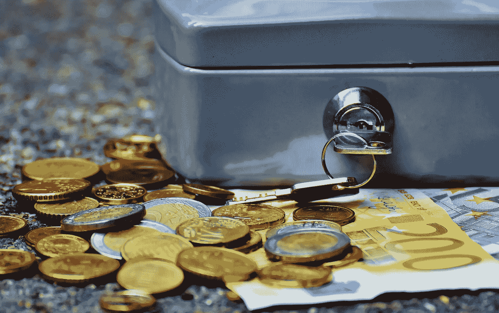

# 自我保管在保护您的数字资产中的重要性

> 原文：<https://medium.com/coinmonks/the-importance-of-self-custody-in-safeguarding-your-digital-assets-d588d07a1da5?source=collection_archive---------42----------------------->

作者:[克里斯托弗·h·卢，医学博士](https://www.linkedin.com/newsletters/financial-freedom-with-dr-loo-6992935013231071233/)

Photo by [Pixabay](https://www.pexels.com/photo/bank-banknotes-bills-business-210705/)

***免责声明:*** *本人观点。不是建议。*

过去一年的事件(Terra，3AC，Voyager，BlockFi，Genesis，FTX)让加密行业蒙上了一层阴影。

他们给许多投资者留下了不好的印象。