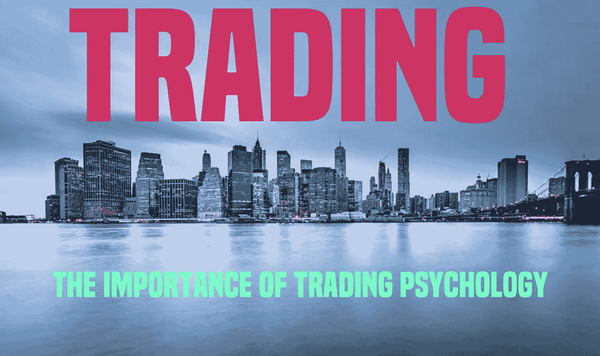

# 交易心理学的重要性

> 原文：<https://medium.com/coinmonks/the-importance-of-trading-psychology-dc3bb0b6534c?source=collection_archive---------55----------------------->

大多数人认为交易成功的关键是找到正确的策略。虽然有一个好的战略很重要，但它不是决定成功的唯一因素。事实上，很多有伟大策略的交易者失败是因为他们没有正确的心态。

交易心理和有一个好的策略一样重要。这是什么让你坚持你的战略，即使当事情…