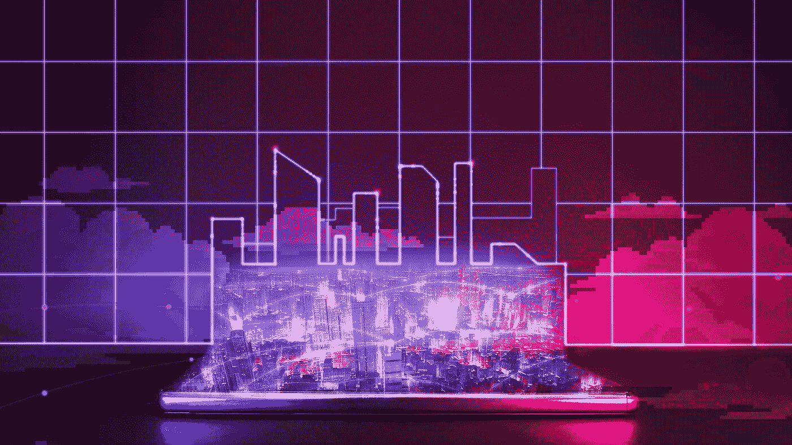

# 为虚拟土地支付数百万美元的疯狂行为

> 原文：<https://medium.com/coinmonks/the-insanity-of-paying-millions-of-dollars-for-virtual-land-1fa0d29af65c?source=collection_archive---------37----------------------->

在脸书更名为 Meta 之后，元宇宙立即成为流行文化。从那以后，关于元宇宙以及它最终会变成什么样，人们的看法不一而足。一些人认为这是对未来的愿景，人们将居住在他们自己的无限可能的虚拟世界中，其他人认为这是扎克伯格将我们囚禁在他自己对未来的愿景中的一种方式，同时收获我们对广告美元的关注。

无论我们是走向虚拟监狱还是数字乌托邦，元宇宙的新闻已经引发了投资者购买元宇宙项目土地的投机狂潮。对于门外汉来说,《元宇宙的土地》听起来像是直接出自经典的骗局之书，除了改编成了密码。为什么你要花真金白银，在某些情况下是几十万，去买一些由实际上并不存在的像素构成的东西呢？听起来很疯狂，元宇宙的土地并不是什么新鲜事。事实上，虚拟房地产已经买卖了几十年，一些数字房地产大亨通过投资变得非常富有。

# 虚拟土地有价值吗？

如果你不是一个经历过疯狂的人，当谈到被夸大的数字资产时，你可能会问，怎么会有人购买只存在于虚拟领域的土地。你会如何评估元宇宙的一块土地？你如何向你的父母解释为什么你把省下来的存款花在一个电子游戏里的一块土地上？为了理解是什么赋予了虚拟土地价值，我们需要回顾一下元宇宙最初的一些概念以及最初的虚拟土地购买。

大多数对元宇宙有更广泛看法的人认为，像《第二人生》这样的视频游戏是导致 21 世纪初这一概念的决定性世界之一。这是在除了尼尔·斯蒂芬森的小说创造了术语“元宇宙”之外，它还没有一个名字的时候。虚拟土地的买卖和租赁是游戏经济的一部分，使用游戏中的货币林登币可以兑换成法定货币。这使得游戏用户可以赚取全职收入，并在虚拟世界中专门建立有利可图的业务。元宇宙的房地产业务不仅仅是出售数字土地，它还涉及开发体验、独特的世界和享有盛誉的位置。世界越有创意，设计越好，体验越令人兴奋，位置越中心，用户越愿意付费。

# 虚拟土地和现实生活中的财产一样吗？

当前元宇宙的土地繁荣也带有类似的基本面。像分散土地、沙盒、Axie Infinity 和 Earth2 这样的元宇宙平台正在迅速发展，通过向潜在的开发商和用户出售土地来获得资金。这些投资可能有风险。这更多的是一种投机热潮，而不是纯粹由价值驱动，就像过去的第二人生销售一样。我们可以在现实生活中的房地产繁荣中看到相似之处。我想到的一个例子是 20 世纪 20 年代佛罗里达的土地繁荣。当时，佛罗里达的大部分是未开发的沼泽地，开发商正以最佳价格出售这个阳光之州。许多投资者在没有看到土地的情况下就买了下来，被告知他们在一个快速发展的州拥有一片天堂。事实是，这片土地的大部分毫无价值，几乎不可能开发。

这和元宇宙有什么关系？土地热潮正在进行中，投资者渴望在未来分得一杯羹。这块土地是否值钱，还有待观察。现实生活中的房地产价值是由与虚拟土地相同的基本面驱动的。位置的可取性如何，土地的最佳用途是什么，有多少交通通过土地？

# 为什么会有人喜欢虚拟世界？

虚拟土地可以有价值，但这完全取决于它是用来做什么的。让我们以沙盒为例。这个用户生成的 3D 游戏是建立在区块链之上的，它鼓励用户构建他们想象中想要的任何东西。阿迪达斯、华纳音乐集团和古驰等品牌已经通过购买自己的虚拟土地来支持该平台以及史努比·道格等名人。这导致了一种狂热，每个人都想购买和出售他们独特的土地，以 NFTs 为代表。假设史努比·道格建了一个虚拟游乐园，轰动了整个元宇宙，每个人都想去看看。如果你买了隔壁的那块地，并且可以直接通过受欢迎的史努比狗狗世界到达，你很可能会经历大量的交通流量。这将使你的位置非常理想。如果你建造了一些高质量的东西，比如说一个虚拟的迷你高尔夫球场，就在游乐园旁边，与几个世界之外的一块土地上的类似迷你高尔夫球场相比，你可能会获得一些令人印象深刻的收入。

为了真正简化虚拟土地的概念，让我们看看元宇宙之前的数字房地产。网站是数字房地产的一种形式，你的域名就是你的一块土地。最理想的域名可以卖到数万美元，甚至数十万美元。元宇宙的房地产繁荣也是如此。投资者希望尽早买入，承担风险，希望这些元宇宙平台能像互联网一样腾飞。他们最终是买下佛罗里达州的沼泽地还是纽约上东区的一部分，取决于元宇宙是成功成为新的网络，还是只是 21 世纪 20 年代的一种时尚。

如果你喜欢这篇文章，并想留在了解所有事情的网站 3，请确保你关注 BAXE 博客并注册我们的邮件列表。

你也可以在 [Twitter](https://twitter.com/BaxeApp) 上关注我们，并加入我们的[电报小组](https://t.me/BaxeCommunity)。

我们承诺让您了解最新信息，尽情娱乐😏

> 加入 Coinmonks [电报频道](https://t.me/coincodecap)和 [Youtube 频道](https://www.youtube.com/c/coinmonks/videos)了解加密交易和投资

# 另外，阅读

*   [加拿大最佳加密交易机器人](https://coincodecap.com/5-best-crypto-trading-bots-in-canada) | [库币评论](https://coincodecap.com/kucoin-review)
*   [火币加密交易信号](https://coincodecap.com/huobi-crypto-trading-signals) | [HitBTC 审核](/coinmonks/hitbtc-review-c5143c5d53c2)
*   [TraderWagon 回顾](https://coincodecap.com/traderwagon-review) | [北海巨妖 vs 双子 vs 比特亚德](https://coincodecap.com/kraken-vs-gemini-vs-bityard)
*   如何在 FTX 交易所交易期货
*   [OKEx vs KuCoin](https://coincodecap.com/okex-kucoin) | [摄氏替代品](https://coincodecap.com/celsius-alternatives) | [如何购买 VeChain](https://coincodecap.com/buy-vechain)