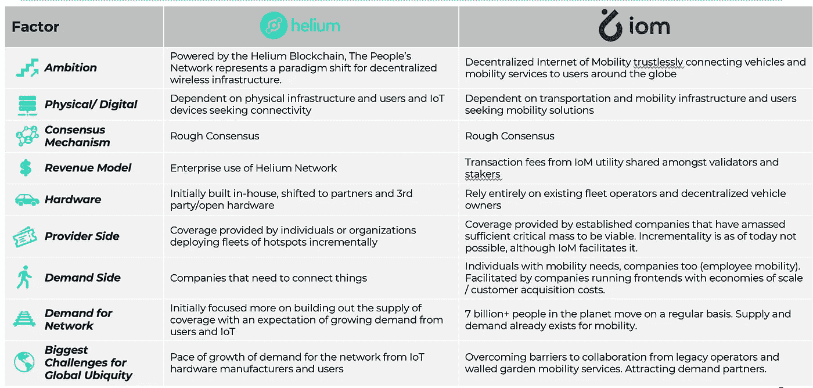

# 移动网络的互联网灵感来自氦网络

> 原文：<https://medium.com/coinmonks/the-internet-of-mobility-network-takes-inspiration-from-the-helium-network-7d315fd40fe0?source=collection_archive---------19----------------------->

与传统企业和 web 2 企业相关的围墙花园商业模式导致了大多数行业的低效、反竞争和高度不完善的市场。虽然这导致了一些过大的 decacorns，web 2 模型导致提取价值捕获，从而导致对网络开发的新 web 3 方法的需求。

氦网络是第一个规模化的 web 3 解决方案之一，为影响现实生活的传统围墙花园模型创建了一个替代方案。在我们寻求建立一个全球分散、可互操作的移动网络时，氦一直是移动互联网团队的灵感来源，本文旨在强调我们从氦网络近年来的巨大成功中获得的灵感领域。

氦团队十年前认识到，为物联网设备构建网络的集中式方法很难扩展，相反，采用更分散的网络可以实现更具成本效益和地域包容性的访问，以满足他们预期的物联网设备制造商和企业不断增长的需求。

今天，氦网络在全球拥有超过 100 万台设备，由令牌激励模式(覆盖证明)驱动，这使我们任何人都能够成为分散、互联的物联网网络的共同所有者和贡献者。这种方法极大地降低了集中式电信运营商创建这种网络的成本障碍。这些激励措施进一步鼓励了电信运营商通常不感兴趣的农村地区的覆盖。

虽然 Helium 现在正在扩展到其他类似的网络，因为他们正在利用相同的模型来生成分散的 5G 网络，但我将主要关注他们最初的物联网网络，因为这激发了我们在构建移动网络互联网时的许多想法。

正如电信网络寻求围墙花园业务模式并未充分服务于某些区域(例如低密度农村地区)或用例(例如物联网网络基础设施)一样，采用 web 2 业务模式的私营运输运营商也试图创建自己的围墙花园，并具有类似的未充分服务的区域和用例/移动性需求。没有一个移动运营商或应用程序可以让您利用一系列移动服务(从出租车和滑板车到公共交通或停车换乘)在城市之间和城市内部自由移动。

> 交易新手？试试[加密交易机器人](/coinmonks/crypto-trading-bot-c2ffce8acb2a)或者[复制交易](/coinmonks/top-10-crypto-copy-trading-platforms-for-beginners-d0c37c7d698c)

为了解决移动性中持续存在的分散的围墙花园业务模式，唯一的解决方案(在我们看来)是一个不可信的全球可互操作的移动网络，该网络无缝连接公共、私有和共享的移动服务。这种网络必须允许用户通过访问移动服务的不可知开放网络来实现“全球移动漫游”,由此用户可以 a)发现它们附近的移动服务，b)组合移动服务用于门对门的连接，c)解锁或预订车辆和服务，以及 d)通过连接到网络的任何接口为那些服务付费。这是国际移民组织网络的雄心。

以下是国际移民组织受到氦网络启发的一些方式(下表比文本摘要更详细):

**1)** **野心**

氦旨在创建无线基础设施的“人民网络”,为爆炸式增长的物联网行业提供动力。国际移民组织旨在创建一个分散的、可互操作的移动网络，以支持全球城市之间和城市内部的无缝移动。

当然，国际移民组织只能希望达到氦网络目前和未来的轨迹，但我相信国际移民组织的愿景同样雄心勃勃。

**2)**物理与数字的关系

Helium 和 IoM 都利用区块链理工大学为企业客户和最终用户无缝连接物理设备(Helium 的节点和 IoM 的车辆/移动服务)。

**3)** **硬件来源/提供商网络**

在氦的情况下，他们连接分散的节点，这些节点由被令牌激励以发展氦网络的用户获得。就 IoM 而言，我们已经开始与成熟的跨国移动服务供应商建立移动网络，包括出租车/拼车、踏板车和自行车共享服务、停车聚合器和服务等。

IoM 希望在未来支持类似氦的分散式车辆和服务连接。例如，今天有超过 15 亿辆私人汽车。车主们越来越愿意将他们的汽车加入 P2P 汽车共享程序，如 Turo 和 Get Around(都是独角兽)以及拼车服务。IoM 将使私人车辆(或停车和电动汽车充电等服务所有者)能够将他们的车辆或服务发布到 IoM，类似于氦网络连接个人拥有的节点的方式。

**4)** **收入模式**

Helium 目前从物联网公司的网络中赚钱，这些公司寻求更普遍、更实惠的无线基础设施接入，他们的设备需要这些接入来保持连接。(注:他们的 5G 网络将服务于企业和无线服务的最终用户)。就移徙组织而言，收入来自预订移动服务的交易费。像当前的氦物联网网络一样，IoM 网络从寻求为其用户或员工提供无缝移动性的企业获得补偿。

IoM 目前的商业需求合作伙伴包括 Brightline Trains(美国私营高速铁路运营商)、伦敦东北铁路公司(英国公共铁路运营商 LNER)和 Vueling Airlines(欧洲一家主要的低成本航空公司，年客运量超过 3000 万)。

**总结思路**

在这篇文章中，我试图说明一个成功的协议，氦网络，如何一直是移动互联网团队的灵感来源，因为我们寻求建立一个全球性的，可互操作的移动网络。虽然我们还处于旅程的早期，但我们已经将目光瞄准了氦网络所产生的影响，帮助解决当今全球交通系统中普遍存在的传统和 web 2 碎片化围墙花园方法的现状所固有的问题。

**关于作者**

*Boyd Cohen 是 Iomob 的首席执行官和联合创始人，Iomob 是一个分散的移动互联网(IoM)网络。自 2001 年在科罗拉多大学获得战略和创业博士学位以来，他在过去的二十年里致力于加速实现低碳可持续经济。这包括出版了 3 本书，多篇同行评审的文章，经常为 Fast Company 投稿，并在智能城市和可持续发展领域创办了一些企业。*