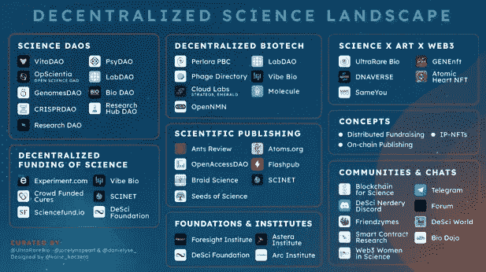
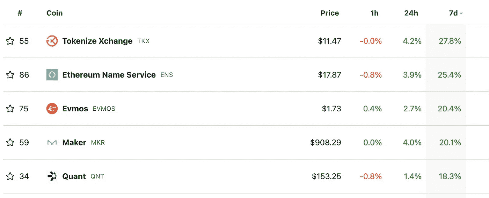

# 就业市场及其全球影响

> 原文：<https://medium.com/coinmonks/the-job-market-and-its-global-impact-219300099df0?source=collection_archive---------48----------------------->

# 内容(4 分钟阅读):

*   🔍就业市场及其全球影响
*   🦹‍♂️网络安全行业急需人才
*   👨‍👩‍👧‍👧Startupy——社区管理的搜索引擎
*   📈本周表现最佳的前五名
*   🔬DeSci 快速指南。
*   📽️什么是[除污](https://www.cryptohopper.com/blog/7764-web3-hollywood-daos-revolutionizing-decentralized-filmmaking?utm_campaign=%5BCopy%5D+Newsletter+friday+redesign+%28all+browsers%29+2022-10-07&utm_content=Newsletter+premium+redesign+%28all+browsers%29&utm_medium=email_action&utm_source=customer.io)
*   📰热门阅读
*   🙏🏻感激…

# 🔍就业市场及其全球影响

美国 8 月份职位空缺减少 110 万个，表明就业市场走软，尚未影响到失业率。失业率稳步下降，目前为 3.5%。对于主要目标是控制通胀的美联储来说，职位空缺的减少是一个好迹象。

此外，我们看到招聘冻结影响到经济的许多部门。这一数据伴随着亚马逊公司[招聘冻结的声明。在解雇现有员工之前，暂停雇佣新员工总是第一步。](https://www.nytimes.com/2022/10/04/technology/amazon-freezes-corporate-hiring.html)

石油输出国组织石油输出国组织决定削减石油产量加剧了全球通货膨胀。该组织在周三的一份声明中宣布，由 13 个国家组成的石油输出国组织集团，加上由莫斯科领导的 10 个盟国，在维也纳的一次会议上同意从 11 月开始，将石油日产量削减 200 万桶。石油供应减少导致油价上涨，从而推高汽油价格。由于运输我们日常使用的大多数产品都需要汽油，这些更高的成本被转移到最终消费者身上。

## 这对市场意味着什么？

随着秘密市场继续类似于股票市场，我们可能会看到一个平静的价格秘密月。随着个人投资者不得不支付更多的钱来支付更高的油价和食品价格，投资于任何资产的资金都会减少，从而对资产价值构成下行压力。

随着假日季节及其额外支出的临近，我们预计市场要到 2023 年才会复苏。随着美联储加息的结束，这种期待已久的复苏可能会放大。

# 🦹‍♂️网络安全行业急需人才。

网络安全行业是一个继续呈指数增长并快速招聘的行业。随着我们走向一个永远互联的世界，元宇宙梦似乎比以往任何时候都更加真实，我们继续看到比以往更多的黑客攻击和利用。

最近，Meta 的安全团队[发布了一份报告，确认超过 400 个恶意移动应用](https://link.axios.com/click/29298710.96606/aHR0cHM6Ly93d3cuYXhpb3MuY29tLzIwMjIvMTAvMDcvbWV0YS00MDAtbW9iaWxlLWFwcHMtZmFjZWJvb2stdXNlci1wYXNzd29yZHM_dXRtX3NvdXJjZT1uZXdzbGV0dGVyJnV0bV9tZWRpdW09ZW1haWwmdXRtX2NhbXBhaWduPW5ld3NsZXR0ZXJfYXhpb3Nsb2dpbiZzdHJlYW09dG9w/61ee341f31571c04df635985B9e15891c)旨在窃取用户的脸书登录信息。这一版本已经公开，但让我们想到大多数数字基础设施在被黑客攻击时是多么脆弱。

几周前，我们[出版了](https://yarocelis.substack.com/p/-july-market-and-hacks-of-the-week)一份时事通讯，重点报道了那一周的加密攻击。黑客渴望利用网桥和加密协议漏洞，因为它们利润很高，而且该领域的安全性不如更集中的系统那样强大。预计这一领域对网络安全专家的需求会大大增加。

[**Startupy**](https://beta.startupy.world/membership/?ref=yarocelis)

> *我很高兴地宣布，我已经成为 Startupy 的策展人和会员。一个社区管理的搜索引擎。零 SEO BS。* [***我邀请你加入这个为漫游、研究和思考而设计的知识和见解的令人愉快的图书馆。***](https://beta.startupy.world/membership/?ref=yarocelis)

# 🔬DeSci 快速指南。

去中心化的科学及其改变世界的潜力。

越来越多的科学家和企业家正在利用区块链工具，包括智能合约和代币，试图改善现代科学。总的来说，他们的工作被称为[分散科学运动，简称 DeSci。](https://future.com/what-is-decentralized-science-aka-desci/)

# 什么是分散科学(DeSci)？

仍处于起步阶段的分散科学(DeSci)处于两个更广泛趋势的交汇点:1)科学界内部改变研究资助和知识共享方式的努力，以及 2)以加密为中心的运动内部将所有权和价值从行业中介转移的努力。

DeSci 运动旨在增加科学资助；从筒仓中释放知识；消除对出版商集团等追逐利润的中介机构的依赖；并加强整个领域的合作。

以科学为重点的区块链倡议可以追溯到 2015 年，但由于新项目的激增，它们直到 2021 年才合并成一个更大的运动。这包括第一次公开科学 NFT 拍卖；拍卖[NFT](https://www.nature.com/articles/d41586-021-01642-3)的研究团体随后崛起；多个以科学为中心的分散自治组织的发展；在去年 10 月由社区领导的区块链活动中，还有一场 DeSci [小组讨论会](https://vimeo.com/639601420?1&ref=fb-share&fbclid=IwAR3v71BsI4wUYMlPSxPpOINdulaZjXoUeVFoxdOq_c6EeyjpNozB6trPO64)， [LisCon](https://liscon.org/) 。

DeSci 相当新，但发展迅速，我们希望看到许多其他行业效仿 DeSci 的例子，试图使他们的行业民主化，使其更加透明。

# 📽️，趁我们还在这个话题上，看看这篇关于[除污](https://www.cryptohopper.com/blog/7764-web3-hollywood-daos-revolutionizing-decentralized-filmmaking?utm_campaign=%5BCopy%5D+Newsletter+friday+redesign+%28all+browsers%29+2022-10-07&utm_content=Newsletter+premium+redesign+%28all+browsers%29&utm_medium=email_action&utm_source=customer.io)的文章

> ***TLDR；—*** *全球电影业被美国电话电报公司、迪斯尼和康卡斯特这样的大公司广泛控制。DAOs 可以开创更民主和更具前瞻性的电影制作，让人们在电影的制作和发行中合作，思想更加开放。*

# 📈本周顶级密码搬运工

**Tokenize Xchange** 是一个完全集成的加密货币交易所，为个人和机构投资者提供无摩擦和简单的用户体验。该平台将不仅作为一个金融工具，而且作为一个教育和公共工具，传播区块链必须提供的价值观和思想。TKX 令牌可用于支付平台上任何交易的交易费用，这样做可以大幅降低费用。

# 📰热门阅读

*   [欧盟新制裁后，Dapper Labs 暂停俄罗斯账户](https://cointelegraph.com/news/dapper-labs-suspends-russian-accounts-after-new-eu-sanctions)
*   据最新报道，火币环球的真正买家可能是孙正义和 SBF
*   [Polygon 的 Web3 扩张计划在 MATIC paradise 遇到麻烦了吗](https://ambcrypto.com/is-polygon-facing-trouble-in-the-matic-paradise-amid-its-web3-expansion-plans/)
*   [超过 12，000 家巴西公司宣布密码持有量创历史新高](https://cointelegraph.com/news/over-12-000-brazil-companies-declare-crypto-holdings-in-record-high)
*   [社交令牌将成为 Web3 从粉丝基础到激励的引擎](https://cointelegraph.com/news/social-tokens-will-be-the-engine-of-web3-from-fanbases-to-incentivization)
*   [鲸鱼购买的比特币与 9 天内积累的价值近 10 亿美元的 BTC 齐头并进](https://zycrypto.com/bitcoin-buys-by-whales-gathers-pace-with-almost-1-billion-worth-of-btc-accumulated-in-9-days/)
*   [据 InvestAnswers 称，智能手机可能会引发大规模加密应用——以下是如何实现的](https://dailyhodl.com/2022/10/09/smartphones-could-be-what-sparks-mass-crypto-adoption-according-to-investanswers-heres-how/)
*   [XRP 诉讼案:在 Ripple 取得决定性胜利后，SEC 的案子出现了令人惊讶的转折](https://zycrypto.com/xrp-lawsuit-sec-case-takes-surprising-turn-following-ripples-decisive-win-in-suit/)

> 交易新手？尝试[加密交易机器人](/coinmonks/crypto-trading-bot-c2ffce8acb2a)或[复制交易](/coinmonks/top-10-crypto-copy-trading-platforms-for-beginners-d0c37c7d698c)