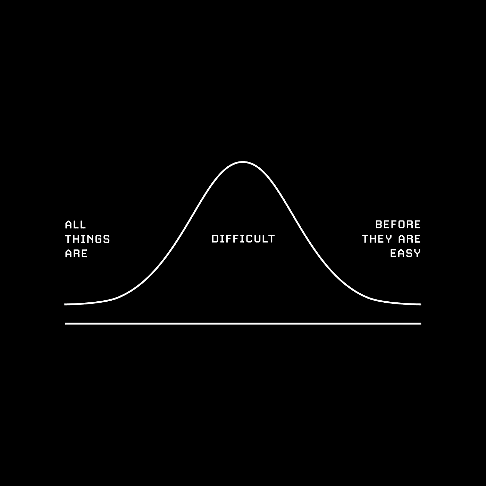
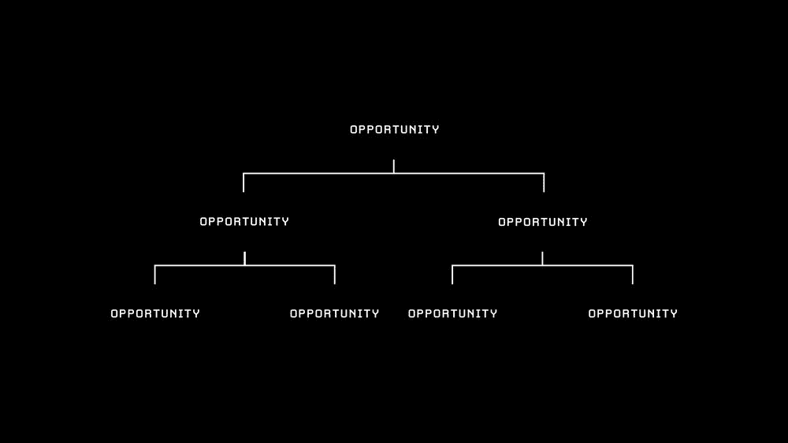
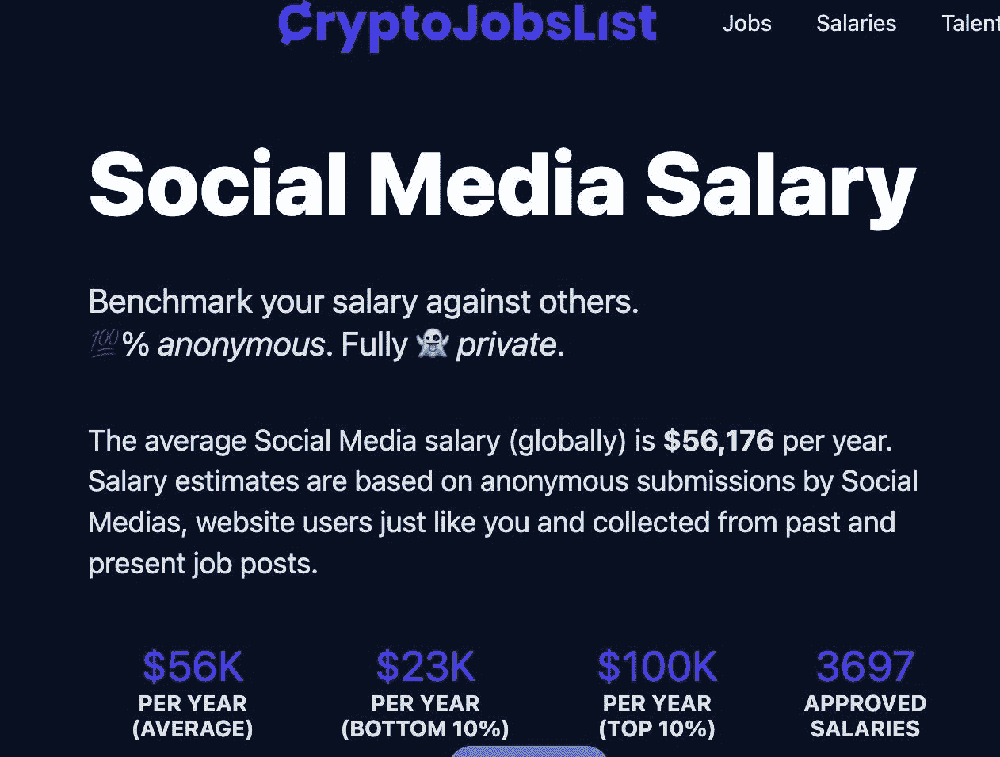
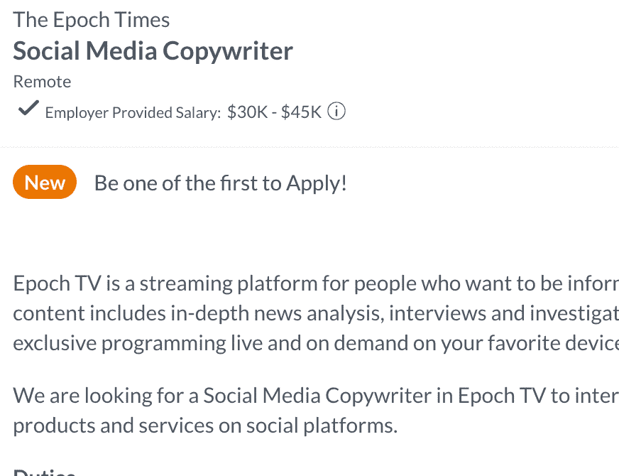
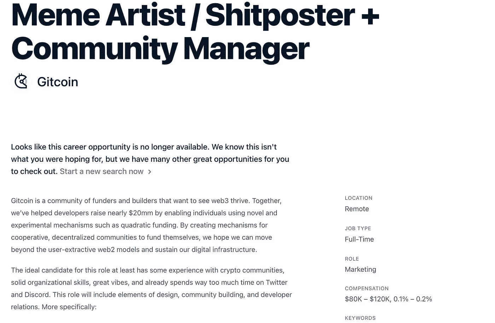

# 加密货币的就业市场正在蓬勃发展——以下是进入该市场的方法

> 原文：<https://medium.com/coinmonks/the-job-market-for-cryptocurrency-is-booming-heres-how-to-get-in-deb374134ada?source=collection_archive---------49----------------------->

如果你正在找一份 crypto 或 web3 的工作，但没有经验，请阅读以下内容:

如果你没有学位、经验或关系，你如何找到一份加密方面的工作？

只有一件事:观众。

本文将涵盖:

-为什么你想在密码行业工作，而不是其他行业

-如何建立您的“工作证明”组合

-与其他行业相比的工资

-外面的工作类型

-grin set 和如何找到成功。

那么，你为什么要从事加密工作呢？

这是我见过的最迷人、发展最快、利润最丰厚的行业。你可以比其他任何领域赚更多的钱，产生更大的影响。好处多，坏处少+你会学到很多，很快。

你怎样才能踏进这扇门？关键是要有观众。就是这样。你不需要学位，不需要以前的经验，也不需要认识任何人。但是你确实需要一个观众。

credit: visualize value

受众的形式可以是 Twitter 关注者、电子邮件简讯、YouTube 频道、电报组、制作 Dune Analytics 仪表盘、博客等。拥有一个观众总会比没有观众打开更多的大门。

cc: visualize value

关键是要证明你知道你的狗屎，并在公共场合这样做。不知道如何吸引观众？想想你感兴趣的角色，你好奇的话题和你想学的东西。

你的‘工作证明’不需要很大，只需要始终如一，高质量。记住，你不需要很多人来伸手，你只需要合适的人来伸手。

一些例子:

[@LinaSeiche](https://twitter.com/LinaSeiche)

在比特币上制作可爱的漫画，并作为商品出售

[@redphonecrypto](https://twitter.com/redphonecrypto)

撰写关于加密领域的惊人论文，并免费发表

[@PatrickAlphaC](https://twitter.com/PatrickAlphaC)

在他的 Youtube 上为开发者提供了最好的入职内容

crypto 公司的薪水高于传统的 web2 公司，这有很多原因(更多的资金，象征性的股权，更快的增长)。以下是 crypto 公司和 web 2 公司社交媒体经理平均薪水的截图。

cc: cryptojobslist.com

接下来是:加密领域的职位名称一直在变化。在其他什么行业中，你在网上做一个狗屎海报能挣近 6 位数的钱？

Grindset:找工作需要耐心和毅力，在你找到第一份工作之前，你会被拒绝很多次。不要气馁，这是每个人都要经历的过程的一部分。

当你向某人伸出援手时，不要显得贫穷或有资格，要谦虚并感谢他们花时间回应你。你想成为他们想帮助的人，而不是他们觉得有义务帮助的人。

总之，
这里是 TL；dr:如果你想找一份密码方面的工作，就通过你的公开作品集来创建展示你的技能和成就的内容。

如果你喜欢这篇文章，请在我的帖子的第一条推特上留言。这是一个很大的帮助。

[https://Twitter . com/crypto comix 1/status/1584263712151830528？s = 20&t = z5l 09 mxajtmyykrqxr 4ia……](https://twitter.com/cryptocomix1/status/1584263712151830528?s=20&t=z5L09MxAjtMmYyKrQxR4iA)

如果你对我应该涉及的话题有什么想法，请在回复中提出或给我发短信。

> 交易新手？试试[加密交易机器人](/coinmonks/crypto-trading-bot-c2ffce8acb2a)或者[复制交易](/coinmonks/top-10-crypto-copy-trading-platforms-for-beginners-d0c37c7d698c)