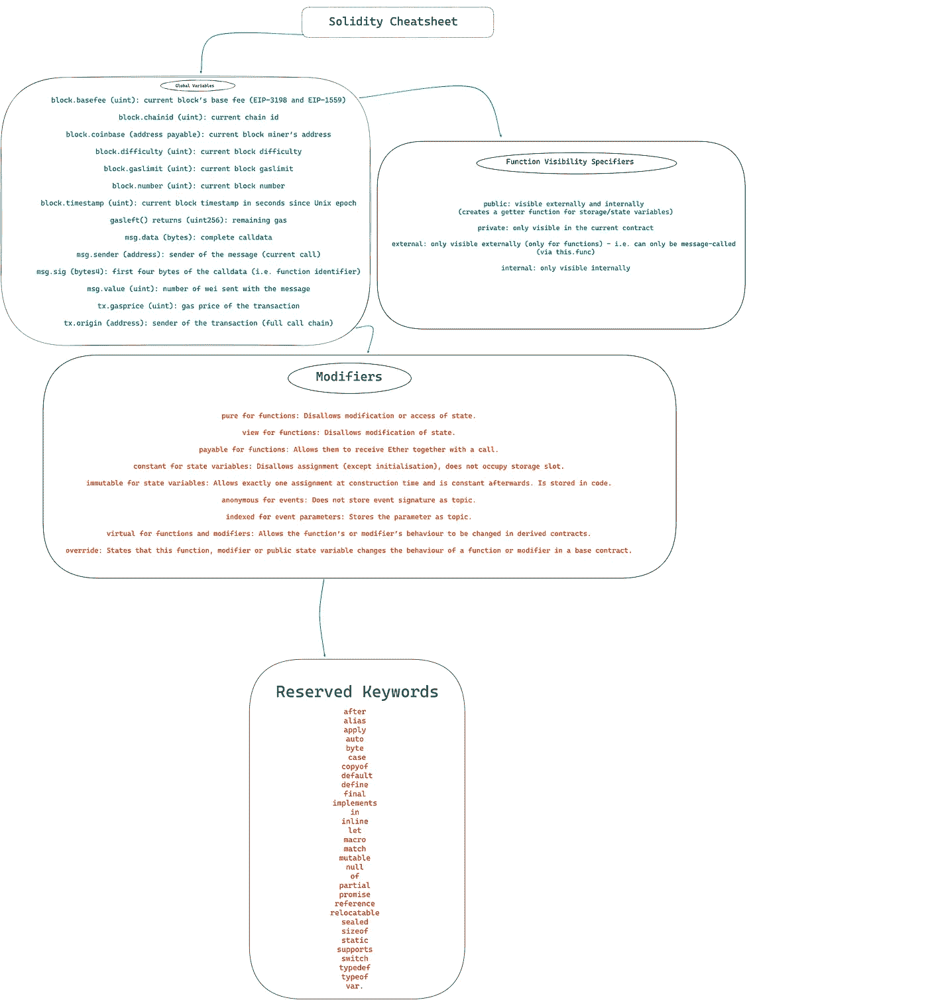

# 学习稳健的终极指南

> 原文：<https://medium.com/coinmonks/the-key-is-solidity-f7d96ea30fd6?source=collection_archive---------1----------------------->

## 一个博客中的语言信息



solidity cheatsheet:

# 固态

Solidity 是一种高级的、面向契约的编程语言，用于编写运行在以太坊平台上的智能契约。Solidity 是专门为在 Ethereum 平台上编写智能合同而开发的，旨在便于具有面向对象编程语言经验的开发人员学习和使用。

简单来说，Solidity 允许开发人员编写在以太坊区块链上运行的自动执行合同。这些合同可用于创建可在以太坊网络上运行的分散式应用程序(DApps ),允许用户与区块链进行交互，并安全地存储和传输数字资产。

Solidity 是一种静态类型语言，这意味着变量类型必须在使用之前声明。它支持各种数据类型，包括整数、布尔值和字符串，以及复杂的数据结构，如数组和映射。Solidity 还包括对继承的支持，允许开发人员创建复杂的、模块化的、易于扩展和修改的契约。

## 坚实度变量:

在 Solidity 编程语言中，变量用于存储可以在合同中使用的数据值。Solidity 是一种静态类型的语言，这意味着变量在使用之前必须用特定的类型声明。

有几种不同类型的变量可用于实度，包括:

*   `bool`:该类型代表一个布尔值(真或假)。
*   `int`和`uint`:这些类型分别表示有符号和无符号整数。整数的大小(8 位、16 位等。声明变量时必须指定)。
*   `address`:此类型代表以太坊地址。
*   `bytes`:这个类型代表一个字节序列。在声明变量时，必须指定字节的大小。
*   `string`:这个类型表示一串 Unicode 字符。

下面是一个在 Solidity 中声明和初始化一些变量的例子:

```
bool success = true;
int8 number = -5;
uint256 count = 100;
address owner = 0x1234567890abcdef;
bytes32 data = 0xabcdef0123456789abcdef0123456789;
string message = "Hello, world!";
```

用不同的数据类型声明和初始化了六个变量。`success`变量是布尔值，`number`变量是有符号的 8 位整数，`count`变量是无符号的 256 位整数，`owner`变量是以太坊地址，`data`变量是 32 字节的序列，`message`变量是字符串。

总的来说，变量是 Solidity 中编程的重要组成部分。它们允许开发人员在契约中存储和操作数据，使得在以太坊平台上构建复杂的动态应用程序成为可能。

## 固态字节

`bytes`数据类型类似于`string`数据类型，但与使用特定字符编码(如 ASCII 或 UTF-8)进行编码的字符串不同，`bytes`数据类型是一个原始的字节序列，没有特定的编码。

要声明一个数据类型为`bytes`的变量，可以使用`bytes`关键字，后跟变量名，如下所示:

```
bytes myBytes;
```

您还可以使用`bytesN`语法指定字节数组的长度，其中`N`是字节数组的长度，以字节为单位。例如:

```
bytes32 myBytes32; // Declares a byte array with 32 bytes
```

一旦声明了一个`bytes`变量，就可以使用`hex`关键字给它赋值，后跟字节数组的十六进制表示。例如:

```
myBytes = hex"01020304"; // Assigns the byte array [0x01, 0x02, 0x03, 0x04] to myBytes
```

除了`hex`关键字之外，`bytes`数据类型还支持`abi.encode`和`abi.encodePacked`函数，这些函数可用于将数据编码为特定格式，以便在函数调用或其他上下文中使用。

## 消息发送者和消息值

`msg.sender`指调用当前函数的账户地址。例如，这可以用于确定呼叫者的身份或实现访问控制检查。

`msg.value`指事务的值，在魏，即调用当前函数。这可用于检查随交易发送的乙醚量，或将金额转移到另一个账户。

以下是如何在可靠性合同中使用`msg.sender`和`msg.value`的示例:

```
contract ExampleContract {
    // Store the address of the contract owner
    address public owner; constructor() public {
        // Set the contract owner to the caller of the constructor
        owner = msg.sender;
    } function withdrawFunds(uint amount) public {
        // Check that the caller is the contract owner
        require(msg.sender == owner, "Only the contract owner can withdraw funds"); // Check that the caller sent at least the amount they are trying to withdraw
        require(msg.value >= amount, "Insufficient funds"); // Transfer the amount to the caller
        msg.sender.transfer(amount);
    }
}
```

`withdrawFunds`函数使用`msg.sender`检查调用者是否是合同所有者，并使用`msg.value`检查调用者是否至少发送了他们试图提取的金额。如果检查通过，该功能使用`msg.sender.transfer`将指定数量的乙醚转移给调用者。

`msg.sender`和`msg.value`是有用的内置变量，它们提供关于调用 Solidity 契约中当前函数的事务或消息的信息。它们可用于实现访问控制检查、传输值等等。

## 固体中的函数

Solidity 中的函数具有以下通用语法:

```
function functionName(parameter1, parameter2, ...) visibility_modifier returns (return_type1, return_type2, ...) {
    // Function body
}
```

这里，`functionName`是函数的名字，`parameter1`，`parameter2`等。是函数的参数，`visibility_modifier`是决定函数是公有还是私有的关键字，`return_type1`，`return_type2`等。是函数返回值的类型。

例如，下面的代码定义了一个名为`addNumbers`的公共函数，它采用两个`uint`(无符号整数)参数并返回一个`uint`值:

```
function addNumbers(uint a, uint b) public returns (uint) {
    return a + b;
}
```

可以使用`functionName(arg1, arg2, ...)`语法从契约内部调用函数，或者通过向契约地址发送事务从契约外部调用函数。

修饰符应用于使用`modifier`关键字的函数，并可用于实现访问控制、参数验证和其他功能。

## 坚实中的继承

继承是有用的，因为它允许开发人员创建复杂的、模块化的、易于扩展和修改的契约。派生协定可以简单地继承基础协定的代码和行为，并根据需要添加自己的自定义内容，而不是将代码从一个协定复制并粘贴到另一个协定。

为了在 Solidity 中实现继承，在派生契约中使用了`is`关键字来指定它所继承的基础契约。例如:

```
contract BaseContract {
    // Code and behavior defined in the base contract
}

contract DerivedContract is BaseContract {
    // Code and behavior defined in the derived contract, which
    // inherits from the base contract
}
```

在这个例子中，`DerivedContract`契约继承了`BaseContract`契约。这意味着`DerivedContract`契约可以访问`BaseContract`契约中定义的所有代码和行为，以及它自己定义的任何代码和行为。

## 可变能见度

从契约外部可以看到一个`public`变量，可以通过调用契约的公共函数来访问它。例如:

```
contract ExampleContract {
    // Public variable
    uint public variable;

    function setVariable(uint value) public {
        variable = value;
    }

    function getVariable() public view returns (uint) {
        return variable;
    }
}
```

`variable`变量被标记为`public`，这意味着可以从契约外部访问它。`setVariable`函数允许将`variable`设置为新值，`getVariable`函数允许通过调用合同的公共函数来读取`variable`。

另一方面，`private`变量在契约外部是不可见的，只能在契约内部访问。例如:

```
contract ExampleContract {
    // Private variable
    uint private variable;

    function setVariable(uint value) public {
        variable = value;
    }

    function getVariable() public view returns (uint) {
        // Access the private variable within the contract
        return variable;
    }
}
```

`variable`变量被标记为`private`，这意味着它只能从契约内部访问。`setVariable`函数仍然可以将`variable`设置为新值，但是`getVariable`函数不能将`variable`值返回给调用者，因为它被标记为`private.`

谢谢你们

在 Twitter 上关注我: [@Param_eth](https://twitter.com/Param_eth)

> 交易新手？尝试[加密交易机器人](/coinmonks/crypto-trading-bot-c2ffce8acb2a)或[复制交易](/coinmonks/top-10-crypto-copy-trading-platforms-for-beginners-d0c37c7d698c)
> 
> 加入 Coinmonks [电报频道](https://t.me/coincodecap)和 [Youtube 频道](https://www.youtube.com/c/coinmonks/videos)获取每日[加密新闻](http://coincodecap.com/)

# 另外，阅读

*   [复制交易](/coinmonks/top-10-crypto-copy-trading-platforms-for-beginners-d0c37c7d698c) | [加密税务软件](/coinmonks/crypto-tax-software-ed4b4810e338)
*   [网格交易](https://coincodecap.com/grid-trading) | [加密硬件钱包](/coinmonks/the-best-cryptocurrency-hardware-wallets-of-2020-e28b1c124069)
*   [密码电报信号](/coinmonks/top-3-telegram-channels-for-crypto-traders-in-2021-8385f4411ff4) | [密码交易机器人](/coinmonks/crypto-trading-bot-c2ffce8acb2a)
*   [最佳加密交易所](/coinmonks/crypto-exchange-dd2f9d6f3769) | [印度最佳加密交易所](/coinmonks/bitcoin-exchange-in-india-7f1fe79715c9)
*   [开发者最佳加密 API](/coinmonks/best-crypto-apis-for-developers-5efe3a597a9f)
*   最佳[密码借贷平台](/coinmonks/top-5-crypto-lending-platforms-in-2020-that-you-need-to-know-a1b675cec3fa)
*   [免费加密信号](/coinmonks/free-crypto-signals-48b25e61a8da) | [加密交易机器人](/coinmonks/crypto-trading-bot-c2ffce8acb2a)
*   杠杆代币的终极指南