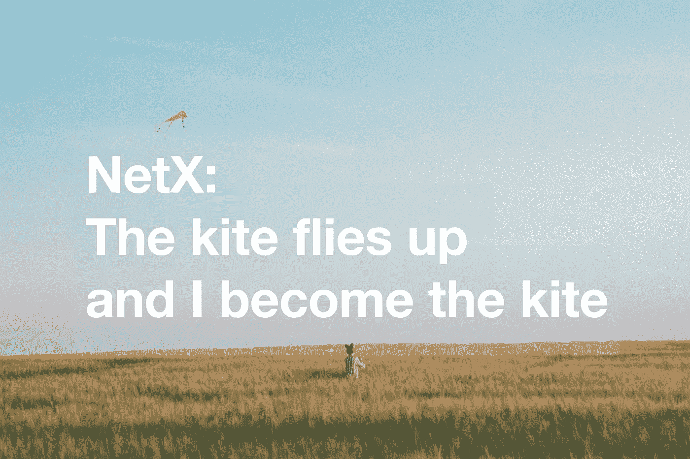
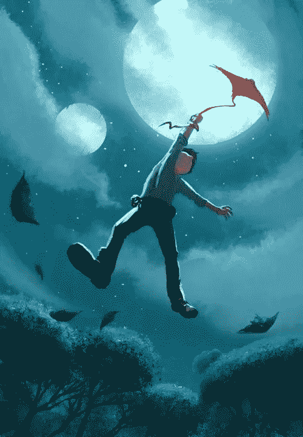

# 风筝飞了起来，我变成了风筝

> 原文：<https://medium.com/coinmonks/the-kite-flies-up-and-i-become-the-kite-40678b9dabda?source=collection_archive---------10----------------------->

第二章第三部分 Web 3.0 有机体正在崛起

TL；速度三角形定位法(dead reckoning)

*   最高层的控制不受控制。NetX 也陷入了同样的循环。
*   我不是 NetX 的拥有者，只是它的创造者。
*   NetX 是一个设计有简单逻辑的群体系统，也是一个自我进化的生命形式。



《道德经》或老子的*《道德经》*说，德行高的人不知道自己的德行，因此有(真正的)德行；德行低的人努力不失去自己的德行，因此没有(真正的)德行。

在网络社会，任何追求最高荣誉的垄断都注定要崩溃。集权企业和集团容易挖掘出集团利益的每一个痕迹，自上而下操纵其成员。然而，结果总是偏离他们在控制金字塔底部的期望。tip 放弃了控制，因此个人以他们独特的方式为集体幸福而战，而对群体来说有利的退出是妥协的。分散化将一个系统装饰成点缀着无数星星的明亮天空，每颗星星都发出耀眼的光芒。这很好地描绘了我渴望建立的 Web 3.0，一个自主的、不受控制的、希望之乡——NetX。

我努力让自己沉浸在最有创意的草图中，并在我创造的这个生物上绘制出最连贯的设计。本文主要讨论 NetX 是如何布局的。细目分类和相互关系将在即将到来的系列中介绍。无论我的工匠工作多么专注和深远，这件艺术品可能不会以最好的形状首次亮相，也不会一劳永逸。代码、软件、设备、规则、文化等的自发升级。正在路上等待。用户的不断流入会触发固有的试错机制。这个系统不断学习和进化，逐渐让位于一个有弹性的、不受控制的存在。我只是走进人群，平静地看着 Web 3.0 成长。

> **NetX 框架**

Web 3.0 已经随着互联网的浪潮浮出水面。控制注定会消亡。皮肤保护人类免受外界危害；器官滋养身体；白细胞杀死病毒。同样，Web 3.0 天生就有其不可或缺的部分。NetX 的名字旨在揭示 Web 3.0 的真实本质，即被无数节点束缚的失控群体。

云原生也加起来是我的灵感。节点起到容器的作用。模拟微服务在底层工作。NetX 将作为一个广泛的生态系统出现，从谨慎编写的代码到布局精美的元宇宙，从独立运行的节点到分布式社交网络。

人们对 NetX 寄予厚望，希望它成为下一个互联网主流。人类的智慧是为解决未解之谜而生的。所有的工具都是为了同一个目的而创造的。因此，简单很重要。NetX 没有发现异常。纯粹的数字化结构支撑着底层；无控制框架增强了对共识层的认知；固有的淘汰机制推动 NetX 学习成长；内部奖励机制使各部分结合得更紧密。这是 NetX 的核心理念。

> **NetX 核心概念**

Ⅰ.将风筝放飞到风中

新手紧紧抓住飞行线。风筝绊了一下，掉了下来。专业人士将风筝放飞到风中，然后带着它一起放风筝。

这里的 NetX 是节点框起来的风筝。在时代的热浪和市场的激流中冲浪，NetX 尊重一切突发事件，在自由发展的浮躁中呼应失控。这写出了有机体的内在规律。我是放风筝和放风筝的人。

Ⅱ.紧密联系和融合

NetX 以分布式方式运行，依赖于物质、信息、能量和数据的链接和交换。各种功能部分的相互关系和相互作用完善了有机体的活动，对保持它们的运行至关重要。

根据 Web 3.0 的工作方式来判断，NetX 可能会以令牌交换的方式交换物质和能量，这是拉近节点之间距离的关键。经验丰富的编码员会像人的心脏一样不断输送营养物质，并在已经通过审核的节点上检查营养物质的安全性。那些兴高采烈的志愿者，扮演着血管的角色，把营养输送到各个部位。这解释了有机体的内部循环。它挖掘出单个节点的价值，让群体更好地融合在一起。

Ⅲ.尝试和错误

NetX 呼吁大胆尝试。

进化没有预设的路径。只有在不断尝试之后，最适合的人才会出现。任何来自积极反馈的奖励都会吸引更多的追随者；任何来自负面反馈的行为都需要严厉的反思。自然选择伴随着发展。只有通过反复试验获得的独家经济、文化和系统才能建立 NetX。

Ⅳ.协调和预测

失去控制会放弃人类的绝对控制，但不会消除控制。人类仍然重要，但只是以一种辅助的方式。代码链接和出错，为群体指出正确的进化方向。

随着协调部分的成熟，NetX 将获得预测技能。人类的知识库是无限的，但却是不完整的。如果我们把它看作一个分布式系统，漏洞是常见的。像蝴蝶效应这样的理论仍然无法解释。NetX 努力编织一个更全面的知识网。更强的联系和更密切的合作将为这个紧密编织的网络注入更多的力量，甚至可以预测蝴蝶翅膀的拍打可能会带来什么样的损害。

没有一种解决方案永远适用。随着人类的进化，新的障碍和挑战不断涌现。随着我们深入宇宙，牛顿的经典力学定律开始放弃它们的绝对正确性。各种法律的权威性也是如此。随着生命的延续，进化从未停止。这就是生命的魅力所在。

最后，风筝飞向天空，我变成了风筝。



image: Pinterest

```
***The writer says*** *What does the Web 3.0 organism look like? I will explain my thoughts on this in a whole new Chapter The Web 3.0 Organism is Rising which includes three parts: the birth, existence and my thinking on this burgeoning organism. Remember that we’ve posted three pieces of writing on NetX(👇)? They all belong to Chapter One The Background. And we try to sew them together in a well-connected way. Everytime enter a new chapter, we feel so excited to share our findings and thoughts. Please join us in this journey！*
```

# 📚必读

[NetX 系列 1.1](/triaslab/rethinking-the-it-industry-d101384e801) | [NetX 系列 1.2](/coinmonks/a-letter-from-satoshi-nakamoto-345a45d012bb) | [NetX 系列 1.3](/coinmonks/out-of-control-the-post-it-evolution-dd64e05ff5bc) | [NetX 系列 2.1](/coinmonks/life-emerges-9ebf26304cd4) | [NetX 系列 2.2](/coinmonks/life-is-out-of-control-9f8e5b7b4b99)

***NetX，面向数字生活的可信可靠的智能自治系统链原生互联网(***[***Trias***](https://www.trias.one/)***)***

[***铁人三项***](https://www.triathon.space/#/)***|***[***Ethanim***](https://www.ethanim.network/)***|***[***tu Sima***](https://www.tusima.network/#/)***| behemotius | Leviatom | Divina***

> 交易新手？尝试[加密交易机器人](/coinmonks/crypto-trading-bot-c2ffce8acb2a)或[复制交易](/coinmonks/top-10-crypto-copy-trading-platforms-for-beginners-d0c37c7d698c)