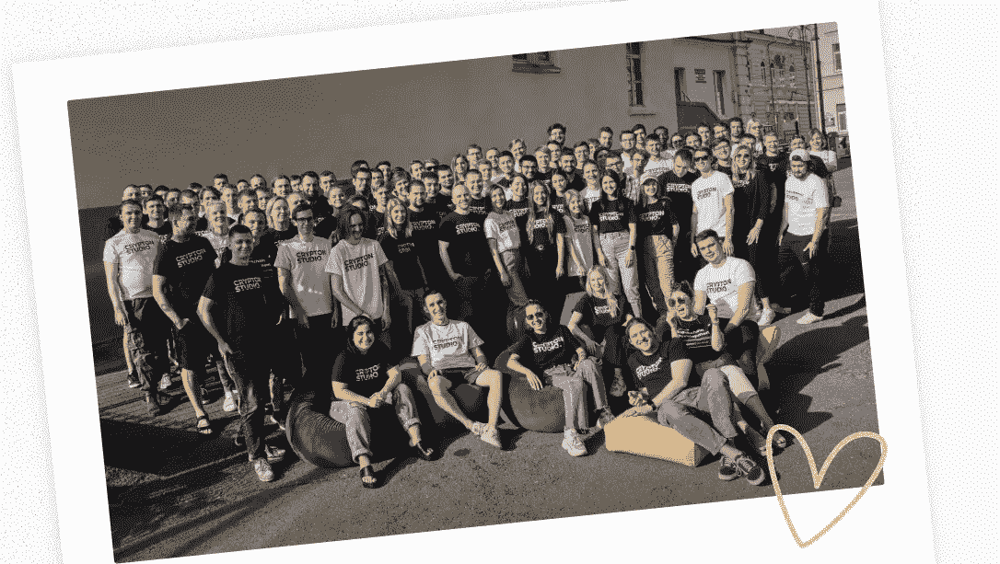

# 最大的区块链发展公司

> 原文：<https://medium.com/coinmonks/the-largest-blockchain-development-company-100283400472?source=collection_archive---------33----------------------->

# 我们负责创建区块链项目的整个过程。

我们是 [Crypton 工作室](https://crypton.studio)！

在我们的团队中，有 150 多名员工，其中 72%是开发人员，18%是经理、设计师和质量工程师，10%是管理人员。我们[负责创建项目的整个过程](https://crypton.studio/blog/The-largest-blockchain-development-company):从商业分析和开发到设计和签署必要的文件。

在全球市场的六年多时间里，我们已经成为欧洲定制区块链开发领域最大的公司。从那时起，我们已经为来自 20 个国家的客户做了 100 多个不同的项目。

> 交易新手？试试[密码交易机器人](/coinmonks/crypto-trading-bot-c2ffce8acb2a)或[复制交易](/coinmonks/top-10-crypto-copy-trading-platforms-for-beginners-d0c37c7d698c)

# *Crypton 工作室重点领域:*

## ―交换

我们将开发一个用户友好的交易所，区块链钱包，拥有加密货币，并将做一个伟大的用户界面。

## ――智能合同

我们将使交易自动化和安全。消除对中间商的需求，以及相关的延迟和费用。

## ― DeFi

我们将帮助你转向现代金融体系。将为您的平台提供高质量的加密、分割和耕作。

## ―市场

我们将为 NFT 组装一个市场，服务和连接一个分散的支付提供商。我们将添加与您的项目匹配的功能。

联系我们，让我们一起开始你的项目！ [https://crypton.studio](https://crypton.studio)

> *加入 Coinmonks* [*电报频道*](https://t.me/coincodecap) *和* [*Youtube 频道*](https://www.youtube.com/c/coinmonks/videos) *了解加密交易和投资*

# 另外，阅读

*   [3 商业评论](/coinmonks/3commas-review-an-excellent-crypto-trading-bot-2020-1313a58bec92) | [Pionex 评论](https://coincodecap.com/pionex-review-exchange-with-crypto-trading-bot) | [Coinrule 评论](/coinmonks/coinrule-review-2021-a-beginner-friendly-crypto-trading-bot-daf0504848ba)
*   [莱杰 vs Ngrave](/coinmonks/ledger-vs-ngrave-zero-7e40f0c1d694) | [莱杰 nano s vs x](/coinmonks/ledger-nano-s-vs-x-battery-hardware-price-storage-59a6663fe3b0) | [币安评论](/coinmonks/binance-review-ee10d3bf3b6e)
*   [加密交易机器人](/coinmonks/crypto-trading-bot-c2ffce8acb2a) | [Bingbon 评论](https://coincodecap.com/bingbon-review)
*   [Bybit Exchange 审查](/coinmonks/bybit-exchange-review-dbd570019b71) | [Bityard 审查](https://coincodecap.com/bityard-reivew) | [Jet-Bot 审查](https://coincodecap.com/jet-bot-review)
*   [3 commas vs crypto hopper](/coinmonks/3commas-vs-pionex-vs-cryptohopper-best-crypto-bot-6a98d2baa203)|[赚取加密利息](/coinmonks/earn-crypto-interest-b10b810fdda3)