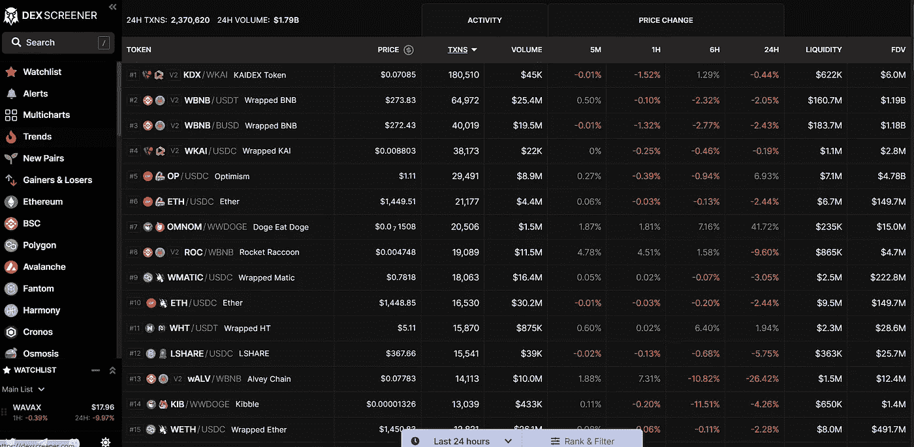
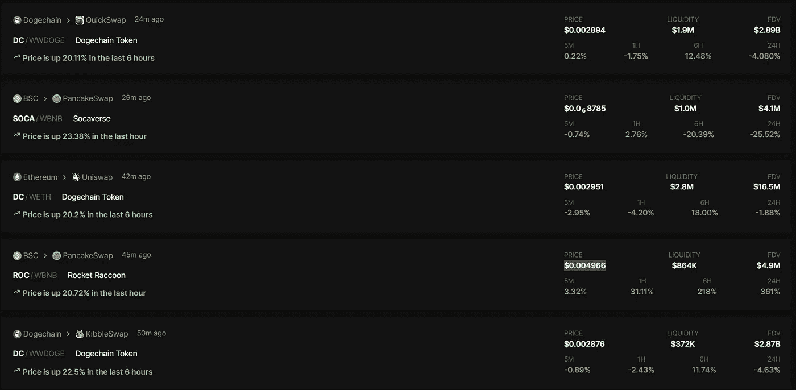
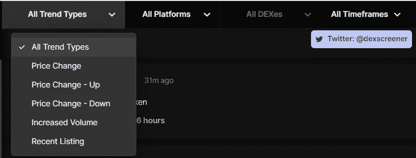
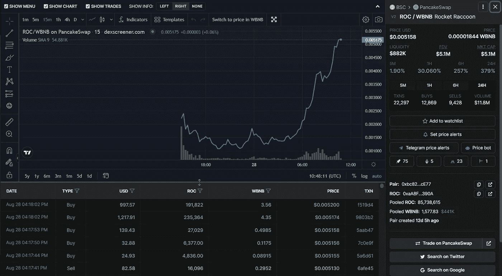
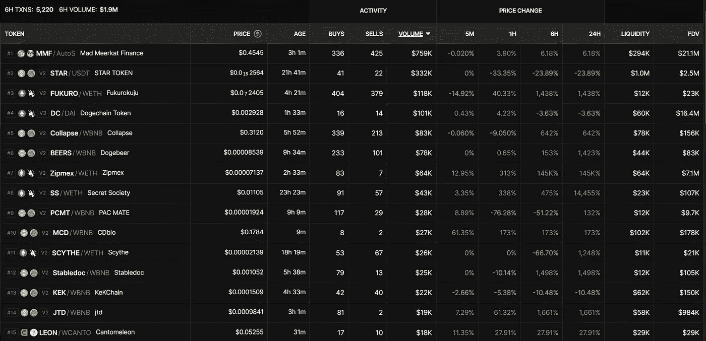
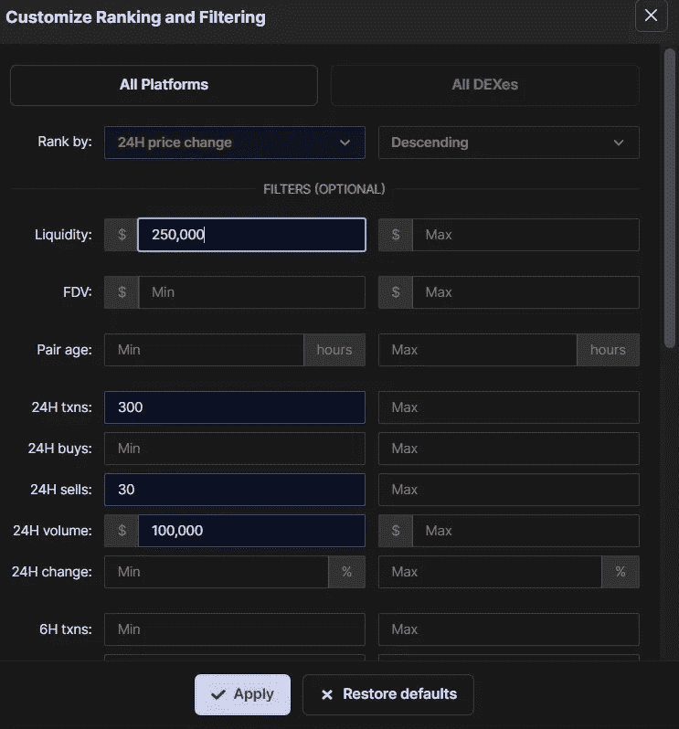
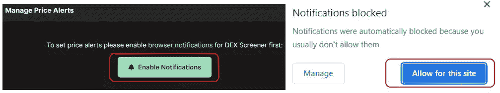
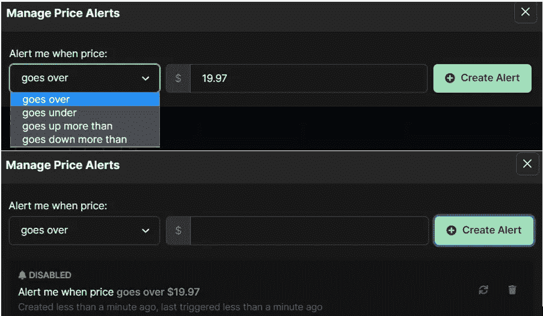

# 关于 Dex 筛分机的最新综述

> 原文：<https://medium.com/coinmonks/the-latest-review-about-dex-screener-43d0692e94e7?source=collection_archive---------10----------------------->

本指南将帮助您理解 Dex Screener 平台上的数据。

## [DEX Screener](https://dexscreener.com/) 是 DEX 的强大分析工具。顾名思义，平台 DEX Screener 分析不同区块链中的[DEX](https://www.altcoinbuzz.io/cryptocurrency-news/thorswap-launches-ethereum-dex-aggregator/)。然后，它提供综合数据，说明整个网络的每日交易和交易量，如果经过过滤，则显示 DEX 级别的数据。

您可以在这里找到多个部分，从中您可以获得市场中所有当前和新上市交易对的整体信息。用户可以快速查看趋势部分，以了解当前市场上的趋势(亏损或盈利)交易对。因此，在本文中，我们将向您详细解释您可以从 DEX Screener 中获得的所有数据，以及您如何理解这些数据。

**如何访问 Dex Screener？**

要访问平台，请访问[页面](https://dexscreener.com/)。你可以看到下面的屏幕。

现在，让我们来探索它们的每一个特性:

**趋势**

从 [**趋势**](https://dexscreener.com/trends) 选项卡中，您可以看到交易对因其价格(上涨或下跌)而在加密市场上的趋势。从下面的屏幕截图可以看出，该平台为您提供了足够的数据来导航到源网络和平台以访问该对。

例如，参见 BSC 网络中 PancakeSwap 上的第二个趋势交易对 SOCA/WBNB。在写这篇文章的时候，价格在过去的 1 小时内上涨了大约 24 %。同样，你可以在不同的网络上找到其他有明显盈亏趋势的交易对。

在页面顶部，您可以找到一个过滤器选项卡，您可以使用该选项卡根据以下参数过滤数据:

*   **趋势类型**(价格变化、价格变化—上升、价格变化—下降、最近上市、成交量增加、全部)
*   **通过平台**(以太坊、BSC、多边形、雪崩等)
*   **按时间范围** (5 分钟、1 小时、6 小时、24 小时)

DEX Screener 平台的每个页面都将包含上述关于交易对的基本信息。所以，要想获得更详细的数据，你可以点击任何趋势来了解更多。

例如，我们选择了 PancakeSwap (BSC 网络)上可用的 ROC/WBNB。因此，通过该选项卡，您可以查看趋势图、总市值、价格、流动性、24 小时内的总交易量(单独的买入、卖出选项卡)、交易对的创建日期、上涨/下跌百分比(1 小时、6 小时、24 小时)以及更多关于该交易对的关键信息。

**新配对**

查看近期各平台上市的[新交易](https://dexscreener.com/new-pairs)对。您可以在顶部找到一个过滤按钮，让您根据网络过滤数据。在此选项卡中，您可以获得最近列出的配对的以下详细信息:

*   对名称(列出的网络和平台符号)
*   价格
*   年龄
*   购买
*   出售
*   卷
*   价格上升/下降(在 5 分钟、1 小时、6 小时、24 小时内)
*   资产流动性
*   FDV(全面摊薄估值)

**注意:**您可能会注意到，这些交易对大多是在 24 小时内创建的，并且包含相关风险。我们要求我们的用户在选择交易之前，首先了解与新交易对相关的风险参数。

同样，你可以选择任何一个交易对来获得更多的详细信息。

**赢家和输家**

查看排名前[的赢家和输家列表](https://dexscreener.com/gainers-losers)选项卡，用户可以过滤数据，仅查看特定网络的赢家或输家。

此外，您可以将时间设置更改为(5 分钟、1 小时、6 小时或 24 小时)。用户可以点击**等级&过滤器**来定制他们的搜索。此选项将允许您基于以下参数过滤数据:

*   期望的平台
*   排名依据(固定为 24 小时价格变化，降序)
*   流动性(最大和最小)
*   FDV(最大和最小)
*   配对年龄(最大和最小)
*   24 小时、6 小时、1 小时或 5 小时内的交易、买入、卖出、成交量、变化

**多部分**

此[部分](https://dexscreener.com/multicharts)将允许您添加趋势图。用户可以在这里添加多达 16 个图表。

例如，如果您点击选项**添加建议图表(BTC、瑞士联邦理工学院、BNB、MATIC、AVAX 和 FTM)** ，则下面的图表将被添加到此部分。

**以太坊**

用户现在可以找到著名的区块链电视网的标签。您可以转到每个选项卡，获取有关网络上构建的 dex 的数据。您甚至可以选择任何特定的指标来显示更详细的数据。

在页面顶部，您可以查看属于网络中所有指标的数据，如 24 小时交易量、24 小时交易量、最新数据块等。

同样，您可以找到不同网络的选项卡，如 BSC、Polygon、Avalanche 等。你可以去任何一个网络标签查看类似的数据。如果您希望在 DEX 级别检查数据，则从顶部选择所需的 DEX。

**添加到观察列表**

如果用户希望监控价格的涨跌，他们可以将交易对添加到他们的[观察列表](https://dexscreener.com/watchlist)中。要将任何配对添加到您的观察列表中，请先打开该配对。你可以找到**添加到观察列表**按钮。点击它，然后选择**主列表**。

这对搭档现在将被添加到你的**观察列表**(主列表)标签中。

如果您不希望监控它，并希望将其从您的监视列表中删除。然后，简单地从你的观察列表中打开交易对。您现在可以找到**从监视列表中移除**按钮。点击它以从监视列表中移除该对。

**设置价格提醒**

用户可以为交易对设置[提醒](https://dexscreener.com/)。一旦你设定的目标达成，平台会通知你。

如果您正在启动设置警报的过程，您必须首先启用浏览器通知。按照下面截图中显示的过程，允许此站点的通知。

完成后，您可以打开任何交易对，并点击**设置价格提醒。**您将看到以下屏幕。用户现在可以输入目标价格并设置条件，即当一对的价格高于/低于设定的目标价格时通知我。最后，点击**创建警报**保存警报。

您可以按照相同的过程对任何交易对设置警报。用户可以从**警报**选项卡查看所有警报列表。

如果您不想保留警报，请转到“警报”选项卡，并选择所需的警报。您可以在这里找到**禁用**和**删除**选项。选择适当的选项将其删除。

***注:*** *本帖首发* [*此处*](https://www.altcoinbuzz.io/cryptocurrency-news/product-release/the-latest-review-about-dex-screener/) *同* [*一个* ltcoinbuzz.io](https://www.altcoinbuzz.io/) *。*

跟我来

**👉** [推特](https://twitter.com/rumadas123)

**👉** [Linkedin](https://www.linkedin.com/in/ruma-das-a1439320/)

> **交易新手？试试** [**密码交易机器人**](/coinmonks/crypto-trading-bot-c2ffce8acb2a) **或** [**复制交易**](/coinmonks/top-10-crypto-copy-trading-platforms-for-beginners-d0c37c7d698c)