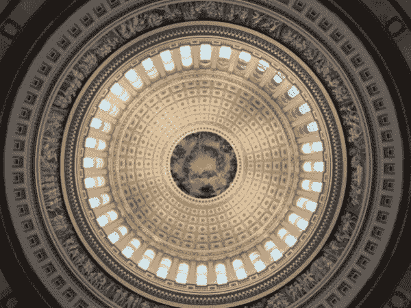

# 泄露的“反黑仔”法案

> 原文：<https://medium.com/coinmonks/the-leaked-defi-killer-bill-6eb3ba9f6661?source=collection_archive---------29----------------------->

[For the best Crypto News in the world, visit TheCoinSphere.com](http://thecoinsphere.com/)

对于美国在加密货币方面将采取什么样的强硬政策，有很多猜测，这里我们特别关注分散金融(DeFi)类别。准确地说，DeFi 指的是任何以区块链为基地、通过用代码取代中央机构来解决金融问题的密码。