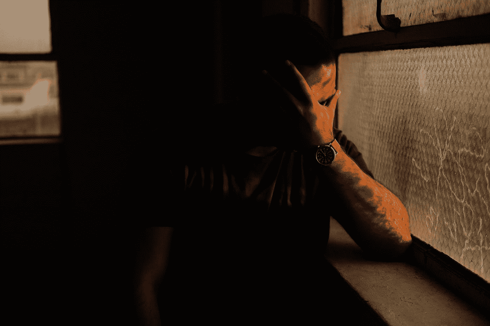

# 过去几个月失业给我的教训是？

> 原文：<https://medium.com/coinmonks/the-lesson-i-learned-being-unemployed-for-the-last-few-months-e36741b348be?source=collection_archive---------36----------------------->

跌倒了要爬起来！

Photo by [Sean Boyd](https://unsplash.com/@seanfboyd?utm_source=medium&utm_medium=referral) on [Unsplash](https://unsplash.com?utm_source=medium&utm_medium=referral)

你知道我发现了什么，生活与你擦肩而过，你无能为力，除非你准备好了。直到最近，我从三月份开始就失业了，这意味着我没有太多的收入，我试图靠剩下的一点钱生存。