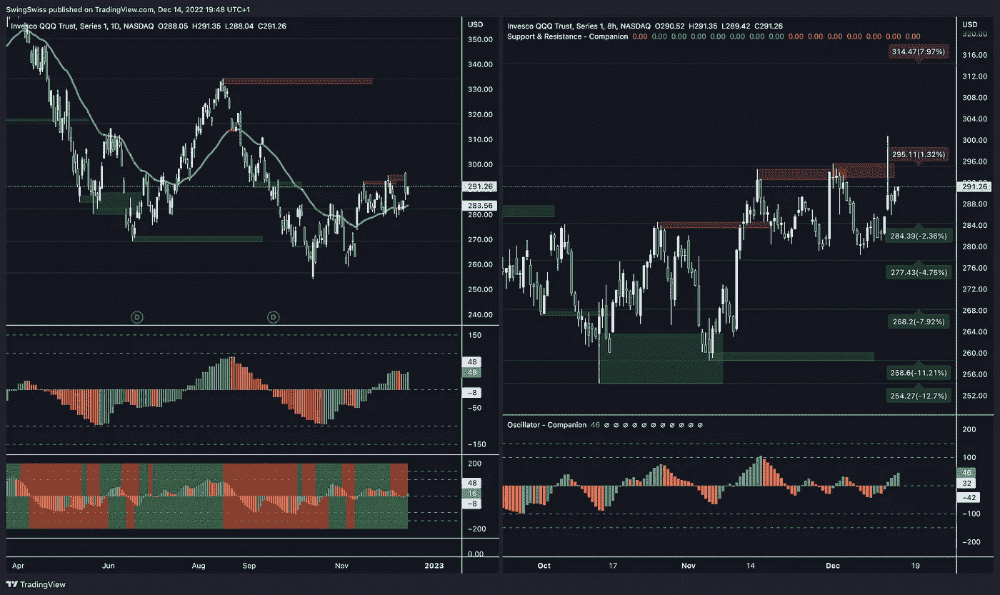
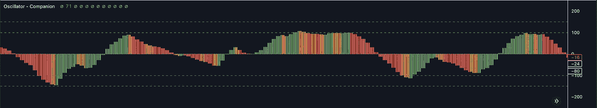
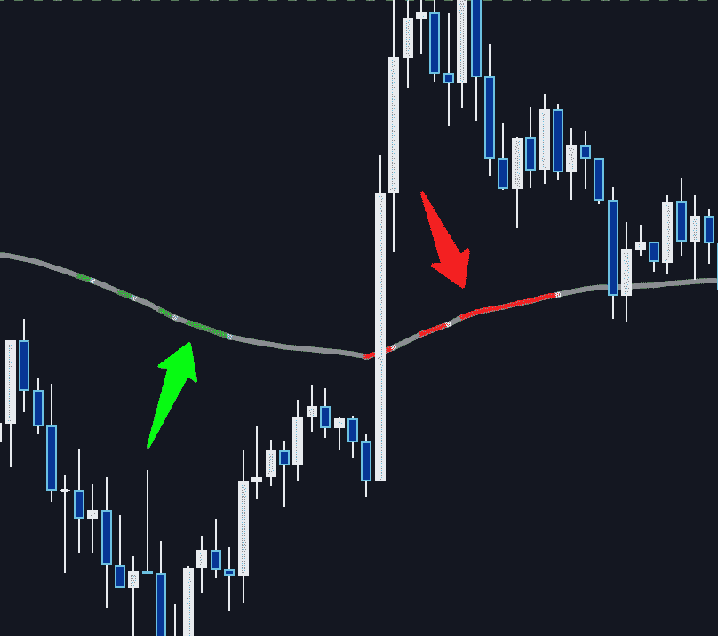
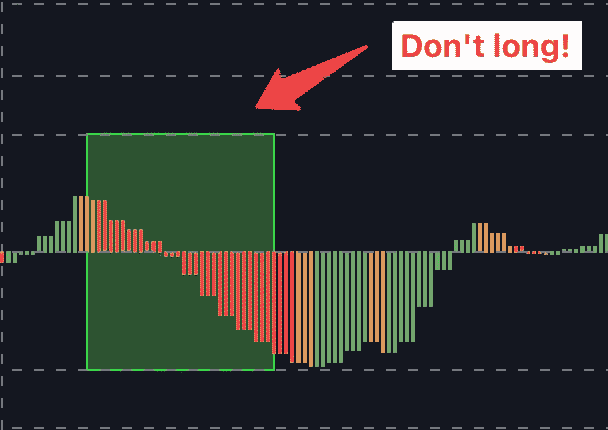
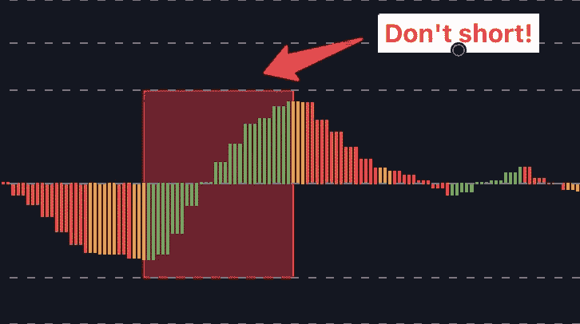
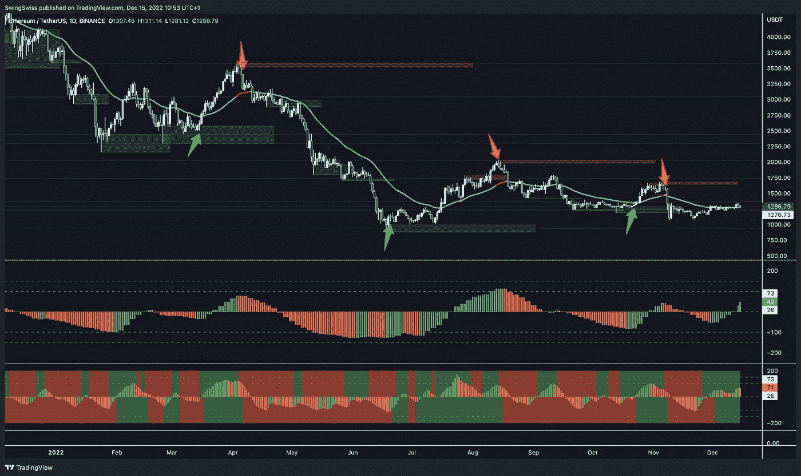
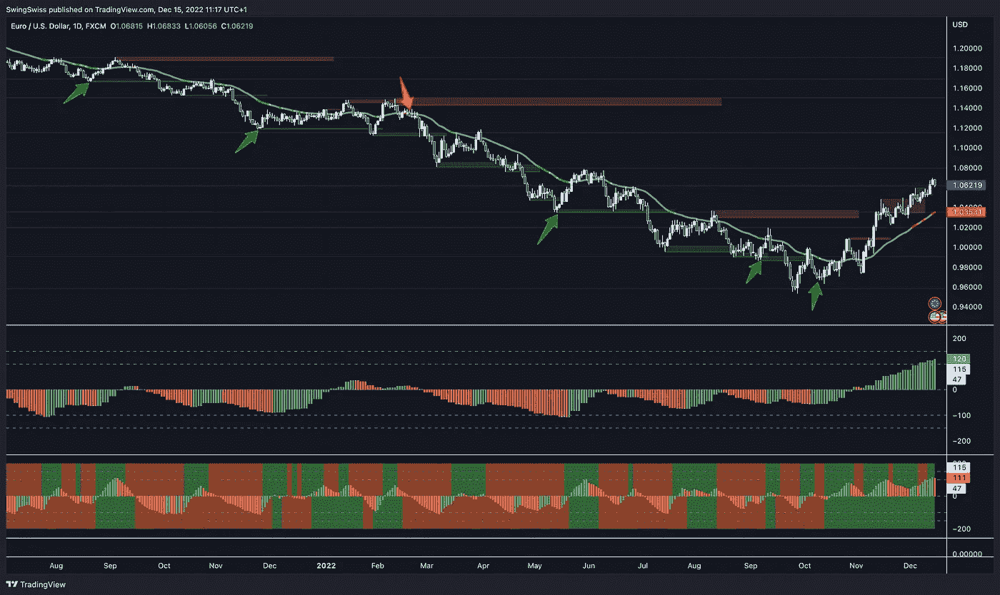
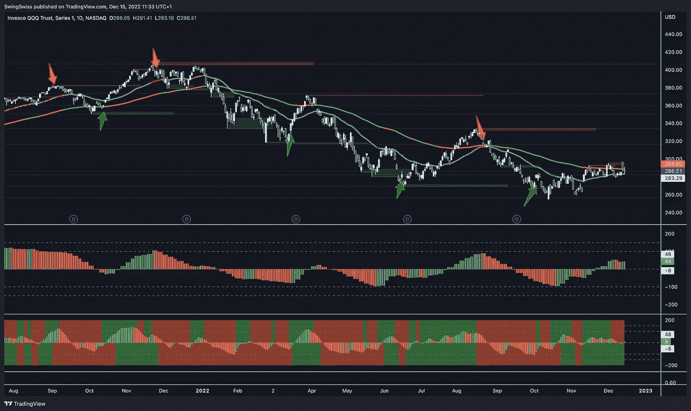

# wise strat——最先进的交易策略

> 原文：<https://medium.com/coinmonks/the-line-a-super-powered-diy-multiasset-trading-strategy-10b558331ada?source=collection_archive---------0----------------------->

WiseStrat 在外汇、加密、QQQ 上显示进入多头或空头交易的最佳时机，并具有极高的准确性

The WiseStrat setup on QQQ

# 它是如何工作的？

自从我接管 SwingSwiss 以来，我一直在挖掘和审查公司发布的每一个版本、档案和指标。结果，我看到了这份基于初创公司旗舰工具趋势分析器的多时间段战略草案。

> 趋势分析仪(Trend Analyzer)，更普遍的说法是 TA，是 SwingSwiss 在 2018 年开发的动量振荡器。顾名思义，它旨在定义资产的当前趋势(相对于 TF 图)并检测可能的反转。

The Trend Analyzer: Green — Bullish, Red — Bearish, Orange — Reversal

它是许多 SwingSwiss 指标的基础，也是一个可靠的工具。

正如你可能在上一篇文章中读到的，我对前任管理层拒绝开发需要用户做一些工作的策略感到非常失望。

> 阅读:一家加密初创公司的崛起&衰落——为什么我要让它起死回生，以及你可以如何帮助我！

不幸的是，Pine (TradingView 编程语言)不支持 MTF(多时间框架)工具，否则会产生很多故障。然而，趋势分析器的最佳用途是将其与其他时间段的值进行比较！

**因为业绩比便利更重要，因为每个交易者都应该能够自己想出一些办法，所以我决定更新这个策略，这个策略很有前途。**

Stop Trusting automated tools. Put on some work! — Photo by [Merakist](https://unsplash.com/@merakist?utm_source=medium&utm_medium=referral) on [Unsplash](https://unsplash.com?utm_source=medium&utm_medium=referral)

**WiseStrat 遵循与仿生 Strat 相同的规则。它基于这样的信念，指标和交易工具只是帮助交易者，而不是自动完成所有的工作。**

> 阅读:仿生策略——或者所有算法交易策略应该如何发展

一条简单的线:绿色表示是时候做长线交易了，红色表示做短线交易了。它有什么好看的？它适用于 15MN TF、4H TF 和每日 TF。

WiseStrat

***我们将分两步过滤这些信号:***

*   我们将从趋势分析器开始，它比我们的图表好三倍。我们在交易日线图；因此，我们将选择三天助教。如果 TAx3 拒绝这个信号，我们就放弃交易。另一方面，如果它验证了，我们继续第二步。
*   我们会用趋势分析仪确认交易，趋势分析仪比我们的图表，8 小时 TA，差三倍。

如果 TAx-3 拒绝这个信号，我们就放弃交易。但是，另一方面，如果它证实了这一点，我们终于有了一个位置！

**这些步骤是必不可少的，只需要几秒钟的时间，但它们会大大提高你的胜率。**

> ***模板:*** *点击那个链接就可以一键复制实现我的设置:*[**https://www.tradingview.com/chart/fKUBsXH4/**](https://www.tradingview.com/chart/fKUBsXH4/)
> 
> ***文档:*** *你会找到这个文档以及跟随那个链接找到条目要遵循的步骤:*[**https://swingswiss.gitbook.io/companion/**](https://swingswiss.gitbook.io/companion/)

# 只是一点味道:

Last six entries on $ETH

Last six entries on $EURUSD

Last seven entries on $QQQ

> ***如果你想访问 WiseStrat，仿生策略，以及配套工具或者只是想聊天，随时联系我*** [***电报******！***](https://linktr.ee/wisechief)

PS:在媒介上跟随我，在电报上把你的用户名发给我。这可能是值得的😉

跟我来；我写我的交易策略、宏观经济和秘密天使投资。我将回答这样的问题:如何为摆动交易创建完美的交易视图设置？如何在预算内交易？如何管理你的风险？