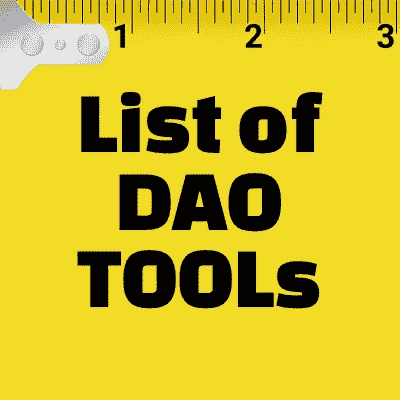

# DAO 工具列表

> 原文：<https://medium.com/coinmonks/the-list-of-dao-tools-a605e2417f30?source=collection_archive---------3----------------------->

## [🖥探索网站🔭分散自治组织(DAO)工具🔧。](http://www.decentra-list.com/list-of-dao-tools)

List of DAO Tools

西蒙·西内克(2010) [关于*伟大的领导者如何激励行动*的 Ted 演讲](https://www.ted.com/talks/simon_sinek_how_great_leaders_inspire_action?language=en)介绍了黄金圈概念*。*由三部分组成，*为什么*，*如何*和*什么*，Sinek 认为黄金圈符合生物学的原则，特别是人类大脑的部分如何处理思想、感情…