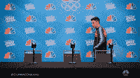

# 文案为 Web3 项目建立活跃社区的鲜为人知的方式

> 原文：<https://medium.com/coinmonks/the-little-known-way-copywriting-builds-active-communities-for-web3-projects-9242c930d97e?source=collection_archive---------31----------------------->

一些拥有超过 20 万社区成员的项目无法创新。你怎么解释呢？你可能会问“这怎么可能，有这么大的社区？”
嗯，这倒是很有可能，很多项目都有过类似的经历。

在发展了一个非常大的社区，托管并加入了各种 Twitter 空间，以前所未有的方式进行合作后，当谈到薄荷日期时，人们没有点击薄荷按钮。

有些人甚至不记得这是一个造币日，尽管他们进行了宣传，而有些人在到达造币页时却转身离开。

所以你坐下来想，到底哪里出了问题。我的意思是，他们做了他们应该做的一切，他们完全按照剧本来。

问题现在看起来模糊不清，但原因是如此之小
现在我听到你说*‘好吧，是什么？’*

这是因为他们未能带领社区前进。我意识到社区中的一些成员不知道这个项目是关于什么的，而一些成员并不完全相信这个项目在构建什么。

治愈的方法是感知。你看，感知比现实要强大得多，因为感知告诉一个人衡量事物的价值。

还有什么比使用说服之王——文案更好的建立感知的方法呢

有了强烈的感知，活跃的社群就建立起来了。

> 一个活跃的社区是这样一个社区，其中的成员理解其目的，并相信创始人正在建设的东西

如果没有“理解”和“相信”，就不会有活跃的社区。

最接近你得到的是垃圾邮件炒作的话，从等待翻转…这不会建立你可持续的东西。

故事也有助于建立认知，你可以在这里阅读所有相关内容[。](/coinmonks/5-shocking-reasons-why-lore-can-build-or-break-a-web3-nfts-defi-project-654f9c521914)

说够了！让我们做一些工作。

## 让我们尝试在典型的 NFT 销售漏斗中运行文案。准备好了吗？

Let’s get bubbling

> 我们将利用这个典型的销售漏斗
> 社区建设——协作——加入 web 2 peeps——发布——发布后——路线图执行——品牌推广

# 社区建设

在社区建设的过程中，我看到许多项目都犯了一个常见的错误，那就是看起来好像他们所尝试的一切都没有成功。

他们采用各种参与策略，但在社区中的出现率和氛围仍然很低。发生这种情况是因为他们忽视了基本面。

如果基础薄弱，一座建筑如何屹立不倒？

一个社区的基石是了解…
**社区的主题
你想要坚持的价值观
成为其中一员的好处
社区背后的目标**

他们必须在社区建立之前到位
要了解如何构建的完整解释，你可以[阅读这篇文章](/@optiimusprime/three-ways-to-dyor-on-a-good-nft-project-watch-out-for-numbers-2-3-cbce28c276b6?source=homepage_reading_list---------3----------------------------)

在这些“基石”已经就位之后，就可以采用接触策略了。
考虑举办类似
游戏锦标赛的活动(不和谐游戏或在线多人游戏，如《我们之间》】
卡拉 ok 之夜
电影之夜
琐事游戏
周五派对
说出 nft
谜题
**发挥创意**，没有人喜欢一个全是邀请赛或 wl 挑战的服务器。

确保在每个事件或活动公告中加入文案元素。不要只是键入*“我们正在举办 xyz 活动，请尝试加入”*

让它变得令人兴奋，并使用情感触发器。按照这种速度，他们对这个项目的看法将会逐渐增加。让我们更进一步，好吗？

# 合作

您还可以参与社区协作决策

如果你发一份 2-5 个项目的清单，并强调与每个项目合作的好处，会怎么样？然后让社区投票决定他们希望你与哪个人合作。

告诉我，他们会觉得重要吗？

他们会觉得你重视他们的意见吗？

他们会觉得自己是建设过程的一部分吗

是吗？我也这么认为。

假设你刚刚获得了一个大项目的合作。
不要只是复制他们的模板，在 collab 频道发帖。这会让你和其他人一样，所以拒绝。

你将主持一个活动，确保你总是为这样的大型合作主持一个活动。

下一步是公告
这是我看到很多项目错过的地方。

你必须以一种隆重的方式去做。你认为一个即将到来的俱乐部会如何告诉公众他们刚刚签下了梅西

噪音很大，对吧？这正是我们要做的。对这次合作吹了很多大话。

你可能会说*‘为什么我需要经历这一切？’*
你忘了吗？我们想在这里建立感知。

用不同颜色的糖果和扭曲的巧克力奶油装饰的甜甜圈，装在透明盒子里，会被认为比用尼龙做的橙色甜甜圈更贵，质量更好。

同样，你希望你的社区意识到你的项目和你刚刚获得的合作是有价值的。

使用高质量的视觉效果宣布(电影视频、图片、采访、徽标..)并说明这种合作给社区带来的好处。

确保你的声明引人注目，让他们觉得如果不参加活动，他们会错过很多。

# 入职 Web2 人员。

你会同意我的看法，最忠诚的人是那些你能教出新东西的人。

这就是 SEO 内容营销发挥作用的地方。创建关于新手如何导航 Web3 空间的信息性和教育内容(NFTs、DeFi…视情况而定)

您的内容将与文案联系在一起，将他们拉至 CTA 按钮，从而进入您的社区。

你也将把 mod 放在适当的位置来回答他们的许多问题，并指导他们所有他们需要知道的。

您可能需要为他们创建一个私人渠道和角色，在那里您可以为他们提供更多入职资料。

# 发动

现在，你正在为这个大日子做准备。从 14 天的无处不在的活动开始，从社交活动到你合作的每一个项目。当然还有服务器上的每日提醒。

确保 mods 不断谈论它，就像世界杯即将来临一样

记得使用吸引人的视觉效果(罕见的偷窥、高质量的图片、电影视频、采访、IRL 活动……)

另外，包括:
**评论**(基本上是人们对项目的评价。你可以转发可信的推文)
**线程**关于你正在建造的东西以及它将如何影响空间
**数字事件**等等

最后一件事。在造币页面上添加一份副本，让他们安心，防止最后一刻反悔。

> 让我们倒回去一点

我们用一个典型的漏斗做实验。你的可以更详细，可能包括更多的阶段，但这不是一个问题，如果你在文案中编织。

在进行我们的实验时，可能需要几周甚至几个月的时间，因为你正在和你几乎不认识的人建立融洽的关系，所以耐心是必要的。

如果你已经完成了这个过程的所有细节，那么销售一空是有保证的。

# 发布后—路线图的执行

发布后不是社区无所事事的时候。取而代之的是，你应该非常积极地向他们更新构建过程中的每一步。

主持活动、ama，并就你的进步进行采访。让他们知道他们很重要，因为事实是，他们真的很重要。

寻找新的方式给社区带来价值。

> 哇！你做到了这一点，谢谢你。你可以在评论中发表你的想法。
> 
> 你在网上做些什么吗？你希望它扩展吗？
> 那我们就聊一聊吧。[我们来连线](http://www.semi-lore.carrd.co/)

> 加入 Coinmonks [电报频道](https://t.me/coincodecap)和 [Youtube 频道](https://www.youtube.com/c/coinmonks/videos)了解加密交易和投资

# 另外，阅读

*   [雷米塔诺评论](https://coincodecap.com/remitano-review)|[1 英寸协议指南](https://coincodecap.com/1inch)
*   [iTop VPN 审查](https://coincodecap.com/itop-vpn-review) | [曼陀罗交易所审查](https://coincodecap.com/mandala-exchange-review)
*   [40 个最佳电报频道](https://coincodecap.com/best-telegram-channels) | [喜美元评论](https://coincodecap.com/hi-dollar-review)
*   [折叠 App 审核](https://coincodecap.com/fold-app-review) | [StealthEX 审核](/coinmonks/stealthex-review-396c67309988) | [Stormgain 审核](https://coincodecap.com/stormgain-review)
*   [购买 PancakeSwap(蛋糕)](https://coincodecap.com/buy-pancakeswap) | [俱吠罗评论](/coinmonks/coinswitch-kuber-review-1a8dc5c7a739)