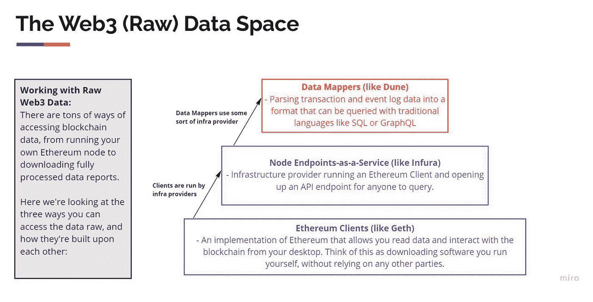

# 区块链分析的漫漫长路

> 原文：<https://medium.com/coinmonks/the-long-way-of-blockchain-analytics-2c3b42b49fc5?source=collection_archive---------8----------------------->

最近，我一直在寻找一种分析区块链数据的方法，以下是我的发现:

区块链数据分析的挑战:正如我们所知，区块链是一个存储在分散存储上的公共分布式数据库。比特币等区块链网络是 2009 年开始的，而以太坊是 2015 年。这两个区块链网络拥有非常庞大的数据量。

另一个问题是，很难直接在链上查询区块链数据。因此，有一些工具对于从区块链数据中获得洞察力非常有用。这是我目前为止发现的。

Source: [https://ournetwork.mirror.xyz/gP16wLY-9BA1E_ZuOSv1EUAgYGfK9mELNza8cfgMWPQ](https://ournetwork.mirror.xyz/gP16wLY-9BA1E_ZuOSv1EUAgYGfK9mELNza8cfgMWPQ)

从上图中，我们可以了解到有三种方法可以获得区块链数据，尤其是以太坊数据。

1.  使用 Geth 客户端应用程序等将 Eth 数据同步到您自己的 PC。然而，对于希望接触加密数据数据科学家或分析师来说，这是可能的。我真的不需要这种方法。
2.  像 Infura 一样使用节点端点作为服务。也有许多基础设施提供商运行 Eth 节点和开放 API 端点，我们可以使用它。然而，由于目的是进行 web3 数据分析，我想我也不需要这种方法。
3.  数据映射器:提供准备好进行分析的数据的应用程序。在这种情况下，来自以太坊或其他区块链网络的原始数据已经被映射到多个模式，可以使用流行的查询语言(如 SQL 或 GraphQL)进行分析。有许多应用程序在这一部分工作，我将重点放在这一部分。

可以使用 SQL 或 GraphQL 进行分析的 Web3 公共数据，例如:

1.  做区块链 ETL，如果你有 ETL(提取转换和加载)区块链数据的知识，你可以这样做。如果你想尝试这种方法，这个公共 GitHub repo 非常有用。目前，许多区块链网络 ETL 源代码可用，如:以太坊，多边形，索拉纳等。
2.  Google BigQuery 提供[比特币](https://cloud.google.com/blog/topics/public-datasets/bitcoin-in-bigquery-blockchain-analytics-on-public-data)和[以太坊](https://cloud.google.com/blog/products/data-analytics/ethereum-bigquery-public-dataset-smart-contract-analytics)等公共 web3 数据。如果你熟悉 Google Bigquery，那么可以考虑这个选项。
3.  [Dune Analytics](https://dune.com/0xgembus) :这个网络应用非常有用，可以免费使用，而且[那边有很多公共仪表盘](https://dune.com/browse/dashboards)。作为区块链分析公司的一名新手，这些公共仪表板真的帮了我很大的忙。我可以直接向专家提出问题并学习！SQL 是必须的，当然，了解 Eth 或其他网络如何工作也是必须的。
4.  [FlipsideCrypto](https://flipsidecrypto.xyz/0xGembus) :如果你喜欢挑战，并且你是一名赏金猎人，这个应用是你的选择。我们可以加入许多数据分析奖金，因此我们不仅可以学习，还可以赚取奖金！与 Dune Analytics 相比，FlipsideCrypto 使用的数据库模式也有所不同。所以，如果你要从沙丘到另一边，你必须做好准备。
5.  [Footprint.network](https://www.footprint.network/) :从我的角度来看，这款应用与 Dune Analytics 颇为相似。然而，这款应用试图填补沙丘分析的空白。如果不了解 SQL，我们就无法在 Dune Analytics 上进行数据分析。同时，在 Footprint 中，我们可以拖放数据可视化来创建和发布仪表板。我们可以只搜索 footprint 已经提供的分析师搜索的最常见的查询。
6.  如果你更喜欢使用 GraphQL 而不是 SQL，那么这是你的选择。Bitquery 上也有许多公共的 GraphQL 仪表板，但是没有 Dune Analytics 上的 SQL 仪表板多。此外，GraphQL 通常用于获取数据并在前端应用程序中使用。在使用之前，我们还需要定义图形模式。
7.  [图协议](https://thegraph.com/en/):如果 Bitquery 是集中式的 GraphQL 提供者，那么图就是 GraphQL 的分散式服务。这个项目真的很有趣。我们可以创建 GraphQL 的子图，并使用子图来获得区块链数据。我们需要$GRT 来做这件事！

到目前为止，我更喜欢使用 Dune Analytics，而这里的[我的 Dune 账户](https://dune.com/0xgembus)，是因为一些原因:

1.  免费使用
2.  许多专家提供的公共仪表盘都可用
3.  我想深入研究加密，所以我必须了解加密项目是如何工作的，并且非常了解 SQL。
4.  数据可用性，到目前为止，我对 Eth、Bsc 和 Solana 进行了分析，所有这些都可以在 Dune 上获得。
5.  如果我觉得 FlipsideCrypto 上的数据库模式比 Dune 更容易，我可能会转向 FlipsideCrypto。我会在探索完 FlipsideCrypto 后立即更新我的决定。

> 交易新手？试试[加密交易机器人](/coinmonks/crypto-trading-bot-c2ffce8acb2a)或者[复制交易](/coinmonks/top-10-crypto-copy-trading-platforms-for-beginners-d0c37c7d698c)