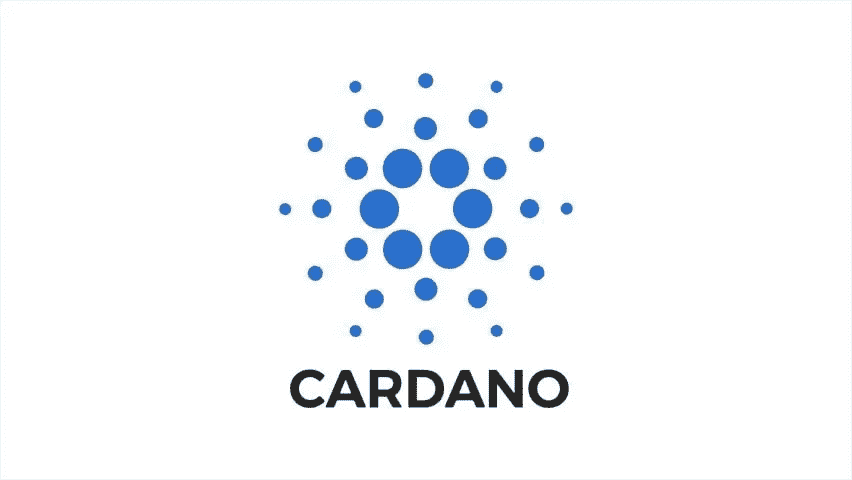
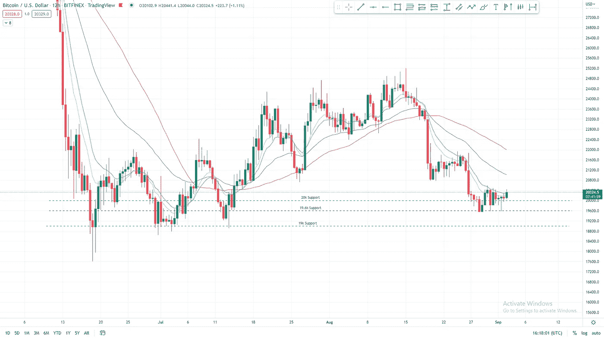
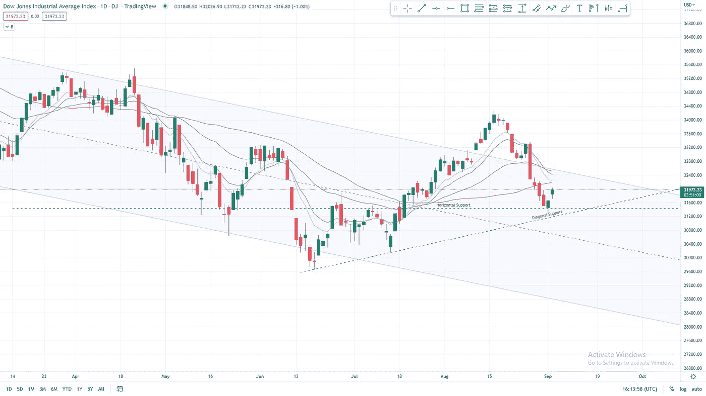

# 迫在眉睫的经济衰退开始影响消费者

> 原文：<https://medium.com/coinmonks/the-looming-recession-begins-to-impact-consumers-2112116e7ff8?source=collection_archive---------43----------------------->

This is Boomish.org’s local weekly newsletter published on 2 September 2022

# 在本周的时事通讯中，我们将介绍:

*   **美国房市下跌**开始。
*   美国 8 月份的失业率上升了 0.2%。
*   能源危机已经开始影响消费者。
*   贝莱德和其他投资公司“抵制”美国能源业务。
*   以太坊合并带来的风险，你应该提防什么。
*   Cardano 宣布推出 Vasil 升级版。
*   比特币持有 20k。
*   美国 30 美元在大幅下跌后开始反弹。

‍

**房市开始走下坡路**

随着对衰退的担忧持续逼近，以及自去年 11 月高点以来普遍超过 20%的股市崩盘，房地产市场恐怕是下一个。

研究公司穆迪分析公司的专家表示，美国许多地区的房屋被“高估”了 25%以上。

该报告断言，他们认为有些城市的住房市场价格过高超过 60%，这些州包括像博伊西和夏洛特。

诚然，穆迪分析公司的这份报告比其他许多知名分析公司的报告要悲观得多。

还有其他机构重复了穆迪的观点，预测美国房价在未来一年将下跌 15%以上。

‍

**美国就业报告**

9 月 2 日周五的政府数据显示，就业市场的远程弹性在 8 月份继续。

尽管雇主已经开始减少雇佣，失业率上升了 0.2%，但统计数据好于预期。

差别不是很大，但投资者预计失业率将停滞在 7 月份的 3.5%。

市场的反应很小，周五的波动性有上有下，现在看来市场的反应是积极的。

在对另一次加息的预期中，投资者和交易员似乎希望最后一次推动市场，并将就业报告作为催化剂。

‍

‍

**全球能源危机**

美国、英国和欧盟的电价正在飙升，越来越多的人正在努力向能源公司支付费用。

据报道，超过 2000 万美国家庭已经拖欠了水电费。

与此同时，在英国，超过 170 万家庭计划在 10 月 1 日停止支付能源账单。

大多数人表示，他们受到了“不要支付英国”运动的启发，该运动呼吁消费者在 10 月 1 日之前取消能源费用。

“不支付英国”的目标是开始集体不支付罢工，以迫使政府和能源巨头重新思考。

以前这样的倡议已经为人民带来了成果，让我们看看这次是否有所不同。

‍

‍

**德州 vs 贝莱德& et。艾尔在能源危机中“抵制”**

在发现贝莱德公司(BlackRock Inc .)、瑞银集团(UBS Group AG)和其他八家金融公司对能源行业怀有敌意后，德克萨斯州正在采取措施，这些措施可能会让它们失去与该州的业务往来。

据贝莱德等消息人士称。艾尔。一直倡导减少美国的石油和天然气消费，包括美国最大的原油和天然气生产商德克萨斯州。

德克萨斯州审计长格伦·黑格(Glenn Hegar)在一份声明中表示，包括贝莱德(Blackrock)在内的一些金融机构“公开发表反对石油和天然气的言论，但私下里却讲述了一个截然不同的故事。”

共和党国家审计长，他认为有 10 多家公司正在参与/过去曾参与“抵制”化石燃料行业。

其中包括贝莱德、瑞银集团、法国巴黎银行、瑞士瑞信银行和丹麦银行。

到目前为止，这些指控已经被所谓的抵制者所减轻和反驳。

‍

**以太坊合并的最新消息**

投资者等待了 5 年多的以太坊合并比以往任何时候都要快。

如前所述，市值第二大的加密货币以太坊(Ethereum)将于 9 月份从工作证明共识转变为利益证明共识。

以太坊基金会最近证实，合并日期定在 9 月 16 日至 20 日之间。

考虑到合并的技术含义，在合并之前、合并期间和合并之后，肯定有一些风险需要小心。

第一个危险是如果一切都出错了，尽管这似乎不太可能，因为以太坊已经运行了许多成功的测试网，但这仍然是一个需要小心的可能性。

投资者和交易者面临的另一个危险是交易活动可能导致的交易中断。

由于以太坊在合并期间出现了巨大的波动，交易者和投资者应该在合并日期前后采取预防措施。

巨大的波动性曾导致交易缓慢，甚至交易中断。

在预期的交易中断中，交易所在预期的合并日期限制或短暂暂停以太坊存款和取款。

[点击这里阅读更多关于“合并”的内容](https://ethereum.org/en/upgrades/merge/#:~:text=Soon%2C%20the%20current%20Ethereum%20Mainnet,energy%20consumption%20by%20~99.95%25.)

[‍](https://ethereum.org/en/upgrades/merge/#:~:text=Soon%2C%20the%20current%20Ethereum%20Mainnet,energy%20consumption%20by%20~99.95%25.) **‍**

‍

**卡尔达诺网络的 Vasil 升级**

8 月 26 日星期五，Cardano 的创始人 Charles Hoskinson 宣布，Cardano 网络将很快推出一款名为 Vasil 的硬叉子，Cardano 是一家区块链公司，通常被视为以太坊的主要竞争对手。

你可以在这里阅读更多关于加密货币的 hardforks 和 token omics[。](https://www.boomish.org/blogs/what-are-the-tokenomics-of-a-cryptocurrency)

Cardano 支持智能合约和 NFT。其代币 ADA 是市值第八大的加密货币。

在声明中，霍金森解释说，“广泛的测试仍在进行中”。

霍金森宣布，hardfork 将于“9 月的某个时候”推出

Vasil fork 的发布日期与期待已久的以太坊合并发布日期一致，这可能不是巧合。

这个时机是一个伟大的营销举措。如果以太坊合并失败，甚至不能满足投资者的期望，许多投资者将涌向下一个最好的系统，对大多数人来说是 Cardano。

卡尔达诺分叉的确切日期仍然未知，很大程度上取决于密码交换。

Hoskinson 解释说，Vasil hard fork 的具体日期将在 5 个最大的加密交易所准备好接受 hard fork 将带来的变化时确定。

准备好提升你的市场知识了吗？

访问我们的网站，查看我们的最新文章和时事通讯

‍

**比特币价格分析**

自 8 月 15 日达到反弹峰值以来，比特币经历了大幅下跌。

正如之前在上周的新闻简报中提到的，随着 8 月 16 日国旗图案的崩溃，比特币看起来并不强劲。

比特币似乎在 19600-20000 水平找到了支撑，并保持良好势头(图 1)。

尽管已经找到了支撑，但自 8 月 28 日在 19600 点左右触底以来，比特币一直无法出现有意义的反弹。

比特币多头的最佳机会是形成一个收紧的价格模式，并向上突破。

截至 9 月 2 日，我们似乎看到了一种限制性的向上突破，多头面临着在这里证明自己的压力。

*图 1 BTC 12H 2022 年 8 月—2022 年 9 月(TradingView)*

‍

‍

**US30 (DJIA)价格分析**

我们在上周的时事通讯中报道了 US30(又名“DJIA”道琼斯工业平均指数)价格下跌的可能性。

正如预测的那样，崩溃发生了，自 8 月 16 日达到最高点以来，总共下跌了 9%。

价格崩溃的后续事件发生在 8 月 26 日。美国 30 指数当天下跌了 3%。

目前，道琼斯指数已经在 5 月份首次触及的水平支撑线和 6 月份低点的对角线上升趋势支撑线的交汇处找到了支撑(图 2)。

水平支撑是 6 月-7 月上升三角形的阻力，它创造了我们在整个 7 月和 8 月看到的反弹。

目前，交易者应该关注通道的持续阻力，阻力目前位于 32400 点左右。

*图 3 1D DJIA/美国 2022 年 4 月 30 日—2022 年 9 月(交易视图)*

BOOMISH 时事通讯由最相关新闻的简明每周报告组成！

[在此订阅！](https://www.boomish.org/newsletter)

 [## 时事通讯

### 8 月 19 日至 8 月 26 日的一周简讯。在本周的时事通讯中，我们将介绍 VISA 和 Mastercard 创建加密…

www.boomish.org](https://www.boomish.org/newsletter) 

> 交易新手？试试[加密交易机器人](/coinmonks/crypto-trading-bot-c2ffce8acb2a)或者[复制交易](/coinmonks/top-10-crypto-copy-trading-platforms-for-beginners-d0c37c7d698c)