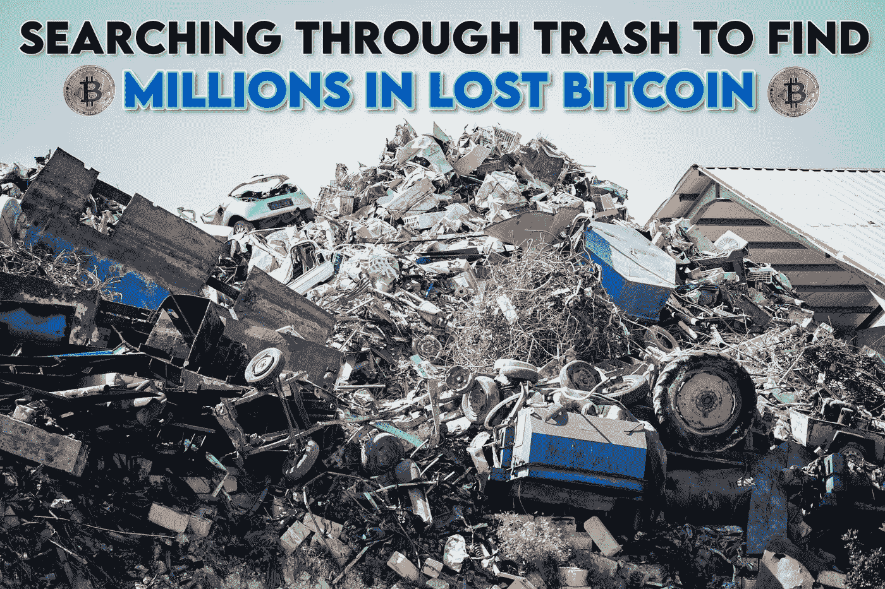

# 这名男子筹集了 1100 万美元，带着两只机器狗 Satoshi 和 Hal 在垃圾场找到了他的 8000 个比特币

> 原文：<https://medium.com/coinmonks/the-man-that-raised-11-million-to-find-his-8-000-bitcoins-at-the-dump-with-two-robotic-dogs-719357de6753?source=collection_archive---------35----------------------->

詹姆斯·豪厄尔斯永远不会停止追逐他的白鲸——他扔掉的一个硬盘，里面有他挖掘的大约 8000 个比特币。

Photo by Evan Demicoli on Unsplash

威尔士的埃姆斯·豪厄尔斯并没有放弃他的秘密梦想。有人可能会说，他已经因为一个代价高昂的错误而被折磨了多年…