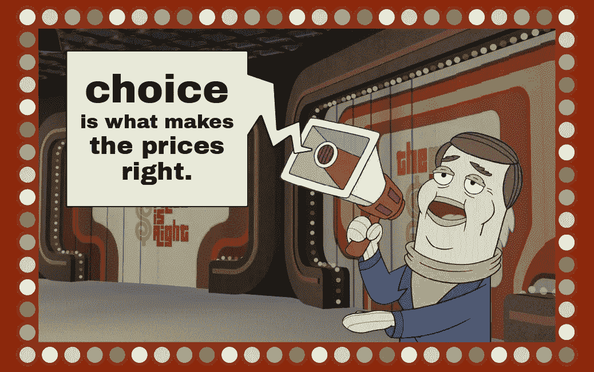
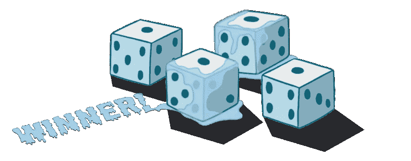
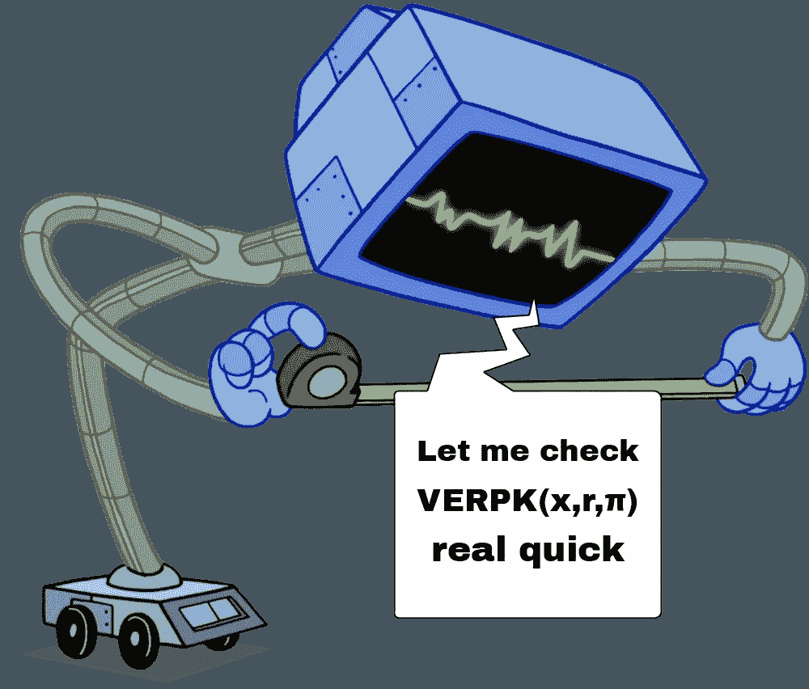
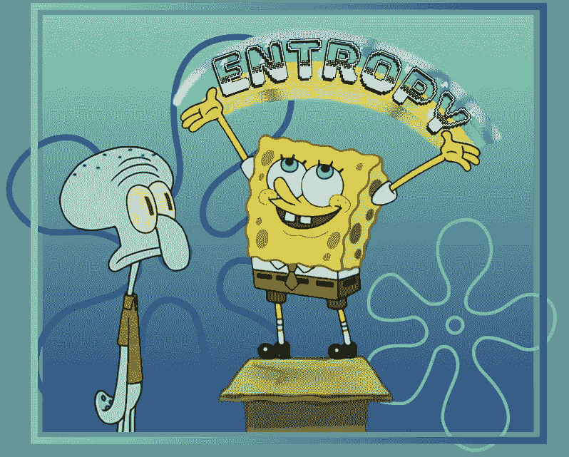
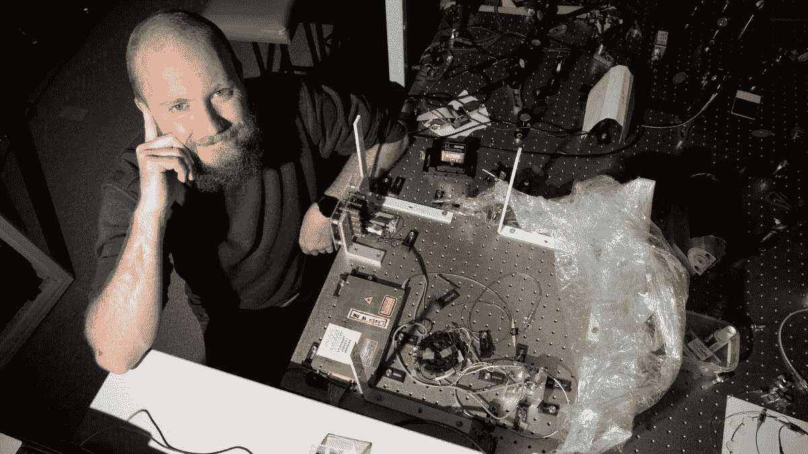
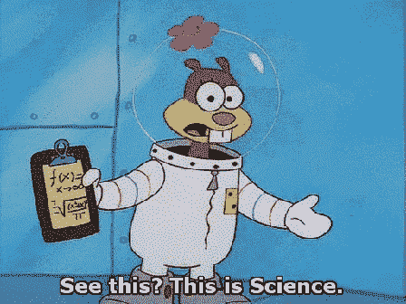

# 随机性市场

> 原文：<https://medium.com/coinmonks/the-market-for-randomness-a8c4a924fb0b?source=collection_archive---------41----------------------->

选择是市场的基石，并通过服务提供商之间的竞争推动创新。为了获得最大份额的顾客收入，公司受到激励，通过提供最适合市场的产品来击败其他公司。

Bob Barnacle explains market forces

> 这意味着那些在游戏中有皮肤的人必须不断地寻求改进，既要针对他们过去所做的，也要针对他们的竞争对手现在正在做的或将来可能会做的。

由于这种机制，服务不仅变得更好，而且变得更便宜。如果顾客不喜欢某种商品或服务的价格，他们可以选择搬到别处。有了竞争，市场力量可以诚实地平衡成本和所提供的东西。

*感谢资本主义！*

# 随机性市场

真正的随机性要求事件没有模式或可预测性。

它对人类如此重要，以至于被识别为骰子的物体在全球各地被发现，可以追溯到几千年前的[和史前](https://en.wikipedia.org/wiki/Dice#History)，随着时间的推移，我们发现了它的许多用途。

The result of 1 roll in 7500

[游戏和赌博](/api3/redefining-trust-truly-random-gaming-8da641ec66eb)经常采用随机的形式来选择赢家和输家(就像轮盘赌，或者吸管)，或者决定玩家的能力，就像大富翁游戏中的骰子在棋盘上移动玩家。

古代雅典的政府对其成员采用随机选择。管理重要事务的各种委员会通过从公民中随机抽取成员而定期形成和改革，就像今天陪审团的职责被分配一样。

> 雅典人认为随机选择是符合他们平等原则的最佳方式。

尽管我们一直在玩弄随机性，但我们发现的唯一真正的源头是自然，但你什么时候知道人类会让小小的自然限制他们的想象力？

让我们来看看在你的 Web3 项目中引入随机性的两种最佳方式。

*   可验证随机函数
*   量子随机数生成

# 随机性的密码证明

VRF 代表“可验证的随机函数”。这些功能由三部分组成:

1.  一种生成函数，使公钥/私钥对的长度为 k 位。

**GEN(1k) = (PK，SK)**

2.一个主函数，根据密钥输出一个关于随机性的变量。

**FSK(x) = (r，π)**

3.一种验证器功能，用于验证根据公钥正确计算了随机性。

**VERPK(x，r，π) =真/假**

Karen Plankton doesn’t trust anyone

除了一个数字，VRFs 还输出一个关于这个数字是如何产生的加密证明。

> 该证明使得计算可重复，从而实现不可信的一致性验证。

然而，vrf 在技术上是[伪随机数发生器](https://www.youtube.com/watch?v=H76UiKClI_U&t=1428s)(prng)，因为有一种机制会导致数字在足够长的时间后开始重复。

当你使用算法来产生随机性时，它们的编程方法固有地遵循一种结构，这种结构在给定足够的时间后会产生模式；他们更接近随机，而不是真正产生随机(因此有了 PRNG)。

此外，PRNGs 的安全性依赖于计算能力的限制，因为它们是确定性算法。

为了真正的随机性，我们必须回到自然界。

# 量子随机性

“Squidward, we don’t need to approximate randomness, so long as we have…”

> *“量子理论基本上告诉我们，在真空空间中，你仍然有……虚拟粒子形成和消失……这就是我们所看到的……我认为这就是为什么人们非常着迷于从无到有产生这个无限随机数序列”——澳大利亚国立大学量子光学组的 Koy Lam 教授*

在 ANU，他们通过在金盒中保持真空来创造这个真空空间，然后使用激光来检测粒子的存在和消失。测量结果被转换成二进制代码，用于生成随机数。

> 随机输入产生真正随机的输出。

# 数字化物理学

ANU 量子随机数发生器实验是专门为加密技术而优化的，即使在有对手的[存在的情况下也是安全的。](https://arxiv.org/abs/1411.4512)

Dr Aaron Tranter with the ANU Quantum Random Number Generator | Picture: Elesa Kurtz

QRNG 在真空中寻找噪音。把这种噪声想象成一种静电，由电、热和量子信息组成。有趣的是，构成噪声的比例遵循一种可预测的分布，即量子与经典噪声比，我们将看到这是所收集数据安全性的一个关键因素。

> 对手相对容易监测或控制热和电磁信号。然而，为了操纵量子信号，人类需要知道如何远程幻影显形物质，这目前还不在讨论范围内。

因此，科学家们能够使用量子与经典噪声比来抵消对手可能预测或控制的数据，并仅基于他们的激光器检测到的量子数据来生成数字。目前，这以 5.7 千兆位/秒的速率产生随机信息位，比可用于广播数据的带宽更快。

ANU API 为它收到的每个调用提供新的和唯一的随机数，并且在过去的 10 年里一直是这样做的。在请求得到满足之前，实验会产生一个任何人都不知道的答案，这是一个持续不断的数据流。

# 从澳大利亚，到世界，到网络 3

除了世界级的量子物理研究，澳大利亚国立大学的科学家们在过去的十年里为 Web2 提供随机数生成。然而，将第三方 oracle 节点集成到组合中的技术挑战使他们无法为 Web3 区块链项目提供相同的服务。

随着 API3 的第一方 Airnode 消除障碍，ANU 能够轻松地将其服务基础扩展到 Web3。

现在，智能合约可以向其 API 发出请求，并以数字、文本、颜色等形式接收真正随机的输出。

与现有的 VRF 选项相比，API3 QRNG 有一些很酷的优点:

1.  免费使用。
2.  可上十家连锁店的 VRF 不是，三家连锁店的 VRF 才是([全列表在此](/api3/api3-qrng-web3-quantum-random-numbers-4ca7517fc5bc#:~:text=API3%20QRNG%20is%20available%20now%20on%3A%20Arbitrum%2C%20Avalanche%2C%20BNB%20Chain%2C%20Ethereum%2C%20Fantom%2C%20Gnosis%20Chain%2C%20Metis%2C%20Milkomeda%2DCardano%2C%20Moonbeam%2C%20Moonriver%2C%20Optimism%2C%20Polygon%2C%20and%20RSK.))。
3.  真正的随机性归功于熵。
4.  打破了整个生态系统对随机数生成的垄断，从长远来看，这只会让开发者和 dApp 用户受益。

# 更丰富的 Web3 生态系统

通过 API3 QRNG，10 个新链上的开发者可以访问随机数生成。3 其他人现在可以在 API3 QRNG 和 VRF 之间进行选择。

无疑会有批评，但我很高兴看到一个新玩家进入游戏如何改变董事会。所以，来点爆米花吧，让我们看看随机性是如何发挥其魔力的——创新是不可预测的。

# 关于 QRNG 的更多信息

> [演示项目:Quantumon](https://quantumon.xyz) — Quantumon 使用 qrg 生成具有随机特征的 NFT
> 
> 教程:构建 quantum on—[Ashar Shahid](https://medium.com/u/ba993dd339df?source=post_page-----a8c4a924fb0b--------------------------------)带你了解如何构建这个项目。
> 
> [qrg 文档](https://docs.api3.org/qrng/?utm_source=Spongebob-randomness&utm_medium=Medium) —了解如何在您的 dApp 中实施 qrg。

> 交易新手？尝试[加密交易机器人](/coinmonks/crypto-trading-bot-c2ffce8acb2a)或[复制交易](/coinmonks/top-10-crypto-copy-trading-platforms-for-beginners-d0c37c7d698c)