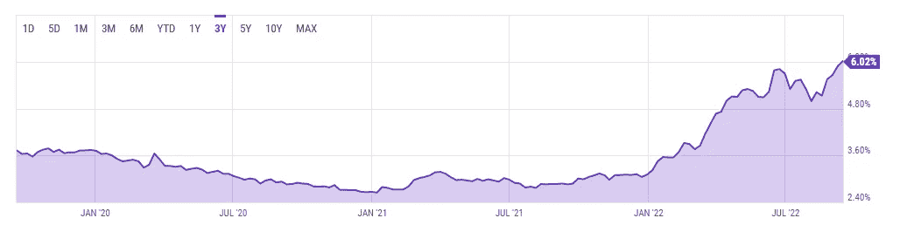
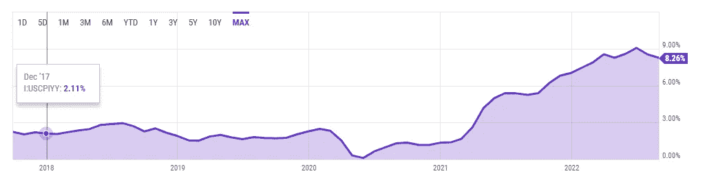
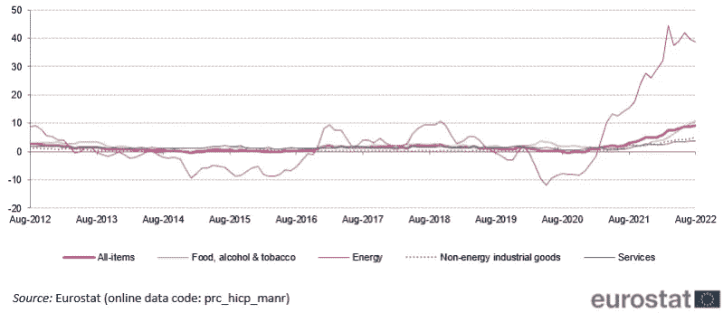
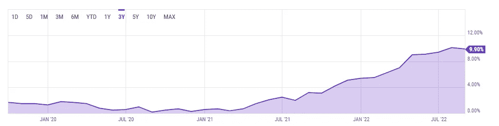
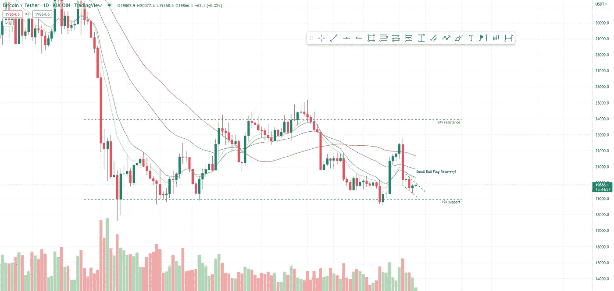
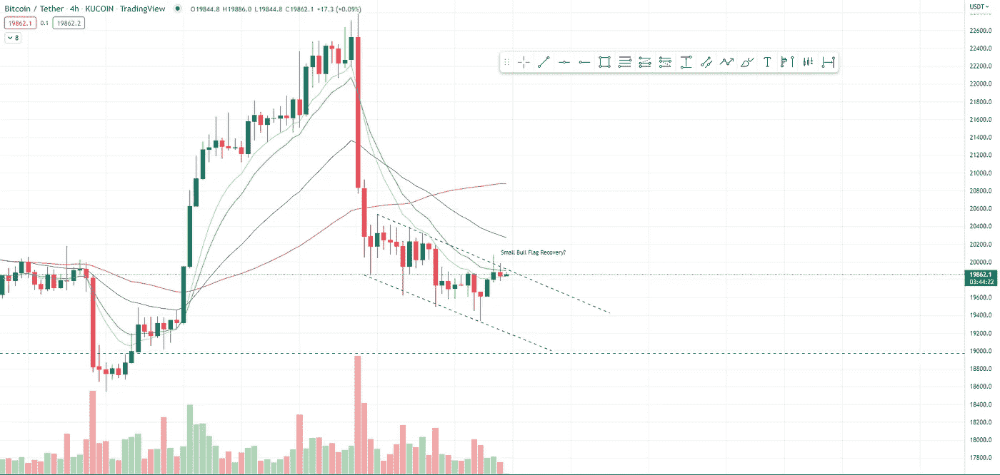
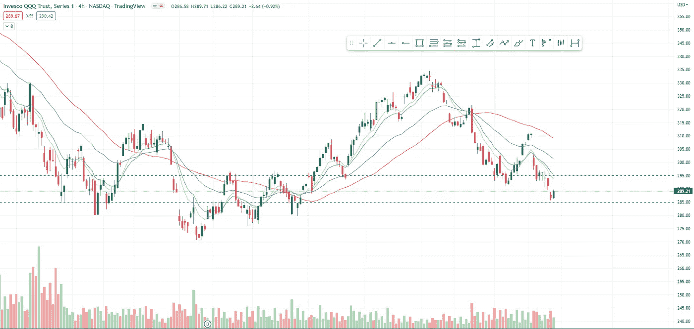
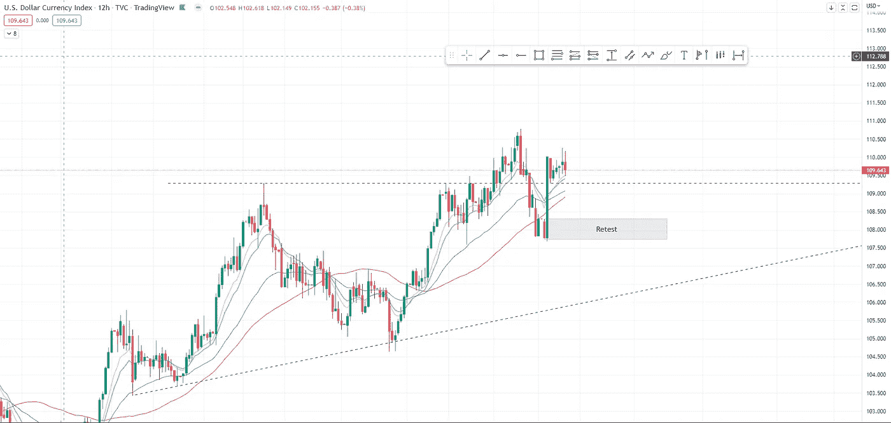

# 市场看起来不稳定，这是一个真正的警告

> 原文：<https://medium.com/coinmonks/the-markets-look-shaky-a-genuine-warning-c1f8c08e9b9?source=collection_archive---------20----------------------->

*the full version of this article is available on* [*www.boomish.org*](http://www.boomish.org/)

**在本周的报告中(9 月 9 日—9 月 16 日)**

*   30 年期抵押贷款利率超过 6.02%，为十年来最高。
*   8.3%的 CPI 超过了共识，导致大盘暴跌。
*   这是对我们所处的经济状况的真正警告，以及我们可能很快就会看到的痛苦。
*   以太坊成功实现其合并升级。
*   Robinhood 表示，比特币是他们平台上最常见的重复投资。
*   比特币价格看起来疲软，但可能会出现短期小幅反弹。
*   QQQ 未能守住 295，目前守住 285。
*   DXY 反弹，但短期内可能会见顶并再次测试较低水平。

‍

**抵押贷款利率跃升至 2008 年末以来的最高水平**

本周，30 年期抵押贷款利率继续上升，通货膨胀率高于预期，自 2008 年末以来首次超过 6%。

‍

30 年期固定抵押贷款利率目前为 6.02%(图 1)。

‍

利率上升在一定程度上是美联储为抑制通胀而加息的结果。提高抵押贷款利率和全面加息是为了遏制支出。

‍

2016 年，利率开始上升。它们在 2018 年底达到峰值，并在 2020 年继续下降。30 年期固定利率抵押贷款利率在 2021 年 1 月触及低点，仅为 2.65%。

‍

当 COVID 狂热袭击美国时，美联储将联邦基金利率降至 0% — 0.25%之间(联邦基金利率不是指抵押贷款利率，而是直接影响它)。

‍

美联储降低了利率，因此在 COVID 狂热期间，更多地鼓励房屋贷款和其他贷款，并在经济衰退期间增加总体支出。

‍

30 年期抵押贷款利率在 2021 年全年基本保持停滞，但自 2022 年初以来，利率大幅上升，年初为 3.11%，6 月底升至 5.70%。

‍

这种急剧下降是由于美联储释放了他们的行动对经济的有害影响(尽管他们永远不会承认)，并提高利率以减少支出(减少经济中的货币量)。

‍

更多的加息即将到来，因此预计今年抵押贷款利率将进一步上升。

‍

随着这一切的出现，9 月份对大多数投资来说是一个糟糕的月份，我们建议极度谨慎，我们预计事情很快会变得更糟。

【图 1 ycharts.com*)**30 年期房贷利率 2020–2022 年(*

*‍*

***CPI 导致投资骤降***

*‍*

*8 月份，CPI 同比上涨 8.3%，超过了 8.1%的预期。尽管与 7 月份的 8.5%相比有所下降，但 CPI 的发布仍然对市场产生了负面影响(图 2)*

*‍*

*自 2021 年 8 月以来，核心 CPI 已攀升 6.3%，该指数排除了波动的价格，是美联储的主要通胀指标。*

*‍*

*由于 CPI 消息，比特币下跌了 5%，以太坊下跌了 6.8%，尽管合并已经临近。*

*‍*

*这种类型的新闻发布对 BTC 的巨大影响表明，它仍然不能完全起到对冲通胀的作用，而是仍然是一种投资风险，就像股票等一样。*

*‍*

*在令人失望的 CPI 数据公布后，纳斯达克、美国 30 指数和 S&P500 股市也以大幅下跌开盘。*

*‍*

*美联储政策制定者已经明确表示，他们的首要任务是将通胀率降至 2%的目标，因此，市场参与者肯定会面临更多痛苦。*

*‍*

*虽然，这种金融痛苦不仅会被市场参与者感受到，而且很可能很快会被全球经济感受到，其程度要比我们目前所目睹的大得多。*

**

**图 2 2018-2022 年美国 CPI 同比(*[*【ycharts.com】*](http://ycharts.com/)*)**

*‍*

***真诚的警告***

*‍*

*没有什么看起来很好，我们看到全球通货膨胀达到十年来的最高水平，同时西部地区也出现了能源危机。这并不是传播恐惧，而是建议谨慎行事，为未来几个月最糟糕的情况做好准备。*

*‍*

*欧元区所有项目的通胀率约为 10%，能源通胀率约为 40%(图 3)。*

*‍*

*英国的通货膨胀率接近 10%(9.9%)(图 4)。*

*‍*

*美国的最高通胀率为 9.09%，目前为 8.26%。*

*‍*

*第三世界国家，如阿根廷，正面临如此高的通货膨胀率，你会认为这是一场真正的世界末日。阿根廷本周加息 550 个基点(5.5%)，目前通胀率高达 75%。*

*‍*

*总体情况并不乐观，但我们看到普通西方消费者几乎没有感受到痛苦，痛苦肯定会在某个时候感受到，而且很可能是迟早的事。*

*‍*

*这不是财务建议，但在这个动荡时期，规避风险似乎是共识。当然，有了非常积极的催化剂，我们可能会看到好转，但在不可预测的金融市场上，悲观情绪往往胜过乐观情绪。*

**

**图 3 2012-2022 年欧元区通货膨胀(欧盟统计局)**

*‍*

**

**图 4 通货膨胀英国 2020–2022(*[*ycharts.com*](http://ycharts.com/)*)**

*‍*

*以太坊合并成功*

*‍*

*最后，经过八年的工作和拖延，以太坊已经过渡到了股权证明。被称为“合并”的过渡升级在 9 月 15 日星期四凌晨完成。*

*‍*

*根据区块链和环境保护主义专家的说法，合并大大减少了网络使用的能源，因此增加了用户群，同时降低了天然气费用。*

*‍*

*正如许多人所知，工作证明(以太坊的旧共识方法，比特币也使用)是非常耗能的，因为需要采矿作业来运行网络。股权证明不需要采矿，而采矿是一项非常耗费精力的工作。*

*‍*

*以太坊基金会指出，合并将使以太坊的能耗降低近 99.95%。*

*‍*

*根据 Crypto Carbon Ratings Institute(CCRI)的一份新报告，合并还将以太坊的二氧化碳排放量减少了 99.992%。*

*‍*

*据区块链的联合创始人 Vitalik Buterin 称，以太坊的合并将世界能源消耗降低了 0.2%。这使得合并可能成为历史上最大的单一脱碳努力之一。*

*‍*

*“我们很高兴委托 CCRI 编写这份报告，它证实了以太坊合并的影响可能是历史上任何行业最大的脱碳努力，”ConsenSys 创始人兼以太坊联合创始人 Joseph Lubin 说。*

*‍*

*这是一个很大的好处，到目前为止几乎没有负面影响。好吧，如果有负面影响的话。利益的证明是一种更加集中的共识形式，它主要有利于富人，使他们进一步富裕，这在 Twitter 用户@BitcoinIsaiah ( [见此处](https://twitter.com/BitcoinIsaiah/status/1570416213548990468))的一份声明中说得很好，他在声明中说:*

*‍*

> **每次你使用以太坊，你都在给予那些拥有最多以太的人以太。**
> 
> **每次你使用比特币，你都在把 BTC 给那些投入最多工作的人。**
> 
> **这个一定要明白。**

*‍*

*‍*

*‍ **比特币在罗宾汉的零售应用***

*Robinhood 的首席执行官兼联合创始人 Vlad Tenev 在 9 月 13 日发表声明称，比特币是他们交易平台上最常见的重复投资。*

*‍*

*这是指不同形式的投资，包括持有、购买和已经持有比特币的用户的美元成本增值，*

*‍*

*根据 Tenev Robinhood 的说法，用户“真的将(比特币)视为他们投资组合的一部分，他们认为应该长期持有，”他们不仅认为这是值得持有的东西，而且会购买更多。*

*‍*

*尽管比特币价格下跌了 60%以上，但这种购买仍在发生。*

*‍*

*最重要的是，Robinhood 并不完全被认为是业内最高度比特币化的交易所，而是被广泛认为是密码行业初学者倾向于使用的交易所。但即使是他们也在持有并扩大比特币的持有量。*

***比特币价格分析***

*‍*

*自 9 月 7 日持续到 9 月 13 日的短期复苏反弹以来，比特币出现了大幅下跌。*

*‍*

*9 月 13 日，由于 CPI 消息，我们看到了更广泛的市场疲软。*

*‍*

*目前，比特币接近测试 19k 支撑位，每次重新测试时，该支撑位都变得越来越弱。*

*‍*

*一个可能向上突破的小旗形态正在形成，但鉴于我们已经看到的弱势，再次测试 19k 水平似乎也很有可能。*

*‍*

*总而言之，不要太牛。在这种情况下，寻找空头比试图做多更明智。*

*‍*

*虽然，如果 QQQ 看到上涨，DXY 看到下跌，比特币价格图肯定会出现牛市。*

**

**图 5 12H BTC 2022 年 5 月—2022 年 9 月(TradingView)**

**

**图 6 4H BTC 2022 年 9 月—2022 年 9 月(TradingView)**

***QQQ 价格分析***

*‍*

*过去一周，QQQ 表现相当疲软。*

*‍*

*在进行了一场形成多支蜡烛线的短期战斗后，该指数已跌破 295 支撑区。*

*‍*

*尽管如此，它还是跌破了，目前正试图守住它的下一个支撑位 285。*

**

**图 7 4H QQQ 2022 年 4 月—2022 年 9 月(交易视图)**

***DXY 价格分析***

*‍*

*DXY 已经看到了巨大的力量，但很可能会下降并重新测试图 7 中用“重新测试”表示的灰色框。*

*‍*

*短期再平衡可能会在未来一周发生，但在我们目前所处的市场条件下，DXY 将保持强劲。*

*‍*

*在这些金融不稳定的时期，人们涌向美元，与消费者在更广泛的市场上感受到的巨大痛苦相比，美元指数飙升得非常漂亮。*

**

**图 8 12H DXY 2022 年 5 月—2022 年 9 月(TradingView)**

> *交易新手？尝试[加密交易机器人](/coinmonks/crypto-trading-bot-c2ffce8acb2a)或[复制交易](/coinmonks/top-10-crypto-copy-trading-platforms-for-beginners-d0c37c7d698c)*