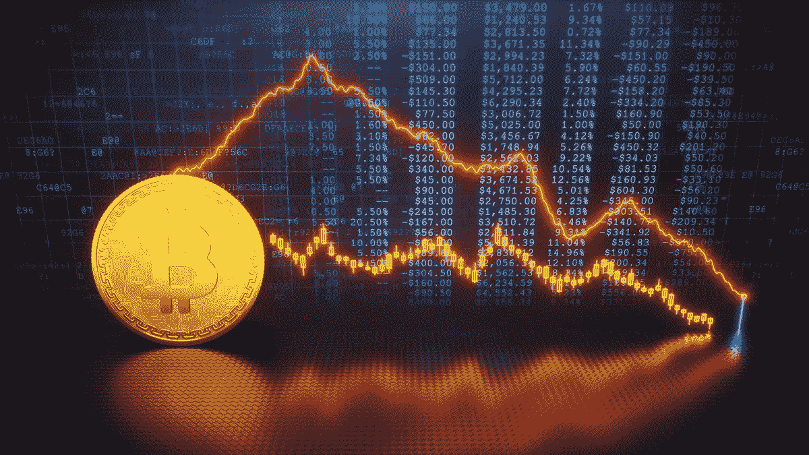

# 市场、全球经济危机和作为对冲的比特币

> 原文：<https://medium.com/coinmonks/the-markets-the-global-economic-crisis-and-bitcoin-as-a-hedge-9e9e542e63?source=collection_archive---------28----------------------->

> 交易新手？试试[加密交易机器人](/coinmonks/crypto-trading-bot-c2ffce8acb2a)或者[复制交易](/coinmonks/top-10-crypto-copy-trading-platforms-for-beginners-d0c37c7d698c)

知名加密货币分析师 **Invest Answers** 称，2022 年上半年市场经历了半个世纪以来最严重的下跌(巨额亏损和利率上升)，其 YouTube 频道拥有 442，000 名订户。

> “我是一个人，但我开始看到人们开始扭转局面，开始看到我们已经看到很长时间的数字。首先，经济已经崩溃，尽管有报告称 GDP 强劲。不，不是的。所有的市场都崩溃了。今年上半年是 50 年来最严重的下跌。消费者信心处于创纪录低点……联邦基金利率去年不到 1%，目前的目标是 2023 年初的 3.8%。利率翻了两番。我们正处于全面衰退之中。没有如果，没有如果，没有但是。”

# 比 2018 年还要差

该分析师补充说，目前的形势比 2018 年股市崩盘更糟糕，因为美国在大约四年内增加了价值 9 万亿美元的债务:

> “我们有一个建立在债务基础上的帝国，它无法将利率控制在 3.2%以上。它就是不能，让我用简单的数字来解释为什么。2018 年，美联储的最高基金利率为 3.2%，市场崩溃，债务比现在少了 9 万亿美元。那只是四五年前的事。所以他们不能在经济衰退时提高利率。这是我的简单看法，我敢打赌。”

# 美元和欧元

InvestAnswers 主持人将注意力转向避险投资，他指出，在经济和政治危机影响欧洲货币之后，美元指数(DXY)的强势表现出人意料地好，在过去六个月中甚至超过了瑞士法郎:

> “到处都是毁灭和黑暗，但隧道尽头有光明。根据我们在 DXY 上看到的，看起来它正在被克服。这一数字飙升至近 108，然后又回落。这种类型的形成告诉我们，它可以脱离危险。我认为对冲的时机是今年早些时候。早些时候，我有一个关于欧元对瑞士法郎的问题，我说瑞士法郎更安全。事实证明，在这段时间内，美元的表现会好一点，大约上涨 2%或 3%。但没人预料到欧元会崩溃这么厉害。”

# 作为对冲的比特币

这位分析师得出结论，人们仍然有时间购买硬资产，如比特币(BTC)，而不是法定货币，作为抵消投资组合未来损失的策略的一部分。

> “亮点是获得硬资产。想想比特币。这就是你现在对冲投资组合的方式。这将保持你的购买力，尽管它仍然被认为是一种高风险资产，仍然像所有其他资产一样在下跌。比特币可能是最安全的赌注。远离法定货币。他们都有问题。”

*原载于 2022 年 7 月 15 日*[*【https://bitnewsbot.com】*](https://bitnewsbot.com/the-markets-the-global-economic-crisis-and-bitcoin-as-a-hedge/)*。*

> *加入 Coinmonks* [*电报频道*](https://t.me/coincodecap) *和* [*Youtube 频道*](https://www.youtube.com/c/coinmonks/videos) *了解加密交易和投资*

# 另外，阅读

*   [Bookmap 评论](https://coincodecap.com/bookmap-review-2021-best-trading-software) | [美国 5 大最佳加密交易所](https://coincodecap.com/crypto-exchange-usa)
*   [加密交易机器人](/coinmonks/crypto-trading-bot-c2ffce8acb2a) | [造币评论](https://coincodecap.com/coingate-review)
*   最佳加密[硬件钱包](/coinmonks/hardware-wallets-dfa1211730c6) | [Bitbns 评论](/coinmonks/bitbns-review-38256a07e161)
*   [新加坡十大最佳加密交易所](https://coincodecap.com/crypto-exchange-in-singapore) | [购买 AXS](https://coincodecap.com/buy-axs-token)
*   [红狗赌场评论](https://coincodecap.com/red-dog-casino-review) | [Swyftx 评论](https://coincodecap.com/swyftx-review)
*   [投资印度的最佳密码](https://coincodecap.com/best-crypto-to-invest-in-india-in-2021)|[WazirX P2P](https://coincodecap.com/wazirx-p2p)|[Hi Dollar Review](https://coincodecap.com/hi-dollar-review)