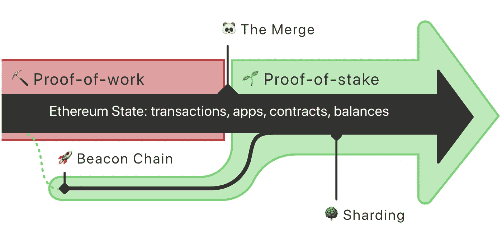

# 合并—快速概述

> 原文：<https://medium.com/coinmonks/the-merge-a-quick-overview-bb9688fcacdf?source=collection_archive---------10----------------------->

ETH 60%的月度涨幅是市场关注的明显迹象。

不要忘记人们买谣言卖新闻，所以现在不要对 ETH 疯狂…NFA。

Lance Grandahl — [https://unsplash.com/@lg17](https://unsplash.com/@lg17)

预计合并将在 9 月份进行，但由于过去的多次延迟，没有人会打赌。

## 开机自检

如你所知，以太坊正在转向一种利益相关共识机制。

**一个重要的方面是，以太坊并没有成为一个完整的利益相关区块链。**相反，它将使用利益证明作为一种手段来验证将记录在工作证明执行层基础上的交易。

以太坊的工作验证基础是对安全的承诺，与其他共识机制相比，以太坊网络需要 OG，6 英寸钢门，三重锁定，移动探测器，激光防护安全，这是工作验证。

但是，这种安全的代价已经高得无法支付。生态上和经济上。尽管生态争论有点目光短浅，因为它必须与其他全球产业相比较，我们优化未来的技术是至关重要的。对于财务方面，我们会看到它现在不会改变。

## 合并

这就是为什么它被称为**的原因，它本身并不是一把叉子**。

[https://ethereum.org/en/upgrades/merge/](https://ethereum.org/en/upgrades/merge/)

区块链不会改变，这就是为什么没有新的代币。没有 ETH2.0 令牌，不要上当受骗。

因此，ETH2 这个名字被去掉了。

交易、dapps 和智能合约保持原样，写入原始的 PoW 区块链。不同之处在于验证新交易，这些交易将通过**信标链**上的新验证器网络，而不是矿工。

这就像升级 SunPass 这样的高速公路自动支付系统，而不是在收费站排队。你在同一条路上改变技术。

## 你需要做些什么吗？

没有。

合并对你的资产没有威胁，你也不需要赎回任何东西。

## 第二层

一个自然的问题是“如果这些问题消失了，所有这些本应解决这些问题的项目会发生什么？”

现在不会有太多的改变，对 L2 解决方案的需求仍然非常重要。

实际上，**合并不会直接影响气费和吞吐量**。这些仍然是需求和网络管理能力的函数。业界的共识很明确，**一个更好的以太坊区块链对基于它的每个项目都是好消息**。

可扩展性不会对合并产生直接影响。事实上，它将来自第二层区块链的广泛采用以及以太坊区块链上的汇总和分片的集成。

Stillness in motion — [https://unsplash.com/@stillnes_in_motion](https://unsplash.com/@stillnes_in_motion)

## 三重平衡

以太坊的社区想出了这个概念来炒作标题中的进步，并把它与众所周知的事件如 BTC Halvening 联系起来。

BTC 的整体薪酬每 4 年左右减半一次。通过转换到 PoS，以太坊预计将从每年注入大约 4%的新代币变为只有 0.4%。

BTC 将在 12 年内达到这一速度，相当于 3 halvenings，因此得名。

## 最后的想法

如果合并后“什么都没变”，不要太惊讶。

这是一个更好的以太坊版本的踏脚石，更适应我们生活的时代。更便宜的汽油费和更快的交易将随后到来。

这个熊市提供了相当多的重大升级和令人兴奋的消息，我们可能会在下周潜水卡尔达诺的成就。

感谢阅读，

保重。

> 加入 Coinmonks [电报频道](https://t.me/coincodecap)和 [Youtube 频道](https://www.youtube.com/c/coinmonks/videos)了解加密交易和投资

# 另外，阅读

*   [印度最佳 P2P 加密交易所](https://coincodecap.com/p2p-crypto-exchanges-in-india) | [柴犬钱包](https://coincodecap.com/baby-shiba-inu-wallets)
*   [8 大加密附属计划](https://coincodecap.com/crypto-affiliate-programs) | [eToro vs 比特币基地](https://coincodecap.com/etoro-vs-coinbase)
*   [最佳以太坊钱包](https://coincodecap.com/best-ethereum-wallets) | [电报上的加密货币机器人](https://coincodecap.com/telegram-crypto-bots)
*   [交易杠杆代币的最佳交易所](https://coincodecap.com/leveraged-token-exchanges)
*   [如何给 MetaMask 钱包添加 Arbitrum？](https://coincodecap.com/how-to-add-arbitrum-to-metamask-wallet)