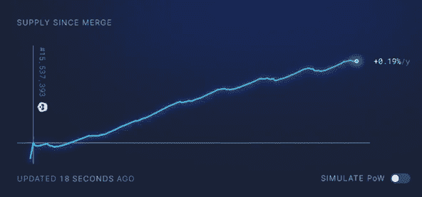

# 合并:一周后，通过数据可视化

> 原文：<https://medium.com/coinmonks/the-merge-a-week-later-visualized-by-data-7af5e6b12d05?source=collection_archive---------32----------------------->

# 介绍

合并最终于美国东部时间 2022 年 9 月 15 日凌晨 2:43 顺利到达。虽然普通用户没有注意到很多，但幕后发生了很大的变化。我的上一篇文章解释了什么是合并，以及一些变化，包括网络的能源使用和以太供应的增长。然而，人们不能轻易看到这些变化。为了可视化合并的影响，最好让数据自己说话。在这篇文章中，我将探索和想象以太坊的能源使用、客户多样性、批量生产和供应计划是如何变化的。

# 能源使用

## 底线

从工作证明(PoW)转换到利益证明(PoS)后，媒体捕捉到的最重要的变化是以太坊大幅降低了能耗。根据加密碳评级机构[的详细报告](https://carbon-ratings.com/eth-report-2022)，这一转变将以太坊的能耗降低了 99.98%。为了形象化这种大小上的差异，我们可以把埃菲尔铁塔比作一个乐高小雕像。此外，以太坊每年的二氧化碳排放量从 1100 万吨减少到 870 吨。这相当于不到 100 个美国家庭。

Ethereum’s electricity consumption visually compared in PoW vs PoS (CCRI)

## 能量使用估计:功率

由于测量每个节点的直接输出是不现实的，因此有几种不同的方法来估计能量使用。为了[在工作证明](https://carbon-ratings.com/eth-report-2022)下估计能量使用，可以使用自上而下的方法或自下而上的方法。一种自上而下的方法着眼于矿工的总收入，并估计该收入中用于电力的份额。图中的黄线说明了这种方法。自下而上的方法查看总哈希速率，即所使用的每种硬件的数量，然后汇总所有设备的平均能耗。已经发现这是一种更合理的估计方法，并且在图上用橙色和灰色线表示。

Energy Usage Estimation of Ethereum PoW Over Time (CCRI)

## 能源使用估算:PoS

Hardware Requirements for Each Ethereum PoS Client (CCRI)

通过测量每个客户端的硬件要求，估计每个客户端的能量使用量，然后通过网络中节点总数中客户端的分布对使用量进行加权，来[估计](https://carbon-ratings.com/eth-report-2022)利害关系证明的能量使用量。然后，可以通过使用这一加权数据并乘以碳强度因子来估计二氧化碳排放量，碳强度因子是根据网络节点的分布情况进行区域性调整的。下表说明了 PoS 能耗的计算以及 PoW 和 PoS 之间的比较。两者都是使用 2022 年 8 月和 9 月的数据按年计算的。据[商业内幕](https://markets.businessinsider.com/news/currencies/ethereum-merge-slashes-global-energy-consumption-vitalik-buterin-crypto-currency-2022-9)报道，这种影响非常显著，据贾斯汀·德雷克(Justin Drake)等以太坊研究人员估计，它已经将全球总能耗降低了 0.2%。

# 增加客户多样性

合并的另一个影响是增加了客户的多样性。根据[维基百科](https://en.wikipedia.org/wiki/Client_(computing))的说法，客户端是“一台计算机或程序，作为其操作的一部分，依赖于向另一个程序或计算机硬件或软件发送请求，以访问服务器提供的服务”。简单地说，它们是以太坊节点运行的用于验证交易的不同软件类型。有些网络，比如比特币，只用一个客户端。以太坊用[几个](https://carbon-ratings.com/eth-report-2022)，用哪个由各节点运营商自己选择。在 PoW 下，以太坊的客户端使用由 Geth 主导，超过 80%的节点使用它。在 PoS 下，客户端多样性大幅增加，这意味着更多的节点正在使用不同类型的客户端，Prysm 以 44%的网络份额领先，Lighthouse 以 34%的网络份额紧随其后。虽然这种分布要有利得多，但它仍然不理想，希望节点操作符随着它们的发布会扩展到其他客户机。

Ethereum Client Distribution

客户端多样性使网络更能抵御漏洞和攻击。bug 通常只影响一个客户端，并可能导致验证程序崩溃。一个严重的 bug 可能会导致大量的验证器从验证器集中被删除，这可能会使网络更容易受到攻击，从而导致激活[不活动泄漏机制](https://coinyuppie.com/why-is-understanding-ethereums-client-diversity-so-important/)，或者不可恢复的 fork。如果 1/3 或更少的 ETH staked 受到影响，信标链仍然可以继续完成块，并且受影响的验证器有时间等待错误被修复或切换到另一个客户端。如果超过 1/3 的 ETH 股份受到影响，信标链就无法完成，这意味着交易不能保证是永久和不可改变的。验证器惩罚也更加严厉，不活动泄漏机制被激活。通过这种机制，受影响的受损 ETH 被缓慢燃烧，直到受影响的 ETH 降至 1/3 阈值以下。因此，理想的情况是，对于任何单个客户端，客户端分布不超过 33%的节点。这张来自 clientdiversity.org的图表展示了理想分布与当前分布的对比

The Ideal Range of Client Diversity (clientdiversity.org)

# 更加一致的阻塞时间

从 PoW 的散列竞争转换到更有组织的 PoS 队列格式，导致了更加一致的阻塞时间。以前，数据块是基于哈希能力来解决的，这意味着数据块时间变化很大，由于纯粹的运气，它们可能几乎是即时的，也可能需要几分钟。现在，队列中分隔验证器的时间只有 12 秒。这意味着我们在块之间有一个一致的间隔，如果一个验证器错过了一个块，时间就跳到 24 秒。验证器可能会因为几个原因错过一个块。这可能是因为验证器关闭了，产生了一个未经批准的恶意块，或者其他原因。在这张由[硬币计量](https://ournetwork.substack.com/p/ournetwork-issue-138)制作的图表中，清楚地展示了这种阻滞时间的差异。合并后，以太坊网络更加可预测，具有一致的阻塞时间。

Block Time Comparison PoW vs PoS

# 供应表

作为合并的结果，以太坊网络最重要的变化之一是以太网排放减少了 90%。在合并之前，信标链共识层的发布量为每天 1，600 ETH，PoW 执行层的发布量为每天 13，000 ETH。现在这些链已经合并，战俘链不再发放奖励，新以太发放量仅为每天 1600 以太。这与 [EIP-1559 的燃烧功能](/@0xlobstah/what-is-eip-1559-3e30207fdc55)一起，意味着每天净乙醚排放量不到 1,600 ETH。这使得以太网有可能成为依赖于网络活动的通货紧缩资产。如果汽油费超过 15 千兆瓦，那么每天燃烧的乙醚就比排放的多。根据[超声波。金钱](https://ultrasound.money/)的说法，由于低网络活动，以太网在合并后仍然保持膨胀(右)。然而，在合并后的第一天左右，由于天然气费用超过 15 千兆瓦，乙醚价格下跌。从那以后，我们经历了几次通货紧缩，这从小时图(左)中可以明显看出，该图显示了通货紧缩的区块数量以及与每个区块相关的基本费用消耗。

Base Fees Burned and Supply Growth Since the Merge (ultrasound.money)

自从合并以来，乙醚供应增加了 4,700 ETH，使我们的年平均通货膨胀率约为 0.19%。如果我们还在运行 PoW，自合并之日起，供应量将增加 9.33 万吨。这是一个显著的差异，因为 PoW Ethereum 合并后会导致每年 3.78%的通货膨胀。这张图展示了 PoS 以太坊、PoW 以太坊和比特币通货膨胀率之间的差异。由于 PoS 的资源密集程度低于 PoW，验证者只需要矿工所需报酬的一小部分就能保持盈利。这使得乙醚有一个低发行，这与 EIP-1559 相结合，允许通货紧缩的性质和超声波货币迷因传播。目前，自合并以来，导致最高 ETH 燃烧率的应用是 600 ETH 的 OpenSea、516 ETH 的 Uniswap 和 434 ETH 的 ether transfers。

Supply Growth PoW vs PoS vs Bitcoin

# 结论

此次合并是区块链领域迄今为止最重大的事件之一，具有讽刺意味的是，普通用户并没有注意到它的变化。即使一个人在合并期间使用网络，他也不会注意到任何事情，除了由于大量的人试图被包括在第一个 PoS 块中而导致的费用的大幅飙升。事实上，第一个 PoS 块[的验证器收取了超过 45 ETH 的费用](https://etherscan.io/block/15537394)。除此之外，查看数据是可视化以太坊网络中这些重大变化的最佳方式。虽然这些变化现在看不到，但它们的影响肯定会在以太坊的能源使用、客户多样性、封锁时间和供应时间表中显现出来。

> 交易新手？试试[密码交易机器人](/coinmonks/crypto-trading-bot-c2ffce8acb2a)或者[复制交易](/coinmonks/top-10-crypto-copy-trading-platforms-for-beginners-d0c37c7d698c)