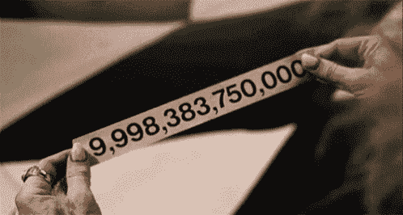

# 以太坊合并——你相信的误解

> 原文：<https://medium.com/coinmonks/the-merge-debunking-common-misconceptions-28e782fef15d?source=collection_archive---------5----------------------->

Photo by [Shubham Dhage](https://unsplash.com/@theshubhamdhage?utm_source=medium&utm_medium=referral) on [Unsplash](https://unsplash.com?utm_source=medium&utm_medium=referral)

## **简介**

在接下来的几个月里，我们*有希望*看到以太坊区块链的合并更新。即将到来的切换将改变整个以太网，从通过工作证明(PoW)机制达成共识到利益证明(PoS)。

然而，加密领域内外的许多参与者对合并有错误的假设，这可能会极大地改变他们的投资决策。

我经常看到重复出现的最重要的误解是什么？

你能说出为什么下列陈述是错误的吗？

*   合并一次释放所有的线程
*   合并降低了交易费用
*   合并增加了 ETH 发行
*   你必须手动更新你使用的应用程序
*   如果不锁定 32ETH，就无法运行节点

如果你揭开了某些陈述的神秘面纱，那么恭喜你！

现在让我们来验证你是否正确，并揭穿其余的误解。

## **合并一次释放所有被押以太网**

想象一下，在合并发生后，所有的栈被立刻释放。如果你想知道 ETH 的赌注是多少，让我用数字告诉你——13，640，408* ETH 是[目前的赌注](https://ethereum.org/en/staking/)。这是一个相当大的数字。用如此巨大的供应量充斥市场肯定会产生巨大的影响，我怀疑这将是一个积极的影响。

这些数字可能会增加。

虽然逐渐释放所有的股份看起来是一个合理的财务决策，但原因是完全不同的。

赌注的数量是惊人的，处理所有涉及释放的交易需要时间。

由于以太坊区块链及其验证器的基础设施，staked ETH 不会立即发布，也不会一下子发布。不要过多地探究技术细节，释放所有被标记的 ETH 可能需要长达一年的时间，因为对每个时期(即每 6.4 分钟)可以释放多少 ETH 有限制。

这可能是你被要求等待的最长的队列。

还有一点你们中的一些人可能会忽略。

你认为每个人都会卖掉他们未上锁的 ETH 吗？我对此深表怀疑。

一些被释放的 ETH 在解锁后肯定会被出售。然而，其余的不会离开赌注保险库。

如果你不记得，你的收益率不是用美元支付的；它以瑞士法郎支付。拥有以太坊生态系统的长期愿景，你不会错过在以太坊赚取收益的机会。

## **合并降低交易费用**

以太坊交易手续费的成本为什么不一样？

是因为给定时间内可以验证的交易数量。你希望你的交易进行得越快，你就要为跳过排队支付越多的费用。这纯粹是一种完美的自由市场机制。

好吧，现在让我澄清一件事。

合并将改变共识机制，从工作证明到利益证明，这不会改变区块链的吞吐量，即以太坊在给定时间内可以计算的交易数量。因此，合并不会对费用产生任何影响。

确实会降低交易费用的机制，虽然不完全在主链上，是上滚式或第 2 层解决方案，如 Arbitrum 或乐观主义，你可能听说过。

> 交易新手？试试[加密交易机器人](/coinmonks/crypto-trading-bot-c2ffce8acb2a)或者[复制交易](/coinmonks/top-10-crypto-copy-trading-platforms-for-beginners-d0c37c7d698c)

## **合并增加 ETH 发行**

合并后，我们会看到 ETH 发行的增加吗？相反，发行量将大幅下降。

目前的发行额约为每年 4.7%，主要是由于在 PoW 共识机制下给予矿工的奖励。然而，一旦合并发生，所有的战俘奖励将被排除在外，因为我们进展到 PoS 系统。

发行利率下调了多少？这很难说，因为数字可能略有不同，但它将减少约 90%的 ETH 发行率。

减少发行 90%左右。

你们中的一些人可能记得 EIP-1559 更新引入了一种燃烧机制，不断减少 ETH 供应。简而言之，我们做的交易越多，ETH 就烧得越多。这就是为什么有人说，从长远来看，瑞士联邦理工学院可能会陷入通缩。

你自己看看吧，这里有更多的统计数据。

还有，你可以在这里观看 ETH [的实时刻录。](https://watchtheburn.com/)

## **您必须手动更新您使用的应用程序**

这是一个常见的误解，因为人们认为合并是区块链上的一个硬岔口，在那里你会得到一个完全不同的链。嗯……不完全是。有很多更新人们并不知道，因为这些更新并没有被“社会炒作”。合并只是其中之一，但对区块链和整个生态系统来说更为重要。

如果你不知道合并发生的时间，你甚至看不出使用不同的应用程序或使用 Metamask 帐户进行交易的区别。

然而，必须进行一些更新，但是只要您不是节点验证者、基础设施提供者或个人 ETH staker，您就不必做任何事情。

## **不锁定 32ETH** 就无法运行节点

这一个是部分真实的。为什么？

因为我们可以运行不同类型的节点。

您可以运行一个完整的节点，以便成为验证器并生成块。在这种情况下，您将不得不下注至少 32ETH 或其倍数，因为每个 32ETH 会授予您网络上的验证者位置，从而获得 ETH 收益。

另一方面，你可能成为一个不同类型的验证者，在那里你不需要冒任何风险。您可以运行自己的节点(Light node)，验证由验证器(也称为块构建器)生成的块。

这样，你就不会获得任何奖励。然而，您甚至可以在智能手机上安装和运行 Light node，因为它不需要复杂的硬件或强大的处理能力。在这种情况下，您几乎没有任何成本地帮助保护网络，因为在智能手机上运行一个节点的唯一成本可能是更快的电池消耗。

## **结论**

如你所见，如果你只是一个普通的网络用户，合并在表面上可能不会被注意到。然而，从长远来看，合并将是加密货币历史上最重要的更新之一。

按估值计算，第二大加密货币将把共识机制从 PoW 切换到 PoS，大幅减少其发行。一些人声称，从长远来看，由于区块链的广泛使用，ETH 可能会变得通货紧缩，燃烧的 ETH 比发行的更多。

抛开未来的猜测不谈，让我们希望一切顺利，我们将能够看到以太坊生态系统的进一步发展。

下次见！

~法医。

> 加入 Coinmonks [电报频道](https://t.me/coincodecap)和 [Youtube 频道](https://www.youtube.com/c/coinmonks/videos)了解加密交易和投资

# 另外，阅读

*   [如何获得自己的。XYZ 领域？](https://coincodecap.com/xyz-domain)
*   [最佳加密交换平台](https://coincodecap.com/best-crypto-swap-platforms) | [最佳加密交易所](https://coincodecap.com/crypto-exchange)
*   [购买比特币印度](/coinmonks/buy-bitcoin-in-india-feb50ddfef94) | [Pionex 评论](/coinmonks/pionex-review-exchange-with-crypto-trading-bot-1e459d0191ea) | [加密交易机器人](/coinmonks/crypto-trading-bot-c2ffce8acb2a)
*   [印度的加密交易所](/coinmonks/bitcoin-exchange-in-india-7f1fe79715c9) | [比特币储蓄账户](/coinmonks/bitcoin-savings-account-e65b13f92451)
*   [Cloudbet 赌场评论](https://coincodecap.com/cloudbet-casino-review) | [点火赌场评论](https://coincodecap.com/ignition-casino-review)
*   [币安费](/coinmonks/binance-fees-8588ec17965) | [Botcrypto 评论](/coinmonks/botcrypto-review-2021-build-your-own-trading-bot-coincodecap-6b8332d736c7) | [Hotbit 评论](/coinmonks/hotbit-review-cd5bec41dafb)