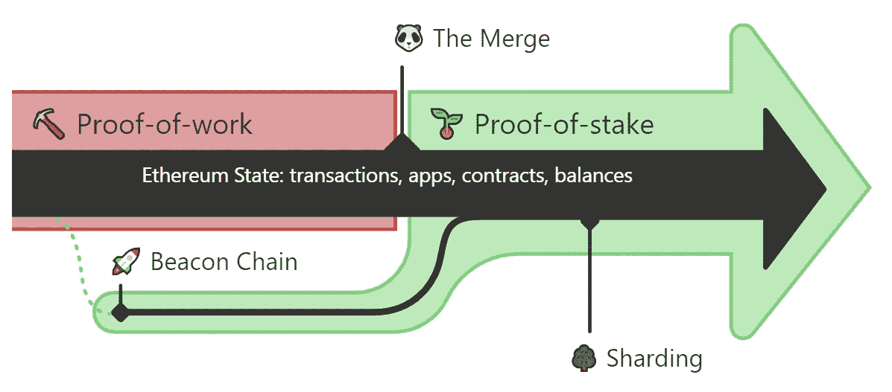
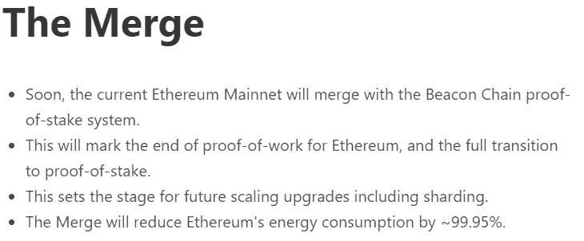
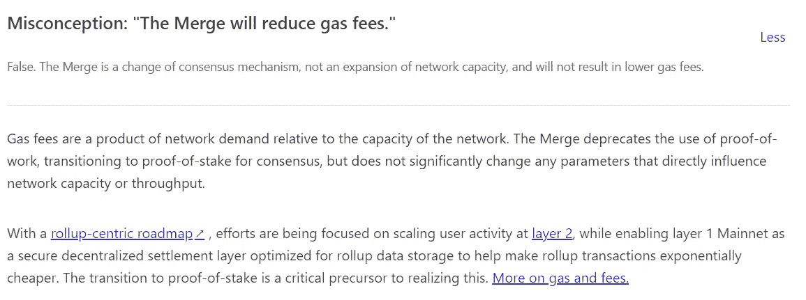
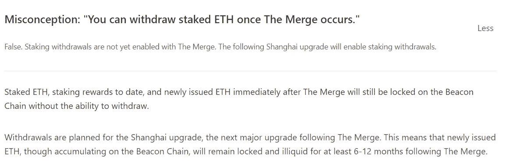

# 合并

> 原文：<https://medium.com/coinmonks/the-merge-e963176ed586?source=collection_archive---------44----------------------->

众所周知，以太坊一直在谈论即将到来的合并。很多人知道这意味着什么，知道这对以太坊有多大，但很多人不知道这是怎么回事。我把这篇文章献给那些不知道这次合并意味着什么以及它将如何影响以太坊的人。

我边走边学，但我认为人们需要知道这种融合意味着什么，以及以太坊的发展和有朝一日在全球使用有多重要。

以太坊从一开始就是一个 POW(工作证明)。权力意味着任何使用工作证明的加密项目都必须被挖掘。这意味着任何挖掘密码的人都在帮助验证交易，同时他们在密码中得到回报。[工作证明定义](https://www.investopedia.com/terms/p/proof-work.asp)

现在以太坊升级到 POS(股权证明)就不会再有采矿了。取而代之的是，根据你钱包里的密码数量，你将获得密码奖励。您持有的越多，赚取的越多。POS 更安全，让每个人都可以从持有中获利，而不是必须有高端设备才能开采。[股权定义证明](https://www.investopedia.com/terms/p/proof-stake-pos.asp#:~:text=Proof-of-stake%20is%20a,and%20keeping%20the%20database%20secure.)

很长一段时间，我认为这种合并将有助于汽油费和 ETH 将提供给普通人使用。事实并非如此。不过，这是朝着正确方向迈出的一步。合并到 POS 是第一步。然后是上海更新，然后是分片。

分片将是一个提升以太坊可扩展性和容量的升级。这使得交易更便宜，也使得节点更容易操作。

此外，每个人都需要知道，当合并发生时，你将不能撤回你的股份。大约在合并后的 6 到 12 个月，将会有另一次升级，称为上海升级，这将允许 staked ETH 被撤回。

合并将使以太坊的能耗降低 99.95%。这是以太坊迈出的一大步。合并也带来了更大的可扩展性、安全性和可持续性。

[**纵观以太坊的历史，开发者们一直在努力工作，准备最终从工作证明过渡到利益证明。2020 年 12 月 1 日，信标链被创建，此后它作为独立于 Mainnet 的区块链并行运行。**](https://ethereum.org/en/upgrades/merge/)

这次合并是以太坊历史上，甚至是整个密码史上最重要和最令人期待的一次。这是 Crypto 迈出的重要一步。以太坊是世界上最著名的加密项目之一。我认为更多人不使用它的原因是因为高额的汽油费，没有办法进行微交易。一旦上海更新和分片生效，更多的人将开始看到以太坊的能力。

我很期待以太坊的未来。它可以由人民为人民进行升级和调整。

以太坊并没有真正被任何人控制，从这个意义上来说，没有一个无所不能的实体或者一个阴谋家在幕后操纵它。以太坊完全通过其用户和开发者社区的参与和工作而存在。它们统称为以太坊网络。

我不是最了解区块链技术的人，但是我在学习，我想帮助其他人在我学习的过程中学习。如果你知道任何我没有分享的信息，我很乐意在评论中听到。

我希望你喜欢我的文章，如果你喜欢，请关注更多内容。我也希望这能帮助你了解以太坊是如何随着 Crypto 的发展而发展的。我们需要一个不断发展的区块链项目来统治他们，以太坊是我见过的最好的。唯一阻碍人们的是汽油费。我认为这个问题会在明年上海和分片实施后得到解决。

点击下面的链接查看以太坊的愿景。

[以太坊的愿景](https://ethereum.org/en/upgrades/vision/)

在我结束这篇文章之前，我想和你分享几个网站。这些网站将允许你赚取密码，这可以帮助你投资于你相信的项目。

CryptoWin 是我发现的最好的水龙头/ptc(点击)网站之一。你每次申请可以获得 2 到 4 个 sat，这看起来并不多，但是随着时间的推移会越来越多。他们还允许你从使用你的推荐链接的人那里赚取 50%的利润。看看吧，在评论里告诉我你的想法。

Cointiply — Cointiply 在加密领域是一个响当当的名字。说到加密，它可能是最赚钱的网站之一。你可以从这个网站赚一大笔钱，这是你进入加密领域的一个很好的途径。

CoinPayz 是另一个我喜欢的赚钱网站。开始时，你每次申请可以获得 1 到 2 个 sat，但是每连续使用一天，你就会获得更多。这个网站也有一个伟大的推荐收入机会。

感谢花时间阅读我的文章，我希望每个人都有一个伟大的一周！

检查我的网站为我所有的内容和不同的方式赚取加密。点击此链接或扫描上方二维码。https://hattysshack.com/

[上的原创文章 read.cash](https://read.cash/@HattyHats/the-merge-bddc76b7)

> 交易新手？尝试[加密交易机器人](/coinmonks/crypto-trading-bot-c2ffce8acb2a)或[复制交易](/coinmonks/top-10-crypto-copy-trading-platforms-for-beginners-d0c37c7d698c)