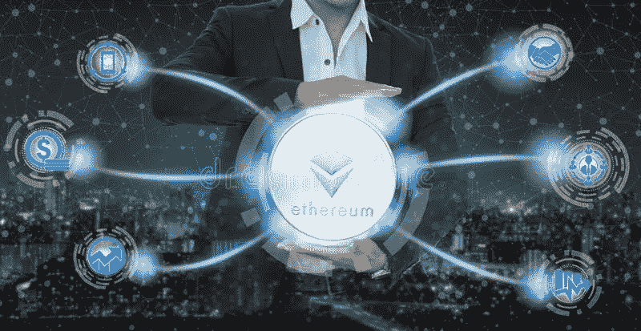

# 合并:以太坊最终转向股权证明——这是好事吗？

> 原文：<https://medium.com/coinmonks/the-merge-ethereums-final-shift-to-proof-of-stake-is-it-a-good-thing-4ec1b76f2c93?source=collection_archive---------46----------------------->

dreamstime

它计划在 2022 年第三季度的某个时候发生——以太坊称之为合并。

是什么让它有足够的新闻价值让你在意？有几件事。

**减少费用和交易时间**

不可替代代币(NFT)和以太币(以太币)几乎是同义词。那就是…