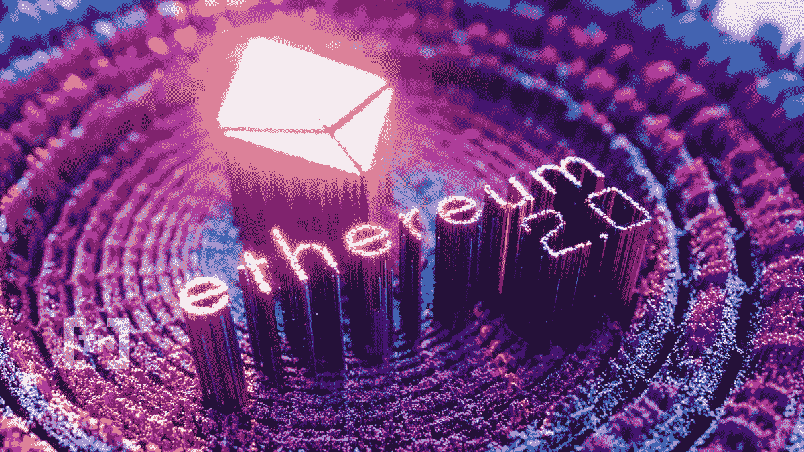

# 合并:以太坊对更高可扩展性、安全性和可持续性的愿景

> 原文：<https://medium.com/coinmonks/the-merge-ethereums-vision-to-more-scalability-security-and-sustainability-9176cd3b6a78?source=collection_archive---------15----------------------->

以太坊是仅次于比特币的第二大加密货币，占所有交易的 18%。更多的是填补比特币的不足，并对其进行改进。市值近[$ 2130 亿](https://coinmarketcap.com/)，我们也可以假设以太坊是比特币的更好版本。这并没有降低比特币的价值，因为与以太坊相比，比特币作为价值资产储存手段没有直接竞争。然而，以太坊在另一方面，以太坊创造了一种不同的新的商业模式、产品和服务，将曾经看起来像是少数特权者的交易开放给了大多数采用加密技术的人。

# 什么是以太坊

以太坊是促进 dAPPS 和智能合约的第一层区块链。$ETH 是为网络供电的令牌，用于支付燃气费和促进交易。不幸的是，以太坊有一个主要问题——它基于工作证明(POW)共识运行，这限制了它有效扩展的能力。POW 还意味着矿商必须验证交易，从而获得巨大的处理能力来支持采矿活动。

# 什么是战俘？

工作证明是一种共识机制，用于验证区块链网络中的新数据块。它的目的是在不信任第三方的情况下保证数字交易的安全。在权力共识机制中，矿工们竞相解决一个复杂的数学难题，以生成一个新的区块，并获得工作奖励。

不幸是，power 只能实现 13 的 TPS(每秒事务数)。由于需求的增加，以太坊的交易量现在每天超过 100 万笔，网络使用量的增加导致了交易速度变慢和高额的燃气费。

交易量的增加意味着以太网无法满足需求，市场变得不耐烦，导致替代 L1 或“以太杀手”

# 什么是 L1s/ETH 杀手？

L1 是智能合约平台，为以太坊提供了资金，旨在成为智能合约平台方面第二大玩家的合法竞争对手。它们是第 1 层区块链，可以减少第一个移动者的缺陷，并改善以太坊缺乏的功能和可伸缩性。

凭借更快更便宜的连锁店，这些第一层区块链正在经历快速的用户流入，而相反，TVL 在 [DeFi Llama](https://defillama.com/chain/Ethereum) 的以太坊市场份额在两年内从 100%下降到 55%。

现在几名 L1 玩家终于不负众望，以太坊团队别无选择，只能寻找解决方案。最后，他们得出了一个合理的结论——以太坊必须从 POW 过渡，以提高可扩展性和速度，并降低交易成本。

输入“合并”

# 了解合并

随着 Merge 的推出，以太坊的价格很可能会随着新用户、用例以及更多项目的建立而上涨。

最初，ETH 2.0 是大家都很熟悉的术语。尽管如此，以太坊还是决定放弃这个术语，因为它令人困惑(ETH 2.0 听起来更像是一个软件升级)，并且不能捕捉团队的愿景。这次合并是以太坊从工作证明(PoW)到利益证明(PoS)的正式转变。

这些阶段从 2020 年底开始，将持续到 2022 年。此外，我们可以将主要升级分为三类:

*   信标链(已完成)
*   合并合并(2022 年 6 月)
*   分片(2023+)分片使以太坊速度更快，计算量更小。碎片打破了以太坊数据库，提高了效率和速度。

第一次升级启动了网络中的[信标链](https://ethereum.org/en/upgrades/beacon-chain/)。第二阶段将合并信标链和现有的以太坊链。

# 这对以太坊意味着什么

目前，以太坊的发行量从 15k/天下降到 15k/天。这意味着排放量减少了 90%。排放量的下降是非常积极的，因为目前以太坊的发行导致了+3.2%的年通货膨胀率。POS 的改变意味着它使用的能源减少了-99.95%。

合并后，[以太坊供应量](https://ultrasound.money/)将减少-0.9%(基于 7d 供应量数据)。最终将会是通货紧缩。

其次，对 POS 验证者的奖励正在大幅增加。合并后，赌注回报预计约为 10%。

未来密码增长的最大驱动力之一是机构采用。随着环境问题成为当今时代利益相关方的主要考虑因素，采用环境可持续模式的区块链比其他连锁店更具优势。

# 合并有什么帮助？

分散化/安全性:MergeMerge 需要最少数量的节点，使得运行一个节点更容易

可持续性:PoS 使用的能源比电力少大约 99%

可伸缩性:为分片打开了大门，有朝一日可能允许 100k TP。

# 如何从合并中获益

你必须赌上你的命！要运行一个节点，需要入股 32 个 ETH，而且要锁定 ETH，直到合并。转型之后，奖金将不再属于矿工，而是属于股东。

然而，并不是每个人都能负担得起 32 ETH 所需的股份。目前，有一些提供商收费来解决这些问题。

这些协议非常简单:

您存放 ETH —少至 0.01 ETH

该协议将 ETH 与您的验证器关联起来

你收到一个液体(可出售)包装，代表对该抵押的权利

押记的 ETH 会产生利息

您可以在 DeFi 上使用液体包装

[火箭池](https://rocketpool.net/)、[丽都](https://lido.fi/)、[斯塔菲](https://www.stafi.io/)等。，允许你用以太坊下注，虽然它们在机制/去中心化/可组合性上略有不同。

他们让你用液体 ETH 代币包装纸赚取利息。您还可以投资于协议本身的治理令牌。

以太坊的未来非常耐人寻味。毫无疑问，合并将巩固以太坊作为智能合约王的地位。这种搭载下一亿用户的潜力将推动我们走向大规模采用，同时不会损害区块链最关键的方面——去中心化。

> 交易新手？尝试[加密交易机器人](/coinmonks/crypto-trading-bot-c2ffce8acb2a)或[复制交易](/coinmonks/top-10-crypto-copy-trading-platforms-for-beginners-d0c37c7d698c)