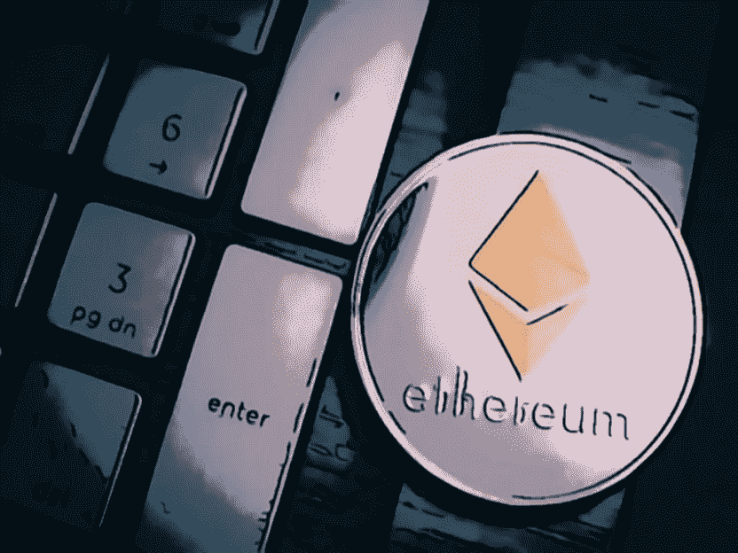
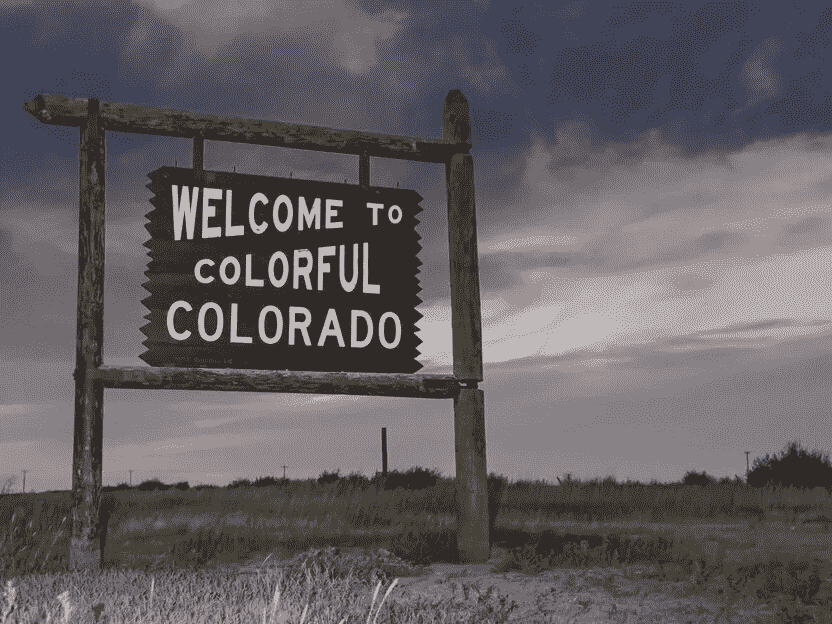

# “合并”无法稳定以太坊

> 原文：<https://medium.com/coinmonks/the-merge-failed-to-stabilize-ethereum-c05d77adada?source=collection_archive---------34----------------------->

过渡到新协议对以太坊没有任何帮助；美国的瑞士接受加密税收；日本正在越来越数字化

# 合并不能帮助以太坊

今年 9 月，以太坊网络转向了一种新的协议类型——利害关系证明——但所谓的合并并没有挽救区块链密码的显著衰落。在秋季的第一个月，这一比率下降了 20%以上。9 月中旬，以太坊区块链转向一种协议，在这种协议中，网络安全依赖于验证者——用户持有一定数量的密码。

根据以太坊创始人的说法，这种转变应该使加密货币更加安全，得到更好的保护；在首次宣布合并后，ETH 取得了相当不错的成绩。然而，后来的加密不能不跟随整体下降的加密市场运动，并与其他下跌。以太坊的总市值在 9 月下半月也有所下降。

尽管如此，一些分析师认为，下降趋势实际上是由以太坊引起的，以太坊拖累了其他加密货币。虽然不是所有的山寨币都进入了衰退期！例如，瑞波(XRP)增长了 40%以上。这要归功于他们对美国证券交易委员会(SEC)的成功诉讼。

# 科罗拉多州将接受加密税

尽管美国当局正在尽最大努力控制一切与加密相关的事情，但一些州对加密用户来说是好消息的来源。这一次，我们将谈论科罗拉多州，那里的税务局允许其用户以加密方式纳税。

此外，科罗拉多州当局正计划使 ico 合法化。州长 Jared Polis 是一个相当进步的政治家，他提出这个想法是因为他相信科罗拉多州需要跟上新技术的发展。难怪这个州也被称为“美国的瑞士”。虽然这个昵称更多的是关于高山国家和科罗拉多州的相似之处——它们都是多山的。

当局承诺将加密税支付的佣金定为 1 美元+总支付金额的 1.83%。

# 日本正在投资 Metaverses

这个太阳升起的地方长期以来以成功管理和发展高科技而闻名。现在，该国总理岸田文雄宣布，政府将投资 metaverses。此外，日本当局还计划为地方市政当局推出 NFTs，以激发他们对最新技术的兴趣。

日本政府已经有了一些用不可替代的代币奖励官员的经验。九月初，七名日本市长获得了国家森林基金的奖励。被提名者是那些在其管辖范围内积极实施新技术的市长们。

> 交易新手？试试[加密交易机器人](/coinmonks/crypto-trading-bot-c2ffce8acb2a)或者[复制交易](/coinmonks/top-10-crypto-copy-trading-platforms-for-beginners-d0c37c7d698c)