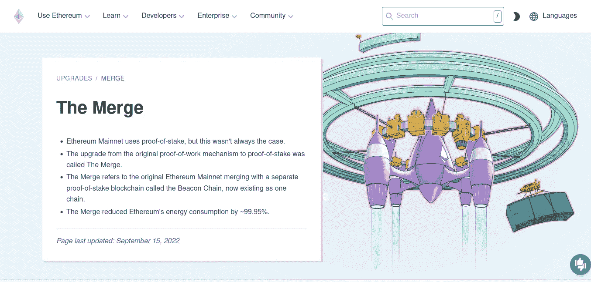

# 像我 5 岁一样合并

> 原文：<https://medium.com/coinmonks/the-merge-like-im-5-c7bb528a40ef?source=collection_archive---------17----------------------->

🙎:2022 年 9 月 15 日**区块链历史上发生了一件事**。

The Merge Website [https://ethereum.org/en/upgrades/merge/](https://ethereum.org/en/upgrades/merge/)

👦那是什么爸爸？

🙎:一辆名为**以太坊**的车将其发动机改成了**股权证明**

👦:哇😲从来不知道汽车引擎是可以更换的。😃

👦:为什么更换发动机🙋？

🙎:这辆**以太坊**车使用**工作证明**引擎消耗了大量能源。

👦:这是不是意味着汽油的成本会降低？

🙎:不会的，燃气费不会减少

👦那为什么要改变呢？

🙎:****发动机降低能耗 99.95%。****

****👦哇，这是一个对经济有影响的变化，爸爸。****

****🙎是的，引擎的改变让以太坊成为了环保的区块链 T21。****

******资源:******

**** [## 合并| ethereum.org

### 合并于 2022 年 9 月 15 日执行。这完成了以太坊向利害关系证明共识的转变…

ethereum.org](https://ethereum.org/en/upgrades/merge/)  [## 以太坊合并完成:这对你意味着什么

### 以太坊成功合并到 PoS。了解发生了什么，并提前提供教育资源。

www.blocknative.com](https://www.blocknative.com/ethereum-merge-countdown) 

> 加入 Coinmonks [电报频道](https://t.me/coincodecap)和 [Youtube 频道](https://www.youtube.com/c/coinmonks/videos)了解加密交易和投资

# 另外，阅读

*   [面向开发者的 8 个最佳加密货币 API](https://coincodecap.com/best-cryptocurrency-apis)
*   [7 个最佳零费用加密交易平台](https://coincodecap.com/zero-fee-crypto-exchanges)
*   [最佳网上赌场](https://coincodecap.com/best-online-casinos) | [期货交易机器人](/coinmonks/futures-trading-bots-5a282ccee3f5)
*   [分散交易所](https://coincodecap.com/what-are-decentralized-exchanges) | [比特 FIP](https://coincodecap.com/bitbns-fip)
*   [用信用卡购买密码的 10 个最佳地点](https://coincodecap.com/buy-crypto-with-credit-card)****