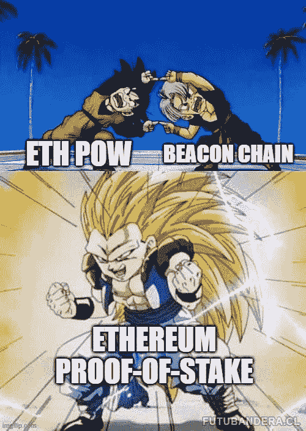
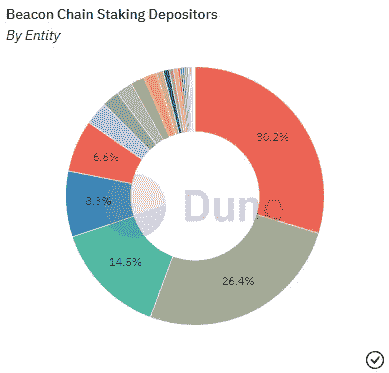

# 合并:快餐

> 原文：<https://medium.com/coinmonks/the-merge-quick-bites-313e6c4d580a?source=collection_archive---------22----------------------->

## 相信我，这不是又一个长篇大论的总结。

免责声明，NFA，所有这些法律的东西:本出版物及其附属机构上呈现的所有信息严格地仅用于教育目的。它不应被解释或视为财务、法律、投资或任何其他形式的建议。

嗨，伙计们🙋🏻‍♂️,

我想花点时间感谢这篇时事通讯的早期支持者。我已经写了两个月了，它正在稳步增长。平均来说，每期大约有 500 次浏览，而第一期就达到了 2000 次。虽然这个数字对你们中的一些人来说可能看起来很小(仍然大于典型的大学 101 讲堂)，但这是一个很好的开始，我迫不及待地想在接下来的几个月里回头看看。

当我写这一期的时候，以太坊合并正在进行中。坦白地说，我真的不知道这个星期该写些什么。这一重大事件引起了人们的注意，写其他任何东西都没有多大意义。也就是说，合并已经被每个人和他们的妈妈报道了；所以我不打算用另一篇关于合并对以太坊是好是坏的长篇文章来打扰我的早期支持者。

相反，这一期将以 ***快速阅读的形式与相关来源*** 一起呈现，并以我个人的一些观点作为结束。

祝你好运！

 [## 马可·马诺波沉思的实用主义

### 秘密，商业和生活的思考-与炒作的实质。点击阅读马可·马诺波的《沉思的实用主义》

pensivepragmatism.substack.com](https://pensivepragmatism.substack.com/) 

# 合并

在这一点上，我们都知道合并是将现有的具有工作证明(PoW)共识的以太网网络与现有的运行着利益证明(PoS)共识的并行链(称为信标链)合并的行为。它将以太坊网络从 PoW 转换到 PoS。

Source: [https://ethereum.org/en/upgrades/merge/](https://ethereum.org/en/upgrades/merge/)

**重要原因:**以太坊是利用率最高的区块链，在其基础上构建的分散式应用创造了超过 300 亿美元的价值。ETH 也是第二大加密资产，市值接近 2000 亿美元。

*   合并还将证明维护和升级一个大规模的分散网络是可能的，进一步证明 web 3.0 的愿景是可行的。

**发生了什么:**合并已经进行了数年，加密社区对合并的结果感到兴奋(和焦虑)。以太坊网络的合并有许多好处，但主要是:

[1]将以太坊网络的**能耗**降低 99%。

*   以太坊目前消耗的电力相当于荷兰的电力。
*   不管你喜不喜欢，投资空间越来越[倾向于](https://www.bloomberg.com/news/articles/2021-12-31/how-blackrock-s-invisible-hand-helped-make-esg-a-hot-ticket)ESG 叙事。这种批评是反对 BTC 和更广泛的加密市场的常见话题。
*   如果我们希望 crypto 得到更多机构的采用，我们需要以太坊成为[能源友好型](https://www.coindesk.com/layer2/2022/09/02/tradfi-investors-will-love-ethereums-merge/)

[2]将新 ETH **供应发放**率降低约 90%。

*   [目前](https://ultrasound.money/)，每天发行 14600 个新的 ETH。合并后，这个数字将下降到只有 1600。
*   年通货膨胀率将从 4.62%下降到 0.49%。
*   包括在 [EIP-1559 升级](https://www.gfinityesports.com/cryptocurrency/ethereum-burn-rate-how-much-eth-burned-deflationary-eip-1559-london-hard-fork/)后的[燃烧](https://watchtheburn.com/)，ETH 将极有可能成为一项通缩资产。

[3]为**进一步扩展升级准备以太坊网络。**

*   以太坊网络将进一步升级，以解决可扩展性和交易费用问题。将网络迁移到利益相关的网络是实现更多目标的第一步。
*   [分片](https://ethereum.org/en/upgrades/sharding/#:~:text=Sharding%20is%20the%20process%20of,rollups%20over%20the%20entire%20network.)，一种将网络分割成更小分区的技术，本质上是水平分布负载并帮助扩展网络，将能够在合并后实现。
*   Vitalik 为社区提供了一个路线图，可以概括为:
*   **激增:**分片和 TPS 缩放
*   **The Verge:**Verkle Trees intro 和验证器去中心化
*   **净化:**减少空间，简化协议
*   **挥霍:**维护网络的小规模升级

期待什么

*   ETH 持有者和以太坊网络用户**不需要做任何事情**。虽然合并是一项技术壮举，但它将在后台发生，大多数零售用户不会注意到。
*   **汽油费和交易速度将保持不变**。我知道这是个遗憾，但是合并并不是为了解决这些问题。相反，合并后的下一次升级，称为[上海](https://watcher.guru/news/ethereum-shanghai-update-what-and-when-is-the-update)，将解决这两个问题。
*   **押了 ETH，后续奖励不可提取。**新发行的 ETH 将[锁定](https://ethereum.org/en/upgrades/merge/)至少 6–12 个月，只有在上海升级后才能退出。
*   **ETH PoW fork** [**日期**](https://decrypt.co/109561/ethereum-fork-ethereumpow-announces-date-of-mainnet-launch) **已经公布。**不出所料，现有的矿工不想浪费他们的硬件，已经选择了将以太坊网络分叉为“以太坊战力”的选项。如果这种情况真的发生，ETHW 将被“空投”到新以太坊战俘链上的 ETH 持有者手中。
*   **顶级验证者之间的权力集中。**对 PoS 模式最有效的批评之一是，权力有可能集中在顶级赌注池中。前 5 大资金池目前拥有以太坊网络 75%以上的资金。

Source: [https://dune.com/arch1111/eth-staking-dashboard](https://dune.com/arch1111/eth-staking-dashboard)

## 我的拍摄

如上所述，合并涉及许多因素，不同的参与者有不同的动机。合并后，我们需要评估:

*   以太坊战力叉会如何发挥？
*   MEV 格局会有怎样的变化？
*   赌注池集中化的趋势会越来越强吗？
*   上海升级会延迟吗？这将如何影响提款？
*   ETH 收益率真的会成为 crypto 的“无风险率”吗？

我通常认为做出预测是有价值的，但对当前形势来说没那么重要。底线是，考虑到能源成本和发行率的降低，合并对以太网是一个积极的举动。将需要进一步升级和合并后维护，以确保网络在新的 PoS 环境中的稳健性，并解决其现有的可扩展性和燃气费问题。

我认为 ETH 价格仍将主要受到宏观市场的影响，仍将被视为一种风险资产，但它将开始更多地与 BTC 脱钩。机构配置者不能再利用 ESG 的谈话要点不投资于 ETH，它现在将开始产生可被视为 DeFi 协议无风险利率的收益率。

总而言之，合并将表明密码社区可以以分散的方式实现困难的技术壮举，进一步证明我们都在努力实现的更加开放和公平的网络未来确实是可以实现的。

## 沉思的时刻

伊丽莎白女王去世了。不管你喜不喜欢君主制，不可否认他们对世界有很大的影响，不管是好是坏。现实是，当我们结束生命时，我们大多数人不会有同样的影响力。对我来说，这意味着与一年前相比，我们有更多的理由停下来，喘口气，看看我们目前的生活状况。对于那些正在尝试的人来说，希望这个结果能让我们看到事情发生了多大的积极变化。我们经常陷入这个疯狂的快节奏的秘密世界，认为“成功”已经太晚了。收益率农业 ponzinomics 已经饱和，狗硬币不再给出 50 倍的回报，不良风险投资基金不断倾销零售。回想起来，所有这些可能都不重要，因为一年之内你的生活会发生很大的变化。盘点你的幸福，暂停，优先考虑最重要的事情——如果那是工作，那很好，但是我发现我们经常忘记其他的事情。

直到下一次，

马尔科·m。

 [## 马可·马诺波沉思的实用主义

### 秘密，商业和生活的思考-与炒作的实质。点击阅读马可·马诺波的《沉思的实用主义》

pensivepragmatism.substack.com](https://pensivepragmatism.substack.com/) 

> 交易新手？试试[密码交易机器人](/coinmonks/crypto-trading-bot-c2ffce8acb2a)或者[复制交易](/coinmonks/top-10-crypto-copy-trading-platforms-for-beginners-d0c37c7d698c)