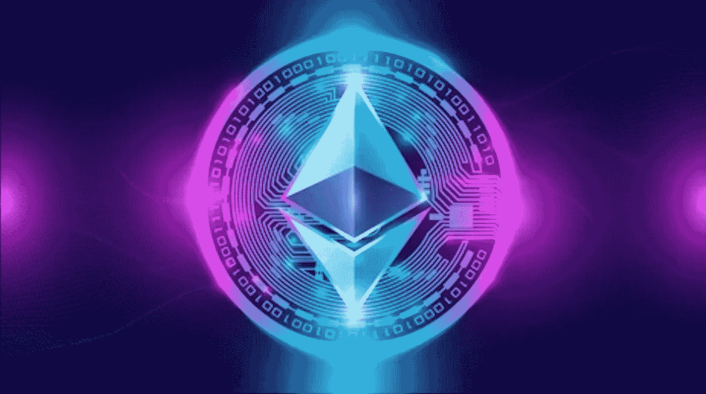

# 重新审视合并

> 原文：<https://medium.com/coinmonks/the-merge-revisited-321d9d48d793?source=collection_archive---------10----------------------->

## 作者:[哈利勒·布莱恩特，法学博士](https://www.linkedin.com/in/khalil-bryant-a64a33111/)

如果你像我一样是一个连续的电子邮件时事通讯订阅者，那么在夏天的时候，你每天早上醒来都会看到至少 3 个头条新闻，谈论一些叫做合并的事情。如果你读了其中的任何一篇，恭喜你(我不相信你)。如果你没有，我抓到你了！

虽然我不想成为一只绵羊，在你的新闻提要中加入加密点击诱饵的攻击，唉，我来了。作为你的常驻"秘密兄弟"，我不仅有权利而且有责任向你解释这些。

Ethereum Stock Image

# 你会问，wtf 就是合并？

以太坊，即“世界计算机”，第二大最有价值的区块链，Vitalik Buterin 的智慧结晶，最近从使用工作共识证明机制过渡到利益共识证明机制。这一转变是区块链发展的五个阶段之一。根据布特林的以太坊路线图，这五个阶段是:合并、激增、濒临、清洗和挥霍。

共识机制有很多种，我在这里就不赘述了。但重要的是要知道，共识对于任何区块链的顺利运转都是必不可少的，因为这让他们变得不可信任。

区块链被认为是不可信的，因为没有中间人来确保一方不会在交易中欺骗另一方。尽管没有监管中间人，但甲方可以放心地在区块链上与乙方进行交易，因为潜在的共识机制阻止了不良行为者。共识是区块链的节点如何保持准确的交易记录，以确保没有人作弊。

在区块链网络中，欺骗被称为 sybil 攻击。sybil 攻击是指黑客通过创建一系列虚假身份来破坏网络，以获得对网络协议的巨大影响。例如，臭名昭著的“51%攻击”是指大多数加密网络的挖掘者或验证者为了他们自己的私利而合谋重组网络。

与本博客同名的“工作证明”是一种共识机制，它使用一种竞争性激励结构，在这种结构中，赢得竞争的回报远远超过作弊的成本。

比特币，即数字黄金，是世界上和我们心中的第一名，是化名中本聪的大脑产物，使用工作证明和其原生硬币比特币(BTC)，是矿工因第一个成功解决复杂数学难题而获得的奖励(以及交易费)。解决这个难题成功地验证了一个事务块，并将其添加到不可变链中。

这是杜撰出来的工作证明，因为解谜所需的精力是让每个人保持诚实的原因。随着更多的节点竞争解决特定的块，难题的难度增加，这反过来需要更多的能量。也就是说，越来越大的难度阻止了 51%的攻击发生，因为获得这么大的权力会变得极其昂贵，尤其是在比特币发展的这个阶段。

对区块链使用工作证明的批评者指出，它需要过多的能源消耗，这就是为什么近年来大多数新项目选择使用股权证明的原因。

利害关系证明不同于工作证明，因为它通过胡萝卜加大棒式的方法而不是基于竞争的激励来达成共识。

胡萝卜是*赌注*，这是当验证者锁定或抵押他们的资产/令牌(在以太坊的情况下，以太(ETH))到一个协议中，以获得提议下一个块的机会，并且抵押的资产增值。根据协议资产的数量，随机选择利益链证明的验证者。换句话说，更高数量的赌注资产使你更有可能被选中来验证下一个区块。棍子是*砍，*坏的验证者因为不诚实的行为而被惩罚，被强制从链中移除并失去他们的资产。

由于验证者在验证利益链时不会主动地互相竞争来提出新的区块，因此能量消耗的数量会以指数方式降低。事实上，据说合并降低了以太坊超过 99.9%的能耗。因此，不再需要使用 ASICs(特殊采矿设备)作为验证器，交易速度(据称)更快。(重要的是，交易费不一定有什么不同。)[虽然能源消耗可能只是转移到其他区块链，而不会完全消失](https://www.yahoo.com/video/did-ethereum-merge-drop-worldwide-175232923.html?utm_campaign=ic&utm_medium=newsletter&utm_source=morning_brew)。

另一方面，对利益链证明的批评者强调，与工作链证明相比，缺乏经证明的安全性，以及鲸鱼对网络交易具有巨大影响的能力。此外，许多人发现以下事实存在问题:许多利益链证明要求资产被抵押的时间最短，从而导致流动性降低。

如果去中心化被看作是一个光谱，那么合并无疑导致以太坊进一步走向一个中心化的区块链。向股权证明的过渡在两个方面挑战了以太坊的去中心化叙事:1)它说明了以太坊基金会如何仍然对其方向行使高度控制，2)鲸鱼现在可以对交易验证施加高度影响。

看看以太坊的潜在监管待遇会因此发生怎样的变化，将是一件有趣的事情。过去，许多著名的监管机构都以类似的眼光看待以太坊和比特币，但转向股权证明从根本上改变了以太坊区块链的性质。与其被视为一种商品，它很可能被归入豪威 T2 测试定义的证券范畴。

# 后知后觉是 20/20 **，**

所以重要的是看看合并后以太坊发生了什么值得注意的变化(如果有的话)。自上个月合并以来，以太的价格下跌了 15%，远远超过了同一时期的比特币。在合并之前，由于其他加密货币继续下跌，价格比今年的低点翻了一番。这可能是由于交易商从超额收益中获利，因为加密货币被视为风险资产，宏观环境已经恶化。导致资产价格下跌的另一个因素是[最近的监管压力](https://www.reuters.com/technology/biden-administration-wants-more-crypto-enforcement-digital-asset-rules-2022-09-16/)，随着该领域破产和法律纠纷的持续以及中期选举的临近，监管压力一直集中在加密行业。

无论短期价格趋势如何，从长期来看，以太坊的投资者可以预计 ETH 的价格会上涨，因为合并已经减少了大约 90%的 ETH 发行，假设链上的流量随着时间的推移继续增加。同样，今年早些时候 EIP-1559 提案的实施意味着一部分交易费用被烧掉，这也将对价格产生积极作用。根据 Arca 的说法，采用这种分期偿还方式的硬币持续表现优于牛市和熊市。

说到流量，合并没有解决的一个问题是以太坊的可扩展性问题。自合并以来，区块链仍在与拥堵和交易费作斗争。

此外，根据区块链发展机构 Labrys 的说法，自从合并以来，以太坊上的审查更加普遍，因为中继使用审查软件来排除不符合外国资产控制办公室(OFAC)要求的交易。如果不使用审查软件的申请人数量减少，这在未来可能会成为一个严重的问题。

尽管如此，合并的主要原因是由此带来的能源消耗的减少。既然机构不再担心 ESG，它们将更愿意投资 ETH，或者探索在区块链以太坊创建自己的代币。虽然这对大规模采用是积极的，但它也增加了对分散化的担忧，因为拥有广泛资源的机构现在可以参与 ETH 并充当验证者，从而对块验证产生很大影响。[数据已经表明，包括利多和比特币基地在内的鲸鱼控制了大部分的濒危物种。这种验证器的集中化增加了 51%的攻击威胁。](https://decrypt.co/109901/big-firms-dominate-post-merge-ethereum-validation)

总而言之，就能耗而言，合并是成功的，但时间将会证明以太坊过渡到股权证明对于网络而言，在其他重要方面(如安全性、去中心化和可扩展性)是否是正确的。

> 交易新手？试试[密码交易机器人](/coinmonks/crypto-trading-bot-c2ffce8acb2a)或[复制交易](/coinmonks/top-10-crypto-copy-trading-platforms-for-beginners-d0c37c7d698c)