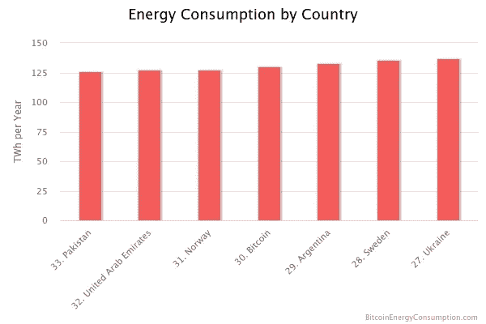
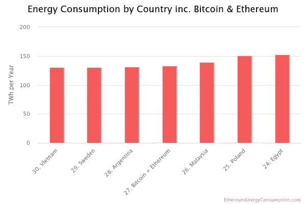

# 合并:以太坊从 PoW 到 PoS 的转变对环境意味着什么？

> 原文：<https://medium.com/coinmonks/the-merge-what-does-ethereums-switch-from-pow-to-pos-mean-for-the-environment-ed29a99cf2df?source=collection_archive---------19----------------------->

[Courtesy of MIT Technology Review](https://www.google.com/url?sa=i&url=https%3A%2F%2Fwww.technologyreview.com%2F2022%2F03%2F04%2F1046636%2Fethereum-blockchain-proof-of-stake%2F&psig=AOvVaw04Ek7a4SAr9x65MVvNILH5&ust=1664198203277000&source=images&cd=vfe&ved=0CAwQjRxqFwoTCODR7cSDsPoCFQAAAAAdAAAAABAD)

2022 年 9 月 15 日，Vitalik Buterin 在一条推文中宣布，以太坊从工作证明到股权证明的计划转换，即著名的“合并”，已经成功完成。

以太坊的联合创始人继续敦促所有为这一巨大成功做出贡献的人感到非常自豪。值得注意的是，我们的环境是以太坊最新行动的最大受益者之一。在本文中，我们仔细研究了我们的环境如何从合并中受益的细节。

Vitalik’s historic first tweet after Ethereum’s successful merge.

就我个人而言，我也想对所有参与合并并取得巨大成功的人竖起大拇指。携手合作，对世界第二大区块链网络进行重大升级，看起来并非易事。以太坊合并的整个过程感觉非常顺利，没有任何意外。

# 合并前:工作证明及其对环境的影响

工作证明是一种[共识机制](/coinmonks/understanding-cryptocurrency-consensus-mechanisms-proof-of-work-and-proof-of-stake-8bb5244f5662)，用于验证区块链网络上的交易。不同的区块链网络采用不同的共识机制。

比特币使用工作证明，Oasis 协议使用利益证明，在最近切换到利益证明之前，以太坊通过工作证明进行操作。

然而，还有其他共识机制，但工作证明和利益证明似乎是被广泛采用的机制。例如，索拉纳·区块链就使用了历史证明共识机制。

自第一种加密货币比特币问世以来，加密货币采矿对环境的影响一直是一个主要问题，这种担忧不仅仅来自批评者。早在 2009 年比特币被广泛采用和实施之前，就连已故的哈利·芬恩(Haley Finn)也表达了他的担忧，他是第一个从中本聪获得比特币交易的人。

你可能听说过比特币比大多数国家使用更多的能源，可悲的是，这是真的。如果比特币是一个国家，它将是能源消耗排名前 30 的国家之一。

这可能是因为比特币挖掘主要是通过使用被称为专用集成电路(ASICs)的重型计算机硬件来进行的。

根据数字经济学家的[比特币消费指数，从一个比特币交易中挖掘将消耗 **1395.13 千瓦时的电力**，并将留下超过 405 克的电子垃圾。对我们的环境有害。](https://digiconomist.net/bitcoin-energy-consumption)

Source: Digiconomist [https://digiconomist.net/bitcoin-energy-consumption](https://digiconomist.net/bitcoin-energy-consumption)

查看合并前以太坊的能源消耗，以太坊挖掘是通过称为图形处理单元(GPU)的特殊硬件完成的。以太坊采矿消耗约 70 TWh/年(约与捷克共和国相同)，这些数字有时取决于加密市场的性质，因为在牛市期间数字可能会更高。

如果比特币和以太坊是国家，它们将合并成一个名为“比特思”的国家，那么“比特思”将在能源消耗最多的国家名单中排在第 27 位。

Courtesy of Digiconomist

# 能耗:工作证明与利益证明

利害关系的证明消除了挖掘的需要，交易的验证是通过验证者锁定或“锁定”他们的一些令牌来完成的。验证器不需要使用专门的计算机硬件来行使高计算能力。因此，证明利害关系比证明工作机制消耗更少的能量。

利害关系证明是环境友好的，因此是工作证明的更好替代方案。

然而，在来自 [ConnectEconomy](https://medium.com/u/6205c98f91b?source=post_page-----ed29a99cf2df--------------------------------) 的 Anja Schuetz 的 LinkedIn 时事通讯中，比特币采矿的环境危险似乎被夸大了。这是因为比特币现在推动矿工使用可再生能源来开采比特币。农民也受到激励，利用猪粪便的能量开采比特币。比特币可能不会很快从工作证明转变为股份证明，但它正在尽最大努力确保减少比特币采矿对我们环境的负面影响。这种想法很重要，为此我推荐比特币。

# 合并后:以太坊变得更加环保

自从合并事件后，以太坊区块链现在以绿色区块链自居。从工作证明到利益证明的转变见证了网络的能源消耗从以前的每年 70 太瓦时到每年 0.01 太瓦时。

此次合并将全球能源消耗降低了 0.2%。这让我印象深刻。

与顶级行业的其他公司相比，以太坊股份有限公司在[能源消耗方面排名最低。](https://ethereum.org/en/energy-consumption/)

在这个新的以太坊赌注证明系统中，验证者不需要过多的挖掘硬件来解决复杂的数学问题，就有机会验证网络中的交易。验证者可以通过简单的设备(如笔记本电脑)执行其下注功能，这表明验证交易所需的能量大大减少。

总之，当人类真正意识到日常活动对环境的影响时。以太坊已经朝着正确的方向迈出了一步，并在拯救我们的星球的斗争中贡献了自己的配额。享受以太坊的赌注证明。

> 交易新手？试试[加密交易机器人](/coinmonks/crypto-trading-bot-c2ffce8acb2a)或者[复制交易](/coinmonks/top-10-crypto-copy-trading-platforms-for-beginners-d0c37c7d698c)