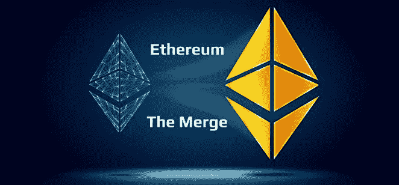

# 合并:真正给以太坊带来了什么？

> 原文：<https://medium.com/coinmonks/the-merge-what-has-really-brought-to-ethereum-70be3f8a211c?source=collection_archive---------13----------------------->

上周，期待中的以太坊合并在合并的名义下发生了，原来的 PoW 以太坊和 Beacon Chain 链合并成了一条链。这一事件已被列为区块链短暂历史中最具代表性的事件之一，尽管它所产生的影响并不总是得到正确的解释。在本帖中，我们打算描述这个过程，以及以太坊 2.0 呈现的新功能或特性，以及对可伸缩性和 ESG 的影响。

## **什么是合并？**

根据以太坊基金会自己的定义[【1】](#_ftn1)，合并是两个独立的区块链合并成一个。具体来说，以太坊区块链已经与灯塔链合并，灯塔链是以太坊基金会自己发起和维护的新链。两者的主要区别在于使用了不同的共识机制:原来的是基于 PoW，而新的是基于 PoS。虽然我们不打算深究两者的区别，但我们可以反映出主要特征:

**PoW —工作证明:**基于密码数学问题解决方案的竞争共识机制，包括识别满足给定哈希的数字(称为 nonce ),反过来，在其他输入中，基于前一个块的哈希。这个数的识别由强力系统执行，因为每个挖掘节点用不同的数迭代 n 次，直到它满足这个等式。在任何情况下，解决这个问题都需要投入电能来运行执行迭代和验证每个数字的机器，因此基本的度量标准是千瓦/小时的价格。

此外，每个协议都建立了解决问题的最大时间，与每个区块的生产时间挂钩(即:比特币协议 10 分钟解决区块)。根据网络的整体哈希能力，每隔 x 个块动态调整问题的难度，以确保在设定的时间内解决问题。在该模型中，机制是竞争的，因为所有挖掘节点都可以参与求解问题，但只有一个节点可以获得块求解所附带的奖励。

**PoS —利益证明**:基于 x 数量的基础资产(通常是用于支付使用区块链的佣金/天然气的令牌)的非竞争性共识机制，作为区块正确处理的保证。

然而，在这种情况下，要由每个验证器节点验证的块数是根据赌注的数量来定义的，从管理 PoS 的智能合约中定义的最小阈值开始。尽管 PoS 配置分类在协议之间改变或可能改变，但目标是每个验证器以随机方式根据其标记来验证块，以便验证顺序的定义取决于算法(即:Tendermint 或 Peppermint，对于多边形 PoS 链)。如果验证者正确地验证了该块，则基于协议的令牌组学模型，它以 APY 的形式接收奖励，而如果该块没有正确地验证，则已经存放该块的智能合约的赌注金额被削减。

因此，如前所述，信标链基于 PoS 模型，而原始区块链、原始以太坊基于 PoW。信标链从一开始就负责应用其 PoS 共识机制来获得其自身区块链下的共识，识别其验证器并确保更新其区块链中这些节点的状态。合并包括将信标链的一致机制应用到原始以太坊处理层，以这种方式，尽管基于 EVM 的智能合同和交易处理模型被保持，但是块生成系统被修改，因此区块链状态更新模式被修改(尽管结果与在 PoW 机制下获得的结果相同)。

## **以太坊 2.0 的后果是什么？**

通过合并，以太坊 2.0 只修改了用于从 PoW 到 PoS 的块处理的一致机制。在这方面，必须注意的是，这种修改对 ESG 有显著影响，但对可扩展性没有影响。

**可扩展性:**每秒的交易水平不取决于网络如何获得共识，因为这完全取决于数据块的大小(就 gas 而言，gas 设置了要包含的最大数据量，因此为交易和/或智能合同的数量设定了上限)以及生成交易和/或智能合同所需的时间。L1 的扩展方式包括减少数据大小的解决方案，例如，通过将数据修改为 calldata 结构，或者根据数据块大小或数据块处理时间进行修改。因此，以太坊在可扩展性层面上的问题，以及由此产生的过高的燃气费，这些问题一直试图通过 EIP 1559 来缓解，但仍有待解决。

对比特币协议以及 PoW 下的以太坊的主要批评之一是维护网络所需的高昂能源成本。随着区块开采的回报增加，由于代币的价格增加，消耗的电能——特别是当这种能源得到补贴时——与获得的收入之间的权衡对矿工来说是积极的，总开采能力(hashrate)增加，这具有更大的能源影响。随着方块难度的增加，更多的能量被添加到网络中以更高的速度迭代，并在既定的时间内解决方块，只要奖励的出售满足这些成本。从这个意义上说，举个例子，估计比特币的全球处理能力大于丹麦。

因此，向 PoS 的迁移，以及竞争性块解析流程和随机数识别的消除，意味着能耗的大幅降低，使协议符合减少碳足迹的 ESG 目标。

## **以太坊 2.0 还会带来什么？**

整个以太坊 2.0 的进程并没有结束。虽然合并通过 PoS 的实施为 ESG 带来了显著的改进，但在可扩展性领域还有很长的路要走。总结一下目前的情况，以太坊目前处理 13 个贸易点，这个数字绝对不足以应付 L1 目前的处理需求。这主要是由于强大的去中心化，以及由此带来的强大的网络安全性，在保证事务最终性(延迟)之前，这迫使块传播到网络的大部分。与此同时，L2 解决方案，从混合解决方案如侧链或提交链，到完整的解决方案如汇总，无论是乐观还是零知识[【2】](#_ftn2)，都使得在其他链中分散执行或处理层成为可能，这些链将这些块分批分组，并向主链发布证明或哈希根，作为在 L2 处理的内容的检查点。L2 领域非常复杂，目前是许多技术努力的焦点(特别是在零知识领域，Starkware、Polygon、zkSync 甚至币安之间开始了推出第一个 zkEVM 兼容汇总的竞赛)，它允许克服当前的摩擦，并将交易数量扩展到可以超过 Visa 当前数字的水平——Polygon PoS Chain 的最高吞吐量达到 7,000 tps，而 Visa 的高达 7,000 tps。然而，尽管这些数字似乎足以满足目前存在的 dApps 的数量，主要基于 DeFi、Gaming、NFTs，即所谓的原生 web3 项目，但整合区块链旗下的公司将需要如此强大的网络工作，因此也有必要增加 L1 以太坊的容量，以便不产生如此强大的积压，即使检查点也是一项过于昂贵的活动，从而导致 L2 的崩溃。

这也是以太坊也准备实现分片的原因。

## **什么是分片？**

分片是一个非常典型的计算机工程过程，由数据库的水平分区组成。每个部分都包含自己的独立状态，即自己的一组账户余额和智能合约，称为碎片。

通过分片，以太坊的集中化问题可以得到解决:由于区块链历史的逐渐增加，每个节点在 RAM、CPU 和内存方面的需求不断增加，导致网络的集中化程度更高，因为很少有节点能够满足维护验证器节点(不是轻型节点，它只复制块头中建立的内容)的操作要求。此外，由于存在大量节点，并且每个块都需要由大多数节点来处理，以保证事务的终结性，因此可伸缩性没有提高。因此，分片将允许每个节点与一个分片相关联，从而显著降低节点的运营成本，并产生更多数量的验证节点，这有利于分散化和安全性，并保证当事务仅通过与该分片相关联的节点时才得到验证。

使用分片可实现的 tps 水平以及需要应对的技术挑战水平仍然难以确定，但它确实将自己定位为 L1 最有希望实现可扩展性的解决方案，再加上 L2 的增长——roll ups、validium 和 volitions——可以使以太坊生态系统流程达到足够的交易水平，以满足区块链统治下的商业世界的需求。

## **结论:**

*   这一合并是向 ESG 范式的重要转变，为更清洁的生态系统打开了大门，并减少了碳足迹。
*   尽管对 ESG 产生了影响，但可扩展性仍未得到解决，这是区块链成为交易的主要结算和处理层的主要制约因素之一。
*   合并是以太坊 2.0 的更新之一，它也设想引入分片作为最有前途的 L1 扩展解决方案，与 L2 结合可以使吞吐量上升到前所未有的水平。

【https://ethereum.org/en/upgrades/merge/】

[【2】](#_ftnref2)[https://vitalik.ca/general/2021/01/05/rollup.html](https://vitalik.ca/general/2021/01/05/rollup.html)

> 加入 Coinmonks [电报频道](https://t.me/coincodecap)和 [Youtube 频道](https://www.youtube.com/c/coinmonks/videos)了解加密交易和投资

# 另外，阅读

*   [AscendEx 保证金交易](https://coincodecap.com/ascendex-margin-trading) | [Bitfinex 赌注](https://coincodecap.com/bitfinex-staking) | [bitFlyer 点评](https://coincodecap.com/bitflyer-review)
*   [麻雀交换评论](https://coincodecap.com/sparrow-exchange-review) | [纳什交换评论](https://coincodecap.com/nash-exchange-review)
*   [支持卡审核](https://coincodecap.com/uphold-card-review) | [信任钱包 vs 元掩码](https://coincodecap.com/trust-wallet-vs-metamask)
*   [TraderWagon 回顾](https://coincodecap.com/traderwagon-review) | [北海巨妖 vs 双子 vs 比特亚德](https://coincodecap.com/kraken-vs-gemini-vs-bityard)
*   [Exness 点评](https://coincodecap.com/exness-review)|[moon xbt Vs bit get Vs Bingbon](https://coincodecap.com/bingbon-vs-bitget-vs-moonxbt)