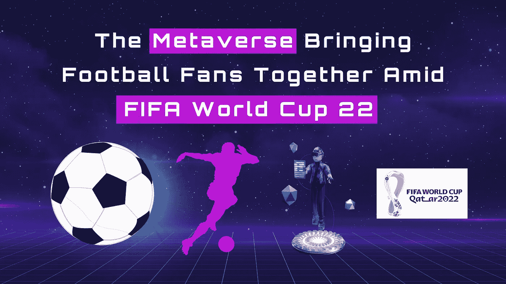
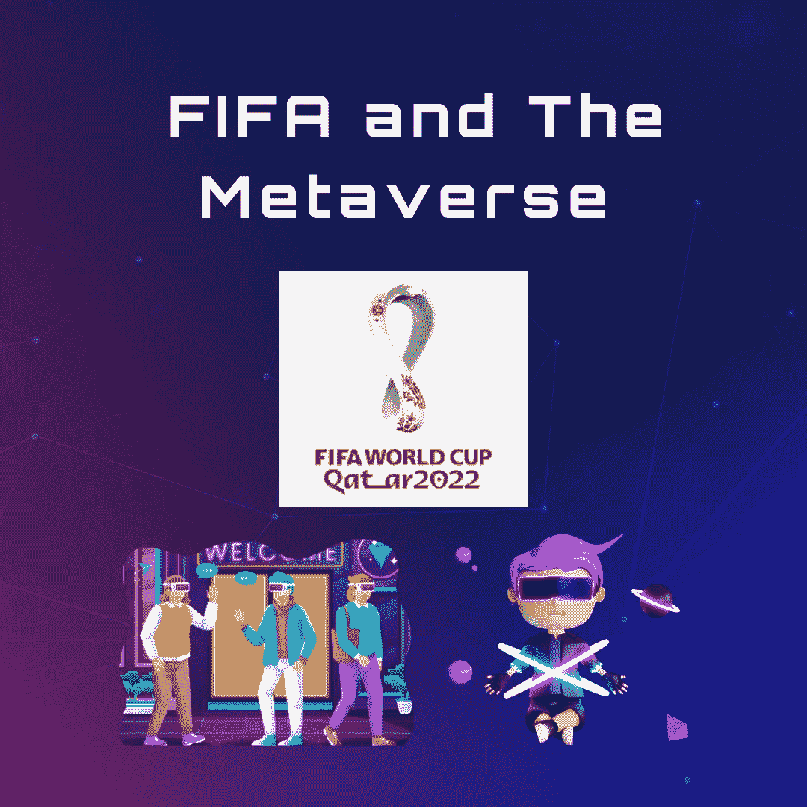
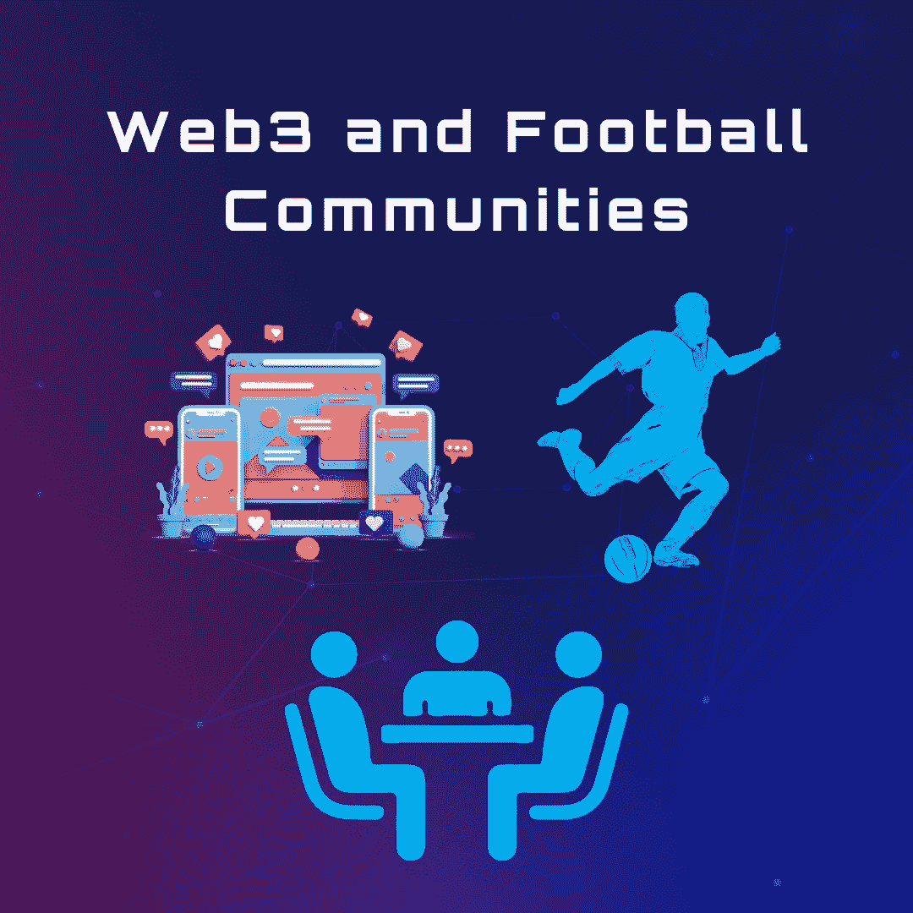
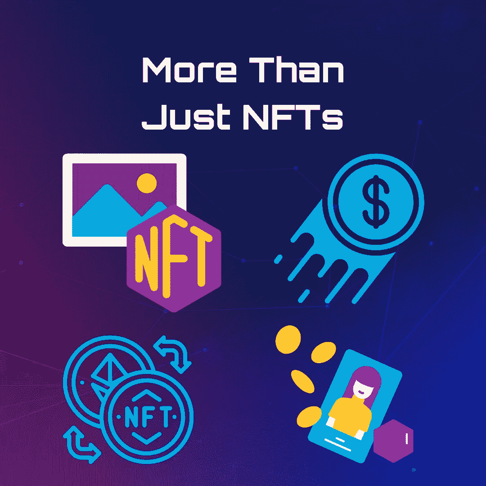

# 元宇宙把足球迷聚集在一起，在国际足联世界杯 22

> 原文：<https://medium.com/coinmonks/the-metaverse-bringing-football-fans-together-amid-fifa-world-cup-22-d392487ee6e8?source=collection_archive---------27----------------------->

作为群居动物，他对“归属”的需求在我们心中根深蒂固。自古以来，人类就建立了基于各种共同兴趣的群体。建立和扩展社区已经有所发展，但是基础仍然需要改进。随着科技的脚步，一种新型的社区建筑通过[元宇宙](https://www.thenationalnews.com/business/technology/2021/11/05/quicktake-what-is-the-metaverse-and-why-does-it-matter/?outputType=amp&utm_source=paid+google&utm_medium=paidsearch&utm_campaign=ind+always+on&utm_term=&gclid=CjwKCAiA7IGcBhA8EiwAFfUDsQnon63q_FCaKbw4GJMKN4yfnYe9Jen_KJ_S4gLkEkRieGScp3amhxoCSKgQAvD_BwE)出现了。元宇宙的定义特征，特别是其沉浸式和游戏化的虚拟体验，旨在模仿现实生活的体验，开辟了新的可能性。

以游戏、品牌和其他亚文化为中心的元宇宙团体已经很出名了。我们现在正在见证一个更广泛的实验，它有可能重塑社区形成、用户参与和投入。国际足联世界杯于上周在卡塔尔开幕，并已成为元宇宙最受欢迎的体育赛事之一。越来越多的区块链和元宇宙项目发起了许多有趣的努力，以吸引全世界的足球迷。

# 国际足联和元宇宙

Crypto.com 的[币安、](https://www.binance.com/en-IN)和[高地](https://www.upland.me/)与主流公司和组织建立了独特的合作和伙伴关系，围绕年度重大足球赛事推出大量完全沉浸式和游戏化的体验。首先，元宇宙平台 Upland 宣布与国际足联达成一项多年协议。作为国际足联和高地有史以来第一次合作的一部分，高地为全球足球迷创造了独一无二的游戏化体验。

FIFA-Upland 的合作使足球爱好者能够更好地掌握 Web3 和元宇宙技术，同时还可以收集、交易和获取 FIFA 主题的[数字资产、](https://www.investopedia.com/terms/d/digital-asset-framework.asp)NFT 和比赛视频集锦等。国际足联和高地合作，在世界上最大的开放元宇宙提供各种游戏化的体验，注册账户超过 300 万。为了世界杯，高地公司已经创建了 [22 个虚拟的现实世界城市展示](https://www.upland.me/events/fifa-world-cup-qatar-2022tm-comes-to-the-upland-metaverse)，并链接到它们相应的现实世界地点。其中有一个卢塞尔体育场的沉浸式副本，这是一个以世界杯为主题的小村庄，展厅和商店，都与各自的现实世界地址相匹配。

此外，Upland 还为足球爱好者发布了一款新的收集游戏，其中包含各种不同稀有程度的神秘包裹。这些盒子包括球队徽章、数字战靴、衬衫、标志、吉祥物、所有 32 个参赛队的海报，以及一个官方世界杯复制品。

足球爱好者可以轻松浏览高地平台的 22 个真实世界的场所。他们还可以买卖虚拟资产，这些资产都与他们的物理位置相关联。在游戏化方面，Upland 允许用户收集并完成数字收藏，这直接贡献了每个用户的粉丝评分。拥有最高球迷分数的用户将有资格赢得额外的奖品，如虚拟卢塞尔体育场所有权、特别的 FIFA 2022 纪念品和比赛视频集锦。

# Web3 和足球社区

高地并不是唯一一家利用全球足球爱好者聚会的公司。加密货币交易所币安也在通过 2022 年世界杯向数百万人展示其 Web3 潜力。刚刚推出的币安足球热 2022 是国际足联 2022 有史以来第一个由区块链技术支持的 [Web3 游戏和球迷体验](https://www.binance.com/en/fan-token/football-fever-2022?utm_source=fan-token&registerChannel=ft_BFF)项目。币安的活动从 11 月 7 日开始，允许用户收到各种礼物。其中包括限量版 NFT、顶级足球俱乐部体验(如球员会议和训练设施参观)以及价值超过 100 万美元的现金奖励。

虽然该活动对公众开放，但有几个先决条件。例如，在币安帐户中至少持有一个球迷代币的用户可以申领他们的免费 NFT 足球护照，以进入 100 万美元的奖金池。用户可以输入他们对所有即将到来的国际足联比赛的预测，增加他们赢得无限奖励的机会，如加密货币，菲亚特奖励和独家 NFT。

与此同时，主流支付服务提供商 Visa 与 Crypto.com 加密货币交易所合作，推出了一项名为 [Visa Masters of Movement](https://usa.visa.com/about-visa/sponsorships-promotions/fifa-world-cup-partnerships/masters-of-movement.html) 的 FIFA 2022 主题活动。该活动将包括一场 NFT 拍卖会和一场让全球足球爱好者身临其境的卡塔尔活动。Crypto.com 平台主办了会前 NFT 拍卖会，展示了传奇足球运动员五个最精彩进球的数字艺术。XK 工作室的尖端算法通过将令人难忘的动作无缝转换为数字艺术作品来创造每一个独特的 NFT。

元宇宙没有重要的加密组件，也有一个直播休息室，头脑简单的人可以一起看比赛。这是一个例子，说明了 Web3 是如何促进虚拟包容和游戏的。

# 不仅仅是 NFT

除了 [NFTs，](https://www.investopedia.com/non-fungible-tokens-nft-5115211) Visa 和 Crypto.com 将于 2022 年 12 月 18 日至 19 日在卡塔尔国际足联球迷节举办“互动数字球场”。通过这一独一无二的活动，足球迷可以从他们最喜爱的 FIFA 世界杯进球、独特的手势和时刻中获得灵感，制作数字艺术。

随着国际足联的大肆宣传和全球大张旗鼓，最近一系列为足球迷提供沉浸式和游戏化体验的合作伙伴关系提醒我们，社区是一切的核心。这些结合技术和线下活动的新举措为社区建设活动的新时代奠定了基础。在这个过程中，链外和链内的生态系统将会融合，为事件和个人带来全新的体验。

> 交易新手？试试[密码交易机器人](/coinmonks/crypto-trading-bot-c2ffce8acb2a)或[复制交易](/coinmonks/top-10-crypto-copy-trading-platforms-for-beginners-d0c37c7d698c)