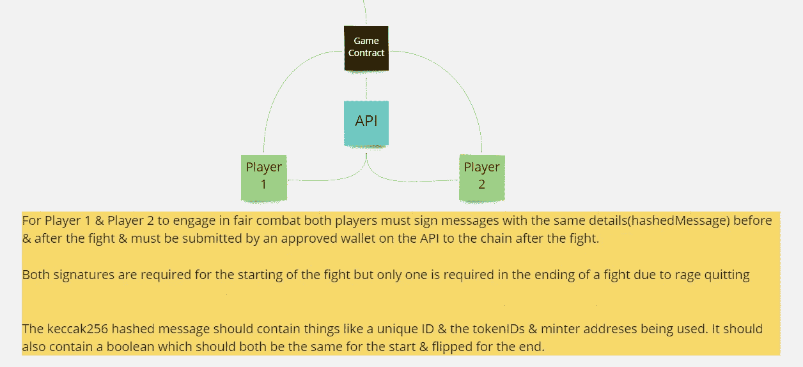

# 元宇宙引擎 2.0

> 原文：<https://medium.com/coinmonks/the-metaverse-engine-2-0-6648f8aaa275?source=collection_archive---------6----------------------->


2.0?？tf 为 1.0 时。它就在紧闭的门后。

无论如何，这次旅程的目标是找到互操作性的解决方案。1.0 在理论上是可行的，但它大大降低了用户体验&主要是最适合低工作量的游戏，而不是我想要的氛围。

**1000 英尺的视野**

很难看到 Ik。


**刀/多西格**

用户投票是链外的&对生态系统采取的任何行动都必须得到两方的批准，一个开发团队和一个社区团队。开发团队在技术规范得到满足时签字&社区团队根据链外用户投票签字。


**管理信息**

为了确保我们尽可能多地分离所需的区域&我们不会达到合同大小的限制，所有关于允许的 minters & games 的信息都应该存储在这个合同上。


**生态系统令牌**

只是一个 20 元的代币。

**统计契约**

这将是不同角色来源之间的共享数据库。


**Minters**

正如我前面提到的开发团队，这是一个需要满足技术需求的地方。

例如，元数据看起来像这样。

```
{
    "name": "NFT #1",
    "description": "This is the best you're getting",
    "image":"ipfs://baeafnnqbiqeo4nuse72ejpxld3pncvbcdb7/1.png",
    "spritesheet_1":"ipfs://baeafnnqbijujpxld3pnfdscvbcdb7/1.png",
    "spritesheet_2":"ipfs://baeafnnqbiqujpxld3pnfdscvbcdb7/1.png",
    "spritesheet_3":"ipfs://baeafnnqbo4ejujpxld3pnfdscvbcdb7/1.png",
    "spritesheet_4":"ipfs://baeafnnqbi4ejujpxld3pnfdscvbcdb7/1.png",
    "dna": "f585ddc968328d295b8092f12b2beb088990037f",
    "edition": 1,
    "date": 1641423728080,
    "attributes": [
      {
        "trait_type": "Background",
        "value": "Gradient Lime & Green"
      },
      ...
    ]
  }
```

这里的目标是构建一个 Unity SDK 来自动化检索 TokenURI、检索元数据、下载图像和分割 spritesheets(扁平的 2D 动画)的过程，以给出在被请求使用的角色上玩的游戏。3D 在这里是可能的，只是觉得 2D 会更快更容易。


**比赛(接力)合同**

与我以前文章中的其他例子不同，这次游戏逻辑不在启用 PVP 的链上。


好了，我们已经把样板文件拿出来了，但是这个 pvp 验证系统呢？



通过利用 ECDSA，我们可以允许这些系统通过授权渠道处理结果。

更多关于验证过程的信息请点击此处。[https://medium.com/p/63a563c56b96](/p/63a563c56b96)

如果你觉得这很有趣，看看这个！
[https://medium.com/p/9eda96d06973](/p/9eda96d06973)

坚实发展研究小组—[https://discord.gg/KzbcGmrnfN](https://discord.gg/KzbcGmrnfN)

-多边形联盟—【https://www.polygonalliance.com/ 

——多边形联盟不和—[https://discord.gg/kJKPCGQu66](https://discord.gg/kJKPCGQu66)

你喜欢这篇文章吗？想请我喝杯咖啡吗？
Polygon/Eth/Bsc—0x4a 581 E0 EAF 6b 71d 05905 e8e 6014 DC 0277 a1 b 10 ad

> *交易新手？试试* [*加密交易机器人*](/coinmonks/crypto-trading-bot-c2ffce8acb2a) *或* [*复制交易*](/coinmonks/top-10-crypto-copy-trading-platforms-for-beginners-d0c37c7d698c) *上* [*最好的加密交易*](/coinmonks/crypto-exchange-dd2f9d6f3769)

> 加入 Coinmonks [电报频道](https://t.me/coincodecap)和 [Youtube 频道](https://www.youtube.com/c/coinmonks/videos)获取每日[加密新闻](http://coincodecap.com/)

# 另外，阅读

*   [免费加密信号](/coinmonks/free-crypto-signals-48b25e61a8da) | [加密交易机器人](/coinmonks/crypto-trading-bot-c2ffce8acb2a)
*   杠杆代币的终极指南
*   [16 款最佳折叠电动自行车](/coinmonks/top-17-folding-electric-bikes-5e296f0918cb)
*   [28 款最佳电动自行车点评](/coinmonks/the-28-best-electric-bikes-review-and-buying-guide-in-2023-7bb3146cb403)
*   前三名[币安期货交易机器人](/coinmonks/top-3-binance-futures-trading-bots-e6031f84b3f9)