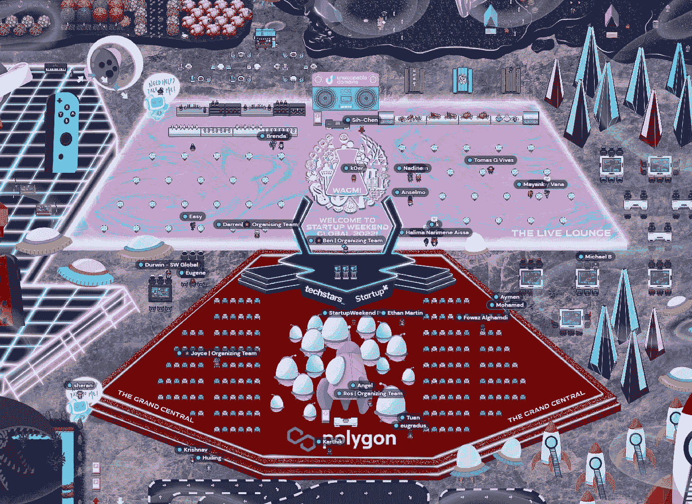
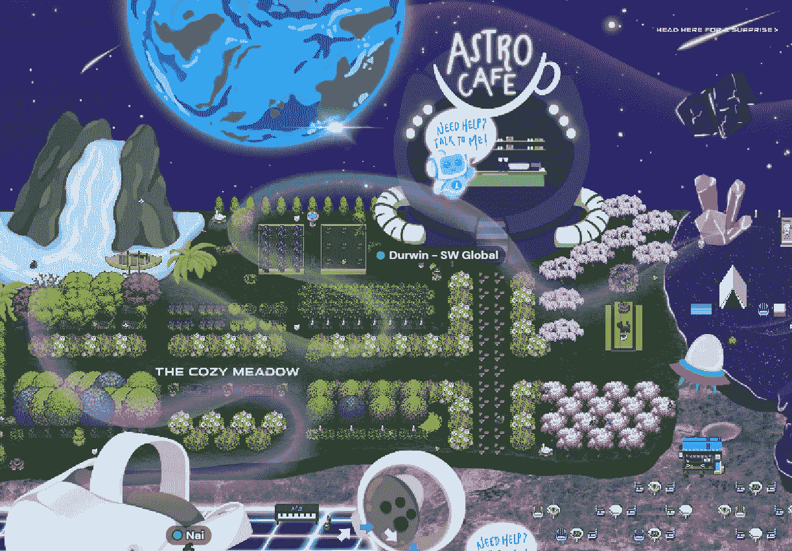
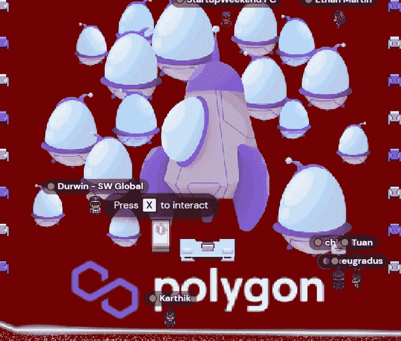
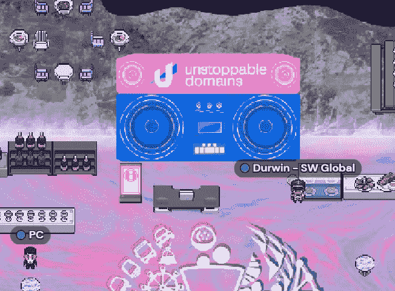
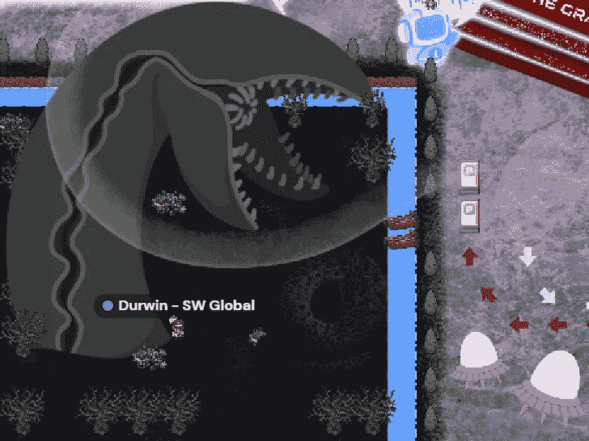

# 元宇宙是真实的，下面是我们如何用它来运行 2022 年最大的黑客马拉松之一。

> 原文：<https://medium.com/coinmonks/the-metaverse-is-real-and-here-is-how-we-used-it-to-run-one-of-the-largest-hackathons-in-2022-d2248a9b9aa9?source=collection_archive---------33----------------------->

Startup Weekend Global 2022 — Web3 edition is live!

创业周末不仅仅是一场黑客马拉松。

这是企业家精神的庆典。

它是创新、勇气和尝试意愿的顶峰。

每年，毫无疑问，我们都会尝试做一两个创业周末。

对于 2022 年，我们正在做一些前所未有的事情。

我们将 SW 延长至 3 个月以上，并有来自 90 多个国家的 2000 多人加入我们。

Web3 对我们所有人来说都是一个新的空间，但我们将像勇敢的太空探险者一样探索未知。

Gosh the effort our team put into designing this custom map is extraordinary.

以下是我在 2022 年全球创业周末(Web3 版)上的开场白:

晚上好，女士们，先生们，还有全世界的每一个人，早上好，下午好。

对于那些网络 3 迷，通用汽车。

他们在 discord 和 Twitter 上都是这么打的。

今天，我们有来自 90 多个国家的数千名参与者、观众、评委、导师、演讲者、社区领袖和朋友聚集在一起，创造创业周末的历史。

对我们所有人来说，这是壮观的一年，无论是在 web3 还是 web2。

2022 年充满了惊喜、心痛、激动和神秘。

当秘密过山车上下起伏时，每个人都在抓紧宝贵的生命。

牛市已经离我们而去，现在熊市正如火如荼。

他们说熊市是建筑商维权的最佳时机？

这正是我们在启动周末要做的事情——构建！

我们将建立新的理念，建立新的公司，建设新的未来。

Shoutout to Polygon for being our sponsor and believing in our mission!

众所周知，建设的最佳时机是在大肆宣传平息下来的时候，是在大屠杀结束、人们有了可以学习的战争伤疤的时候。

对于今天在座的每个人来说，这是一个绝佳的机会，可以在接下来的几个月里结识志同道合的人，建立令人惊叹的公司，并学到一些东西。

你知道，典型的创业周末，我们在周末做，顾名思义。

这一次，对于 2022 年全球创业周末，我们正在做一些真正特别的事情。

我们将首次将启动周末延长至 3 个月以上，从 2022 年 12 月 9 日至 2023 年 3 月 4 日！

这是前所未有的，也是我们向全球社区共同学习、建设和成长的承诺迈出的一大步。

“创业周末”是在一个地下室开始的，目标是在一个周末创办一家公司。

在过去的十年里，它已经发展成为世界上最大的创业活动之一，我们现在都是这个运动的一部分。

所以欢迎！

Big thanks to Unstoppable Domains for partnering with us!

对我们许多人来说，Web3 就是未来。这项技术，它的应用和所有的奇迹都是非常了不起的。

这就是为什么我们要鼓励这里的每一个人开始构建我们的 5 个主题:元宇宙、NFT、游戏、Defi 和 Web3。

可能性是无限的。

对于 web3 的新手来说，只需要知道 web3 不仅仅是昂贵的 jpegs 和令牌崩溃。

有许多迷人的技术，如区块链、治理、去中心化和扩展工具。

为此，我们与 Web3 领域的杰出人士合作，如 Polygon 和 Unstoppable Domains，他们相信我们的愿景，即增强全球企业家的能力，弥合 web2 和 web3 之间的差距。

We even have a dune worm!

对来自世界各地的所有志愿者和组织者大声喊出来，他们花了几个月的时间筹备 SW，计划和组织这一奇迹发生所必需的一切。

代表我的团队，我想借此机会再次向赞助商、Polygon、Unstoppable Domains、Techstars，当然还有 Gather 表示感谢，感谢他们对创业周末的支持。

每年我都会这么说，我想我会一直这么说下去，直到它成为一个事实:不是每个人都能成为企业家，但是一个好的企业家可以来自任何地方。

我希望每个人都能在全球创业周末活动中一切顺利，让我们玩得开心！

-

你加入创业周末全球 2022: Web3 版了吗？

-

想加入新成立的威肯元宇宙公司吗？
走吧:[https://startupweekendglobal.com/](https://startupweekendglobal.com/)

-

# startups # business # startupx # growth # success # social media # culture # web 3 # strategy # hacks # revenue # nfts # eth # BTC # crypto # startupweekend # SW global # startupweekend 2022 #元宇宙

> 交易新手？试试[加密交易机器人](/coinmonks/crypto-trading-bot-c2ffce8acb2a)或者[复制交易](/coinmonks/top-10-crypto-copy-trading-platforms-for-beginners-d0c37c7d698c)