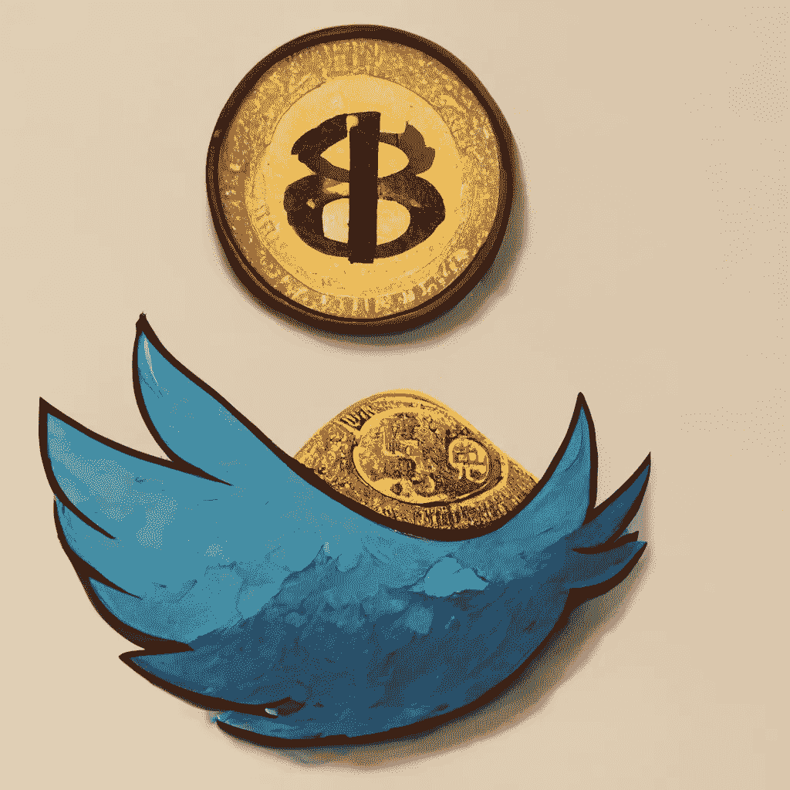
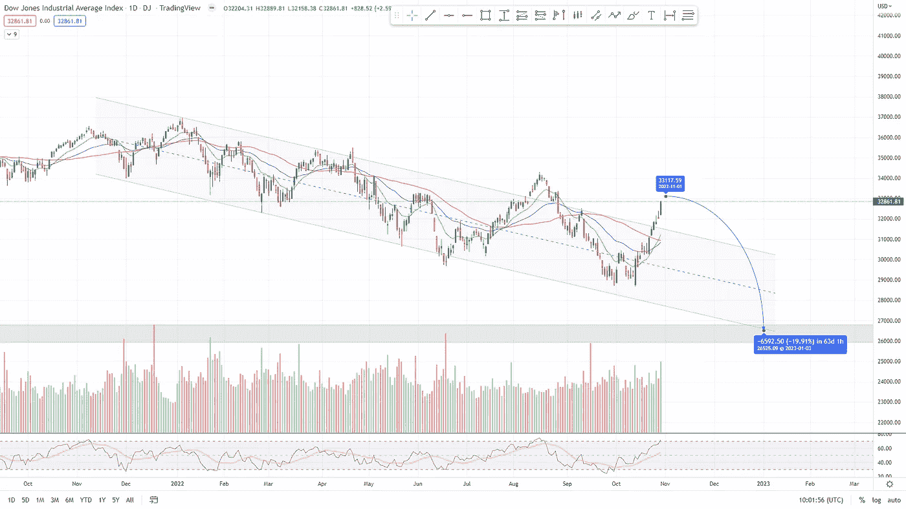
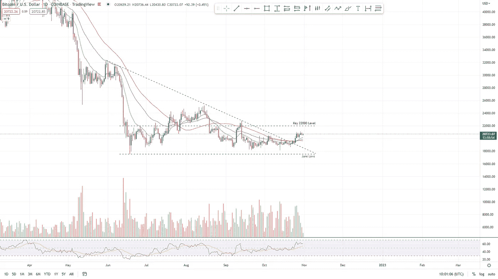

# 中期反弹——投资者对未来一周的预期

> 原文：<https://medium.com/coinmonks/the-midterm-rally-what-investors-expect-in-the-week-to-come-3ddf60c0982?source=collection_archive---------44----------------------->

Twitter x Elon，要知道什么。十月二十八日。

# 关键见解

*   收益报告和经济日历上的事件可能会在下周产生重大影响。但是怎么做呢？
*   埃隆·马斯克对 Twitter 的收购以及大型加密公司的参与。
*   比特币积累最多的一天。超过 11 亿比特币从币安交易所撤出。
*   FTX 致力于当地的稳定硬币。
*   BTC 价格分析。
*   纳斯达克价格分析。

‍

‍

# 过去的一周和未来的一周

‍

本周，我们看到了道琼斯、S&P 和纳斯达克等大指数的相对强势。尽管许多大型股如 META 和 Amazon 由于糟糕的收益报告而大幅缩水。

‍

在接下来的一周，我们将收到更多来自大公司的收益报告，如优步、辉瑞、Paypal、星巴克、Moderna、丰田、CVS、索尼、AirBNB、派拉蒙全球等等。

‍

如果收益报告继续令人失望，指数的力量可能会减弱。

‍

本周美国还公布了 GDP 和核心 PCE 指数的数据，市场在预期基本实现后略有上涨。

‍

下周，我们将公布更多大型经济统计数据，包括联邦基金利率、美国失业率和多项 FOMC 声明。

‍

‍

# 埃隆·马斯克收购 Twitter

埃隆·马斯克(Elon Musk)和 Twitter 已经为 Twitter 收购交易的通过进行了一场漫长的战争。

‍

然而，埃隆并没有从自己的口袋里拿出这笔 440 亿美元的交易。

‍

在马斯克向美国证券交易委员会(SEC)透露的文件中，他从众多投资者中筹集了 71.4 亿美元，其中包括美国计算机技术公司甲骨文的联合创始人拉里·埃里森、币安、资产管理公司富达和布鲁克菲尔德，以及红杉资本和 A16z。

‍

但这并不是唯一感兴趣的投资者，FTX 首席执行官班克曼·弗里德提出的高达 100 亿美元的报价显然被马斯克拒绝了。

# ‍的币安

 **首席执行官赵昌鹏表示:“我们很高兴能够帮助 Elon 实现 Twitter 的新愿景，我们的目标是发挥作用，将社交媒体和 Web3 结合在一起，以扩大加密和区块链技术的使用和采用。”**

**‍**

**币安已被证实向埃隆·马斯克(Elon Musk)440 亿美元的收购 Twitter 的出价投资了 5 亿美元的股权资金。**

**‍**

**币安在 Twitter 的股份可能会给赵一个机会，通过 Twitter 这样的大型 web 2 社交媒体实现 Web3 的去中心化理想，通过这次收购，加密技术与 web 2 世界的集成将更加紧密。
‍**

**‍
马斯克之前已经陈述了他对 Twitter 的许多计划中的一些，他已经暗示了让该网站更加加密友好的计划，包括接受 dogecoin 作为 Twitter 的本地支付方式。**

**‍**

**让我们看看埃隆在哪里可以把 Twitter 作为新的自由言论和 web 3 集成的社交媒体平台。**

# **FTX**

**‍**

**FTX 加密交易所的创始人萨姆·班克曼-弗里德(Sam Bankman-Fried)出价一大笔钱，想和埃隆·马斯克(Elon Musk)一起收购 Twitter。**

**‍**

**但埃隆拒绝了这一提议，更愿意与之前上市的投资者和全球最大的密码交易所币安一起收购。**

**‍**

**但是为什么会这样呢？高达 100 亿英镑的巨额股份会让埃隆更容易收购该平台。**

**‍**

**据报道，班克曼-弗里德的顾问威尔·麦卡斯基尔给马斯克发了一条短信，与这位 FTX 创始人讨论收购 Twitter 的事宜。**

**‍**

**马斯克和推特之间的法庭案件中透露的短信显示，班克曼-弗里德提出以高达 150 亿美元的资金支持马斯克。**

**‍**

**埃隆奇怪地拒绝了，尽管肯定是经过深思熟虑的。问题是为什么？埃隆不相信 FTX CEO 的动机吗？我们能做的就是推测。**

# **Dogecoin**

**‍**

**随着埃隆马斯克收购 Twitter，我们看到 Dogecoin 价格在 4 天内上涨了 150%，但根据众多指标，DOGE 现在是自 2021 年 4 月以来最超买的。**

**‍**

**如前所述，今年早些时候，Elon 曾暗示过让 Dogecoin 成为该平台上使用的支付方式的想法。**

**‍**

**加密货币在 twitter 等主要平台中的全面整合将标志着加密货币合法性和全球采用的一个伟大里程碑。**

# **迄今为止最大的比特币积累**

**‍**

**币安通过向外部钱包发送 55，000 BTC 结束了这一周。**

**来自链上分析公司 [CryptoQuant](https://zwobrd.clicks.mlsend.com/te/cl/eyJ2Ijoie1wiYVwiOjExMjYzMSxcImxcIjo3MDQ3NjIyMjMyMDA4NDUwMCxcInJcIjo3MDQ3NjIyMjY1OTgyMjczM30iLCJzIjoiOTgxZmVkM2E0NjkzOTMxYiJ9) 的最新数据显示，一天内离开币安的 BTC 比以往任何时候都多。**

**‍**

**10 月 26 日，币安的净头寸变化超过 55，000 BTC。**

**‍**

**有史以来最多的一次，总计 11 亿美元，计算平均价格约为。每比特币 2 万。**

**‍**

**与币安不同，跨平台持仓变动并未创下全球纪录，6 月份仍保持高位。**

**‍**

**尽管这对于加密牛市来说无疑是一个好兆头。**

# **FTX 稳定币**

**‍**

**FTX 首席执行官山姆·班克曼-弗里德在最近的一次采访中表示，FTX 加密货币交易所正在努力创造一种稳定的货币。**

**‍**

**FTX 加密交易所的首席执行官表示，他们与另一家公司在稳定币上的合作可能是“非常强大的”**

**‍**

**“我想在不久的将来，你可能会从我们这里听到一些关于这个问题的消息，”他告诉采访者。**

**‍**

**班克曼-弗里德说:“我们已经推迟了这项工作，因为我认为在某种程度上，我们认为在这方面的合作非常强大，很多事情最终都是我们试图找到我们非常乐意与之合作的合作伙伴。”。**

**‍**

**更多来自可信机构和个人的稳定反馈可能是件好事，这取决于他们的合作关系和分散性。**

**‍**

**准备好提升你的市场知识了吗？**

**‍**

# **‍Dow、标准普尔和纳斯达克**

**‍**

**正如本周所言，我们已经看到了道琼斯、S&P 和纳斯达克等大指数的相对强势。尽管许多大型股，如 META 和 Amazon，由于糟糕的收益报告，已经出现了大规模的撤资。**

**‍**

**我们已经看到了 10 月份的大反弹，但回调肯定是我们应该很快就会看到的。**

**‍**

**美联储给市场带来任何利好消息的可能性很低。如果他们带来了好消息，那只会推迟不可避免的崩盘。**

**‍**

**我们在道指上看到了通道的突破(图 1)，尽管我们以前也看到过这些突破，它们经常会反转回到通道低点。
‍**

**‍
道琼斯指数 26000 点的关键长期水平目前位于通道底部。在适当的条件下，这些水平极有可能在未来两个月内达到。**

**‍**

****

***图 1 1D DJIA 2022 年 2 月—2022 年 10 月(TradingView)***

# **比特币**

**‍**

**密码市场已经从 10 月中旬的低点反弹。**

**‍**

**对于比特币来说，这个低点大约是。10 月 13 日达到 18000 点，从低点反弹了 13%以上。**

**‍**

**它也突破了长期下降三角形，如图 2 所示。**

**‍**

**下降三角形向上的轻微突破并没有给多头带来太多的跟进。随着关键阻力位于 22000 点，我们距离可能的强烈拒绝只有 5%的距离。**

**‍**

**在当前的宏观经济条件下，新一轮牛市似乎不太可能出现。**

**‍**

**‍**

****

***图 2 1D BTC 2022 年 4 月—2022 年 9 月(TradingView)***

**这里有一个免费的 PDF 格式的回调 trading‍指南，一个伟大的优势和交易技术:[https://www.boomish.org/free-e-books](https://www.boomish.org/free-e-books)**

> **交易新手？尝试[加密交易机器人](/coinmonks/crypto-trading-bot-c2ffce8acb2a)或[复制交易](/coinmonks/top-10-crypto-copy-trading-platforms-for-beginners-d0c37c7d698c) ‍**