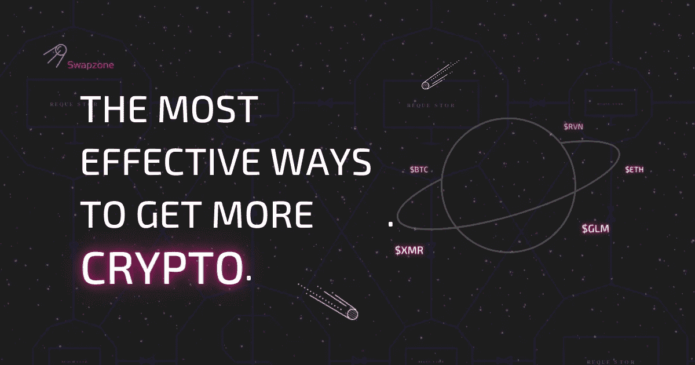

# 获取更多密码的最有效方法

> 原文：<https://medium.com/coinmonks/the-most-effective-ways-to-get-more-crypto-3cc7c7a03741?source=collection_archive---------31----------------------->

过去每个人都问“什么是加密”的日子已经一去不复返了如今，大多数人都有兴趣知道最好的密码购买和他们如何能得到更多。虽然现在购买加密货币比以往任何时候都容易，但加密行业仍然不确定，不受监管，最重要的是，充满了骗局。这使得获取更多密码的合法无风险方法变得非常少。

回到过去，一个人可以通过在个人电脑上挖掘来获得更多的密码。如今，加密货币挖掘，尤其是[比特币](https://swapzone.io/currencies/bitcoin)，稍微复杂一点。你将需要高端设备，如专用集成电路，以便采矿。即便如此，你仍将与拥有装满复杂采矿设备仓库的大型矿商竞争。

因此，如果你正在寻找无风险的方法来获得更多的密码，你来对地方了。别走开，我们会告诉你怎么做。

# 最佳平台上的 Exchange 加密

你还在考虑如何获得下一个大型加密货币吗？别担心。获得 crypto 的最直接的方法之一是直接购买。这意味着你需要在网上注册一个密码交易所。虽然加密交换是伟大的，但它们中的大多数在过去都曾被黑客攻击过，有些甚至继续在亚级安全功能下运行。

> 交易新手？试试[密码交易机器人](/coinmonks/crypto-trading-bot-c2ffce8acb2a)或[复制交易](/coinmonks/top-10-crypto-copy-trading-platforms-for-beginners-d0c37c7d698c)

然而，不要让注册一个不安全的加密交易所的恐惧限制了你进入加密领域的机会。一旦你找到一个很棒的密码交易所，你会惊讶于整个密码交易过程是多么的简单和安全。为了帮助你，我们已经回顾了一些最好的加密交换平台，以帮助你在正确的基础上开始。它们包括:

*   [ChangeNOW](https://swapzone.io/reviews/changenow)
*   [简单交换](https://swapzone.io/reviews/simpleswap)
*   [多变](https://swapzone.io/reviews/changelly)
*   [InstaSwap](https://swapzone.io/reviews/instaswap)
*   [Exolix](https://swapzone.io/reviews/exolix)
*   [易比特](https://swapzone.io/reviews/easybit)
*   [SWFT](https://swapzone.io/reviews/swft)
*   [固定浮动](https://swapzone.io/reviews/fixedfloat)
*   [Flyp.me](https://swapzone.io/reviews/flypme)

# 赚取加密货币红利

如果你想知道如何获得免费加密，那么你绝对应该选择支付红利的加密货币。由于 crypto 的开源性质，许多新硬币给该行业带来了新功能。其中一个特点是能够获得类似股息的支付。根据你所拥有的密码类型，不同密码的要求可能不同，因为每个硬币都有自己的一套条款和条件。

有两种方法可以让你在加密货币领域获得红利。它们包括赌注和持有。[赌注](https://www.coinbase.com/learn/crypto-basics/what-is-staking)包括将您的硬币“赌注”或锁定在支持的钱包或特定的加密交易所中。作为回报，您将根据您钱包中密码的总价值、您将密码锁在钱包中的时间以及您持有的硬币数量获得奖励。另一方面，持有就是在你的钱包里购买和持有密码。

这是两种不用花钱就能得到免费密码的方法。也就是说，这里有一些在 2021 年投资的最佳加密货币，可以赚取加密红利:

*   [科莫多](https://swapzone.io/currencies/komodo)
*   [库币](https://swapzone.io/currencies/kucoin-token)股
*   [尼奥](https://swapzone.io/currencies/neo)
*   内布利欧
*   [VeChain](https://swapzone.io/currencies/vechain)
*   [ReddCoin](https://swapzone.io/currencies/reddcoin)
*   [颁布法令](https://swapzone.io/currencies/decred)
*   [PIVX](https://swapzone.io/currencies/pivx)
*   [导航币](https://swapzone.io/currencies/nav-coin)
*   AscendEX

# 分散投资以储蓄

一个最好的方法，你可以获得密码是在密码支付。每当你接受加密作为支付方式时，你就去掉了中间人，在这种情况下就是银行。这意味着你也去掉了银行为清算存款而保留存款的额外时间。有了加密货币，你的交易是即时的。因此，你可以决定分散投资

如果你是一个精明的投资者，那么你很清楚把所有的鸡蛋放在一个篮子里是非常危险的。因此，你需要分散投资，将它们存入不同的资产，以减轻一项或多项资产表现不佳的风险。做到这一点的最佳方式是将投资组合的一部分分散到加密货币中。如果你不熟悉 crypto 或者刚刚开始，那么你最好从一两个硬币开始。

最快的方法，你可以添加加密到您的投资组合是获得支付加密。这样做的好处是，你从每笔交易中去掉了中间人，这意味着你的交易是即时的。此外，有一些应用程序可以增强您的加密体验，并为您的投资组合添加更多数字资产。从投资组合经理到借贷平台，再到密码交易所，选择有很多。只需找到最适合您需求的最佳加密货币应用程序，并开始交易加密。

# 参与推荐计划

推荐程序是另一个简单的方法来获得免费加密。在这种情况下，你需要做的就是找到一个服务，提供成为推荐伙伴的机会，并要求参与。之后，你可以与你的朋友、家人和社交媒体关注者分享你的推荐证书，尽可能多地与人接触。记住，你接触的人越多，他们使用你推荐的机会就越大。你的收获完全取决于你的网络规模和参与度。

你现在可能想知道从哪里开始推荐。我们对此也有答案。Swapzone 有自己的[推荐程序](https://swapzone.io/referral-program)供你使用。请联系我们，我们将为您安排推荐收入之旅。

# 如何在 Swapzone 上获得更多的加密？

获得更多的加密绝对是大多数投资者努力的目标。只要确保在你购买更多的密码之前，你有一个安全的地方存放它们。Swapzone 为您可能需要的各种形式的密码提供便捷的一站式服务。要获得更多的密码，过程相当简单。你需要做的是:

1.  前往 [Swapzone](https://swapzone.io/) ，选择你想要交换的加密货币对(例如[到 ETH](https://swapzone.io/exchange/btc/eth) )，并输入所需的数量。
2.  最佳选择将会呈现在你面前。选择汇率最好的一个，点击**“交换”**按钮继续。
3.  填写您钱包的详细信息。一旦你填写了正确的细节，就可以直接进行交易了。
4.  我们会给你一个地址，让你把钱存进去。将必要数量的加密发送到服务提供商为您交换的地址。
5.  稍等片刻，等待交易完成并接收您兑换的资金。
6.  请花点时间来评价交易并留下评论，以便我们知道如何改进我们的服务。